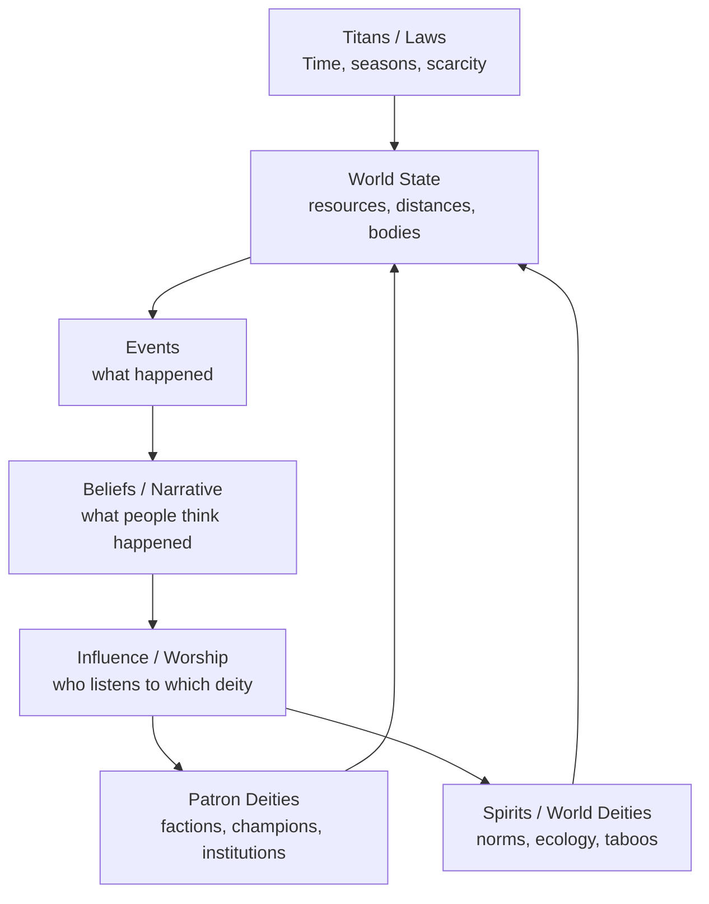
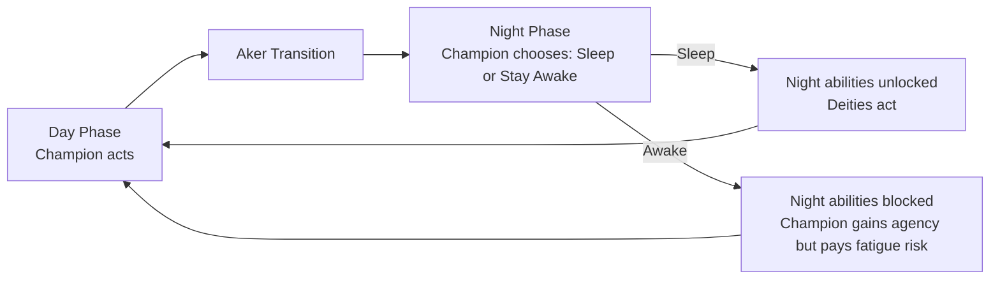
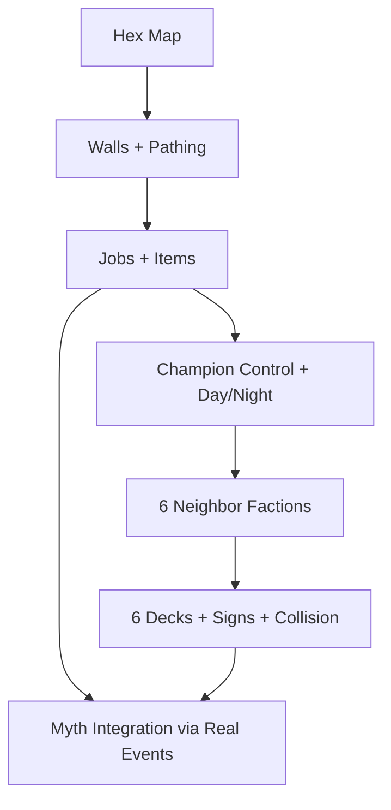
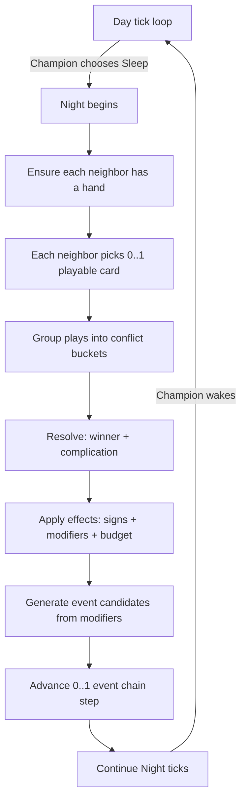

# A model that matches what you liked in RimWorld, without the “random/samey” feel...
Exported on 13/01/2026 at 16:03:38 [from ChatGPT](https://chatgpt.com/g/g-p-69646a00d5ec8191919fd74c2731277e/c/696472c0-4e7c-8326-b75d-336dce3fec44) - with [SaveMyChatbot](https://save.hugocollin.com)

## User
describe Fantasia

## ChatGPT
Fantasia (your project, as it’s showing up in this workspace)
-------------------------------------------------------------

**Fantasia** looks like a _world-simulation + narrative game design_ effort where the “world” is modeled explicitly—so characters, groups (governments, churches, knightly orders, guilds), and their relationships can **produce events**, which then drive story, quests, rumors, conflicts, alliances, etc.

Instead of hand-authoring every quest, you’re aiming for a system that can _describe the world_, _track why things are true_, and _generate what happens next_ in a way that stays consistent.

### The core idea

*   **Entities** (people, places, artifacts, organizations)

*   **Facets** (structured attributes/roles/states like _is-a priest_, _owes debt_, _wants relic_, _aligned-with faction X_)

*   **Relationships** (why two entities are connected; not just “friends/enemies” but _how/why_)

*   **Groups as first-class entities** (a church can be spiritual _and_ political; an order can require faith membership while serving non-religious roles)

*   **Events** as the “motion” of the world (things that happen and change facets/relationships)


### Why facets matter here

Facets are basically your “attachable lenses”:

*   A person can have facets like `Citizen`, `Knight`, `Heretic`, `Merchant`, `Witness`.

*   A group can have facets like `Religion`, `Government`, `MilitaryOrder`, `CharityNetwork`.

*   Relationships can also have facets: `Oathbound`, `Debt`, `BloodFeud`, `Patronage`, `ConfessionalSecret`.


This lets you represent cases like:

*   “This order wasn’t founded as religious, but members made it religious over time.”

*   “This church runs courts, schools, grain stores, and also worship.”


### Where GOAP fits

GOAP (Goal-Oriented Action Planning) becomes the bridge from _state_ → _action_:

*   An agent sees the world state via facets/relationships.

*   It forms goals (“secure legitimacy”, “avoid scandal”, “acquire relic”).

*   It chooses actions that cause events, which mutate the state.


### “We want something similar to describe events”

That suggests your event system is not just log entries, but **structured transforms**:

*   Preconditions: what must already be true in the world

*   Intent: why an agent/group initiates it

*   Effects: which facets/relationships are added/removed/changed

*   Fallout hooks: what new opportunities/conflicts it spawns


### A plausible MVP slice

If you wanted a clean prototype boundary, Fantasia’s MVP could be:

*   A small world state (10–30 entities, 5–10 groups)

*   A facet + relationship schema

*   20–50 event templates

*   A simple planner loop:

    1.  pick an agent

    2.  derive goals from facets

    3.  pick/plan an action

    4.  apply event → update state

    5.  emit “story feed” (what players would hear/see)


Diagram
-------

```mermaid
flowchart LR
  WS[World State<br/>(Entities + Facets + Relationships)]
  GO[Goal Derivation<br/>(from Facets/Needs)]
  PL[Planner<br/>(GOAP / heuristics)]
  EV[Event Template<br/>(Preconditions + Intent + Effects)]
  AP[Apply Event<br/>(mutate state)]
  FF[Fallout<br/>(new hooks, rumors, quests)]
  UI[Player-facing Output<br/>(news, quests, NPC dialogue)]

 WS --> GO --> PL --> EV --> AP --> WS
  AP --> FF --> GO
  AP --> UI
```

* * *

### Quick note on ambiguity

There’s also **Disney’s _Fantasia_** (the 1940 film / later _Fantasia 2000_), but given your open tab name “Fantasia Game Design” and the ongoing DSL/facets/events context, I’m describing **your Fantasia** here.

> This description was created with the assistance of an AI.

#fantasia #game-design #world-sim #goap #worldbuilding #systems-design

## User
I didn't realize the disney movie was spelt like that. I was pronouncing that word more like "Fan-ta-see-a" not "fan-taes-ya" What would a better spelling be?

## ChatGPT
If you want people to _say_ “Fan-ta-see-a”
------------------------------------------

English readers will usually map spelling → sound like this:

*   **Fantasia** → “fan-TAY-zhuh” / “fan-TAY-see-uh” (Disney has made this spelling “feel” like its own proper noun too)

*   To bias harder toward “see-a”, you want to **force the “see” syllable**.


### Strongest “say it right” spellings

These are the most likely to get _fan-ta-SEE-uh_ on first read:

*   **Fantasea** _(fan-ta-SEE)_ — very readable, but it also evokes “sea/ocean” immediately.

*   **Fantaseia** / **Fantaseya** _(fan-ta-SAY-uh / fan-ta-SEE-uh depending)_ — mixed; “seya” can drift to “SAY-uh”.

*   **Fantasiaa** _(fan-ta-SEE-uh)_ — works sometimes, but looks like a typo/double-vowel.


### Cleaner “name-like” options (less ocean-vibes)

*   **Fantasea** is the clearest, but if you don’t want “sea” imagery:

*   **Fantasea** with a **subtitle/brand** can help: _Fantasea: Chronicles of…_

*   **Fantaseia** is “fantasy-ish” looking, but pronunciation is less guaranteed.


### If you actually mean “Fan-ta-zee-a”

If your target is closer to _fan-ta-ZEE-uh_:

*   **Fantazia** — pretty reliably “zee”, and it sidesteps the Disney spelling.


### If you want to keep “Fantasia” but guide pronunciation

You can keep the classic spelling and add a subtle cue:

*   **Fantasia (fan-ta-SEE-a)** in the logo, store page, trailer VO, etc.

*   Or stylize it: **Fan-ta-see-a** as a tagline once, then drop it.


Recommendation
--------------

*   If the priority is _people saying it correctly_: **Fantasea**

*   If the priority is _avoiding Disney association + still readable_: **Fantazia** (if “zee-a” is acceptable)

*   If you want _minimal change + keep the aesthetic_: keep **Fantasia** and include **(fan-ta-SEE-a)** the first few times.


If you tell me which pronunciation you want in IPA (or “rhymes with \_\_\_”), I can narrow it to 1–2 best spellings.

## User
It was a place holder but I was getting a bit attached to the name... but maybe there are  other names for a myth engine

## ChatGPT
Yeah—**Fantasia** is a _killer_ placeholder name, but if you want something that reads more like “a system that manufactures myth,” here are some options that keep the same vibe without the Disney gravity.

Names that imply “myth-making machinery”
----------------------------------------

*   **MythForge**

*   **LoreFoundry**

*   **SagaWorks**

*   **FableEngine**

*   **LegendMill**

*   **StoryFoundry**

*   **MythPress**

*   **ChronicleWorks**

*   **CanonWorks**

*   **MythWeaver**


Names that feel more _ancient / occult / mythic_
------------------------------------------------

*   **Aetherloom**

*   **RuneFoundry**

*   **Omenwheel**

*   **Glyphsmith**

*   **Oracle Loom**

*   **The Sibyl Engine**

*   **Moirai Machine** (the Fates)

*   **Ananke** (necessity/fate)

*   **Nyxworks**

*   **Eidolon Works** (ties nicely to your existing concept)


Names that lean “simulation that becomes story”
-----------------------------------------------

*   **Causality Loom**

*   **Consequence Engine**

*   **FateGraph**

*   **The Continuity Engine**

*   **Worldseed**

*   **EventWeave**

*   **Motif Engine**

*   **MythOS** (if you want it to feel like infrastructure)


Names that are punchy and brandable
-----------------------------------

*   **Lorekit**

*   **SagaKit**

*   **MythKit**

*   **Fableware**

*   **Lorecore**

*   **Mythcraft** (common word—might be crowded)

*   **SagaSynth**

*   **MythSynth**


A few “keeps the Fantasia energy” alternatives
----------------------------------------------

*   **Fantasea** (if you liked the sound)

*   **Phantasia** (older spelling; still close)

*   **Fantasium**

*   **Fabletide**

*   **Mythoria**

*   **Sagenia**


* * *

A quick way to pick one that sticks
-----------------------------------

A name tends to survive when it’s:

1.  **Easy to say once seen**

2.  **Hard to misspell**

3.  **Searchable** (not too generic)

4.  **Expandable** (works as `X Engine`, `X Studio`, `X Canon`, etc.)


If you tell me 2–3 words you want it to _feel like_ (e.g. “mystical + technical + playful” or “serious + mythic + academic”), I’ll narrow this to a tight top 5 and give matching “module names” too (like `mythforge-core`, `mythforge-ui`, `mythforge-sim`).

#naming #game-design #world-sim #procedural-narrative #myth-engine

## User
I kinda want it to be connected to the ideas in promethean and pantheon, but it's also this distinct thing.

It's a game world that.. well I think the very natural language text based knowledge graph nature of the system lends it's self to modeling/simulating/studying social phenomenon.

## ChatGPT
If **Promethean** is the “fire / toolmaking / infrastructure” vibe, and **Pantheon** is the “gods / beliefs / institutions” vibe, then this distinct piece—the _social myth engine_—can be named like the **human layer** where meaning spreads, factions form, and stories become “real.”

Here are some names that _connect_ to Promethean + Pantheon without feeling like the same thing.

The cleanest “third pillar” names
---------------------------------

### **Agora**

_Public square + marketplace of ideas._
Fits a text-native knowledge graph where rumors, norms, status, and institutions collide.

*   Promethean = tools

*   Pantheon = gods/institutions

*   **Agora = people/social dynamics**


### **Chorus**

_Collective voice that narrates the world._
Great if you want “emergent myth” to feel like it’s being sung into existence by many agents.

### **Egregore**

_A collective thoughtform that becomes “real” through shared belief._
Very on-theme for social phenomenon, memetics, institutional reality, and myth crystallization.

### **Noosphere**

_Sphere of shared mind/culture._
If you want the “study/simulation” angle to read more academic and less fantasy.

### **Polis**

_City-state as a unit of social order._
Good if your simulation focuses on governance, legitimacy, class, factions, civic religion.

Names that explicitly signal “myth engine”
------------------------------------------

These are more literal (good for clarity, slightly less mythic-mysterious):

*   **MythForge**

*   **LoreFoundry**

*   **MythLoom**

*   **FableEngine**

*   **CanonWeaver**

*   **ChronicleWorks**


Names that lean “graph / language / social science”
---------------------------------------------------

If you want the “study social phenomenon” identity to be obvious:

*   **Sociograph**

*   **Mythograph**

*   **Narrative Graph**

*   **Civitas**

*   **Forum**

*   **Consensus Engine**

*   **Causality Loom**


My top 5 for _your_ stated vibe
-------------------------------

1.  **Agora** (best balance: mythic + social + readable)

2.  **Egregore** (best “belief becomes real” framing)

3.  **Chorus** (best “emergent narrative voice” framing)

4.  **Noosphere** (best “simulation/study” framing)

5.  **MythLoom** (best “engine that weaves myth” without being too academic)


A naming scheme that keeps things cohesive
------------------------------------------

If you like a consistent ecosystem feel:

*   **Promethean** — platform/toolchain

*   **Pantheon** — ideology/gods/institutions layer (UI fits here nicely)

*   **Agora** (or **Chorus/Egregore**) — social myth simulation engine

*   Then internal modules can be clean and legible:

    *   `agora-core`, `agora-sim`, `agora-graph`, `agora-text`, `agora-ui`

    *   or `egregore-core`, `egregore-events`, `egregore-society`


If you tell me which direction you want the brand to _read_ at a glance—**mythic** vs **academic** vs **game-dev tool**—I’ll narrow to a final 3 and suggest matching module/subsystem names that rhyme with Promethean/Pantheon.

#naming #promethean #pantheon #fantasia #world-sim #knowledge-graph #social-simulation

## User
Polis is strong, with how much of it is about communication though, maybe we can add some flare of hermes in there? Or with how important day/night is, Apollo and Artemis

## ChatGPT
Blending **Polis** with Hermes / Apollo / Artemis
-------------------------------------------------

**Polis** reads as _civic order, institutions, law, class, factional gravity_.
Adding a god-name can “tilt” the vibe toward what your engine _actually does_.

*   **Hermes** → communication, trade, travel, rumors, boundary-crossing, messengers

*   **Apollo** → daylight, order, prophecy, rational structure, civic clarity

*   **Artemis** → night, wilderness, secrets, liminal spaces, hidden networks


### Hermes-flared options (communication-first)

These keep _Polis_ but imply “the city is made of messages”:

*   **Hermopolis**
    Strong and obvious. Also a real historical place-name, so it’s searchable-noisy but mythically legit.

*   **Keryxpolis** _(kḗryx = herald)_
    “Herald-city” — very on-theme for a rumor/announcement/dispatch-driven sim.

*   **Caduceapolis** _(caduceus = Hermes’ staff)_
    A little extra, but memorable, and screams “messenger networks.”

*   **Mercurypolis** _(Latin Hermes)_
    More Roman flavor; very readable.


If you want _less_ “proper noun god name” and more “system name”:

*   **Signalpolis**

*   **Rumorpolis**

*   **Dispatch Polis**

*   **Courier Polis**


### Apollo / Artemis flared options (day/night as a _core mechanic_)

If the simulation’s _rhythm_ matters (day institutions vs night subcultures):

*   **Apollopolis**
    Feels like “orderly civic simulation.” (Also resembles some ancient place names.)

*   **Artemispolis**
    Feels like “the city at night,” clandestine ties, hunts, hidden factions.

*   **Luminopolis** / **Noctipolis**
    Clear day/night split without invoking specific deities.


### A spicy “day-night cycle” word that’s secretly perfect

*   **Nycthemeron** _(night+day = a full 24h cycle)_
    This one is _chef’s kiss_ if your engine cares about social behavior across the cycle.
    It’s distinct, scholarly, and myth-adjacent without being Disney-adjacent.


You can still keep the pantheon flavor via subsystems:

*   `nycthemeron-apollo` (day layer: courts, markets, rituals, legitimacy)

*   `nycthemeron-artemis` (night layer: crime, secrets, cults, backchannels)

*   `nycthemeron-hermes` (messaging layer: rumors, trade routes, courier nets)


My top picks based on what you said
-----------------------------------

1.  **Keryxpolis** — Polis + “communication is reality”

2.  **Nycthemeron** — the day/night engine name that feels _distinct_ but aligned

3.  **Hermopolis** — bold, mythic, immediate (with real-world name collision)


If you tell me whether you want the name to feel more **mythic** or more **systems/academic**, I’ll lock a final 3 and propose matching module names that rhyme with **Promethean** + **Pantheon**.

#naming #polis #hermes #apollo #artemis #social-sim #knowledge-graph #fantasia

## User
We're definitely leaning mythic, I am no academic. I think about it more and centering it all around those 3 gods by default as a pantheon makes a lot of sense. Hermopolis isn't a horrible city to steal influence from, as the cities a bit of a religious melting pot of history where thoth and hermes are getting mixed together. It's been around since the egyptian old kingdom era. The egyptians had some pretty specific idea's about night and day, the 2 primary dieties were a night and day aspect that were always changing places

## ChatGPT


This is a really good mythic backbone
-------------------------------------

What you’re describing already has a _native_ anchor point in real myth-history:

*   **Hermopolis** literally becomes “the City of Hermes” in Greek because the Greeks identified **Hermes with Thoth**, and the city is a major cult center of Thoth. [Wikipedia+2Encyclopedia Britannica+2](https://en.wikipedia.org/wiki/Hermopolis?utm_source=chatgpt.com)

*   Its older Egyptian name **Khmunu / Khemenu** means “**City of the Eight**,” pointing at the **Ogdoad** creation-myth cluster that’s centered there. [Wikipedia+2Encyclopedia Britannica+2](https://en.wikipedia.org/wiki/Hermopolis?utm_source=chatgpt.com)

*   It’s described as a provincial capital **since the Old Kingdom**. [Wikipedia+1](https://en.wikipedia.org/wiki/Hermopolis?utm_source=chatgpt.com)


So “Hermopolis” isn’t just a cool-sounding city—it’s basically a pre-built symbol for **syncretism + scribal reality + ideas becoming infrastructure**.

Day/night as _a system primitive_ (very Egypt-coded)
----------------------------------------------------

Two pieces of Egyptian myth slot cleanly into your “communication + day/night” engine:

*   **Ra’s daily + nightly journey**: by day across the sky, by night through the Duat, returning at dawn—time as a repeating loop, with the horizon as a gate. [Wikipedia+1](https://en.wikipedia.org/wiki/Ra?utm_source=chatgpt.com)

*   **Aker’s twin lions** guarding the horizons—named **“yesterday” and “tomorrow”**—which is an incredibly game-y symbol for the day/night handoff and “state flips.” [Wikipedia+1](https://en.wikipedia.org/wiki/Aker_%28deity%29?utm_source=chatgpt.com)


And if you want the _three-phase_ daily swap baked in:

*   **Khepri (morning), Ra (midday), Atum (evening)** as aspects of the solar cycle. [Wikipedia](https://en.wikipedia.org/wiki/Khepri?utm_source=chatgpt.com)


That gives you a mythic justification for why the sim’s social rules feel different by phase.

A naming move that keeps it distinct but connected
--------------------------------------------------

If you’re centering a default mini-pantheon of **Hermes/Thoth + Apollo + Artemis**, I’d treat the engine name as the _place where those forces collide_, not the gods themselves.

### Best “this is the myth engine” names

*   **Hermopolis**
    The city where _messages become reality_. It also naturally carries the Thoth/Hermes blending you want. [Wikipedia+1](https://en.wikipedia.org/wiki/Hermopolis?utm_source=chatgpt.com)

*   **Khmunu**
    Same place, _older, stranger, more yours_. Also quietly encodes “many forces at once” via the “Eight” framing. [Wikipedia+1](https://en.wikipedia.org/wiki/Hermopolis?utm_source=chatgpt.com)

*   **Aker Gate** (or **The Aker**)
    If day/night transition is sacred in the design, naming the _threshold_ is powerful. [Wikipedia+1](https://en.wikipedia.org/wiki/Aker_%28deity%29?utm_source=chatgpt.com)


How the three gods map cleanly onto your social-sim graph
---------------------------------------------------------

*   **Hermes/Thoth** = _propagation layer_
    Rumors, trade, memetics, messages, record-keeping, “who knows what,” and how fast it spreads.

*   **Apollo** = _day/public order layer_
    Institutions, legitimacy, law, ceremonies, official narratives, visible status.

*   **Artemis** = _night/private layer_
    Secrets, liminal ties, shadow markets, taboo, cults, hidden alliances.


Then **Aker** is your **mode-switch**: what rules “win” at the boundary.

My recommendation
-----------------

Call the engine **Hermopolis** (mythic, sticky, thematically perfect), and internally name subsystems like:

*   `hermes` (messages/rumors/commerce)

*   `apollo` (public order/ritual/authority)

*   `artemis` (private networks/secrets/night play)

*   `aker` (day↔night transition rules)


If you want a punchier “product” name that’s still rooted there: **Khmunu** as the repo/package name, **Hermopolis** as the in-world brand.

## User
Alright, this all works. This idea I've had may be a lot of ideas. I was really thinking about just a single game, but... engine... there are too many ideas... but inno... that is kinda what rimworld and these other types of sims are, sandboxes to play out complex stories in with a bit of random conflict to keep the story from going stale. They did release a lot of DLC so... the move... yes ok, Khmunu, hermopolis sounds too much like hermit and that isnt' the image I want.... I like naming it after the day night transition though too as Aker....

I don't want the game to lock people into egyptian/greco roman mythology though. I want the name it's self to sound mythical, not academic, I want it to evoke thoughts of ancient greece, rome, egypt (maybe because I am biased in my knowledge of these being a white westerner, and they have influenced the culture of my world) But I don't want to lock out mythology from other places, or turn off people who would get joy out of using this if they realized it could be used for other stuff too...

I started with fantasia cause it's kinda a story generator.

Existing mythology helps me thinking about it all though.... trying to create new mythology is hard, not even the myths of the past are totally original (look at thoth and hermes!) or the romanization of many many other gods... It's always about borrowing ideas around you and making them make enough sense that you get an advantage.

## ChatGPT
You can keep the **myth-energy** _without_ pinning the project to any one mythology by doing a simple split:

*   **Public name** = _mythic, archetypal, culture-agnostic_

*   **Default “starter pantheon”** = your Hermes/Apollo/Artemis triad (because it helps you think), but framed as _roles_ that can be reskinned/replaced


That way you get the cognitive scaffolding of existing myth, while the engine’s identity stays open.

A strong framing move
---------------------

Instead of “this engine is Egyptian/Greek,” make it:

*   **The Engine of Thresholds** (dawn/dusk as the world’s “state change”)

*   With a default **Triad of Roles**:

    *   **The Herald** (communication / spread / trade / rumor)

    *   **The Sun** (public order / legitimacy / ritual / law)

    *   **The Moon** (private networks / secrecy / taboo / night economy)


You can still _call them_ Hermes/Apollo/Artemis in the default module, but the core system talks in roles.

Names that feel ancient-mythic but don’t “lock” you in
------------------------------------------------------

These lean into your day/night hinge idea (and stay non-academic):

### The “threshold” set

*   **Aker** (short, hard, memorable — and _most people won’t place it_)

*   **Akergate**

*   **Duskgate**

*   **Dawnhinge**

*   **Eventide**

*   **Gloamgate** (gloam = dusk; old-feeling word)


### The “weaving fate / stories” set

*   **Mythloom**

*   **Fateloom**

*   **Sagaweave**

*   **Threadbound** (more modern, still mythic)


### The “city of stories” set (without “Hermopolis” vibes)

*   **Khmunu** (as a repo/internal name, it’s _amazing_)

*   **Polis of Echoes**

*   **City of Ash & Gold** (very title-y; good for a game name)


A clean naming scheme that fits what you just said
--------------------------------------------------

If you’re feeling:

*   **Khmunu** = the _project codename / engine repo_ (mythic, weird, yours)

*   **Aker** = the _core mechanic + brand-forward engine name_ (the day↔night hinge)

*   The default triad module = **The Herald / The Sun / The Moon**
    (and internally: Hermes/Apollo/Artemis as the first skin)


This keeps your mythic roots as _inspiration_, not _a boundary_.

About “too many ideas”
----------------------

You’re describing exactly what makes RimWorld / Dwarf Fortress / Sims-like sandboxes work: a **small core loop** that produces infinite recombination, plus expansions.

A good “scope governor” here is:

*   Base game/engine ships with **Aker (day/night switch) + Herald (communication propagation)**

*   Everything else becomes **modules** (religion packs, culture packs, magic packs, politics packs)


If you want, I’ll take your current mental model and write a **one-page “Aker Core” design pillar** (what it must do, what it must not do) so it stays a game _and_ doesn’t explode into “engine forever.”

#naming #myth-engine #world-sim #fantasia #promethean #pantheon

## User
We're getting there. Let's look at some persian mythology, their society may have some good inspirations, the Achaemenid Persian Empire was a diverse and tolerant society, then after alexander the greek influence became strong, and it even found it's way into india, with greek buddhist.

## ChatGPT


If you want **Persian mythology** as _design fuel_ (not as a lock-in), there are two big “stealable” gifts:

1.  **A moral physics that feels mythic**

2.  **An empire-scale communications + pluralism blueprint**


1) Mythic mechanics you can turn into systems
---------------------------------------------

### **Asha vs. Druj** (Order/Truth vs. Lie/Chaos)

Zoroastrian thought is famously good at giving you a **world-rule** that isn’t just “good vs evil,” but a _cosmic_ notion of **order/truth (asha)** opposed by **deceit/disorder (druj)**—which maps cleanly onto simulation knobs: trust, legitimacy, coordination, corruption, rumor, propaganda. [Encyclopaedia Iranica](https://www.iranicaonline.org/articles/rasn-deity/?utm_source=chatgpt.com)

**Engine idea:** treat _truth_ as a conserved resource (hard to create, easy to destroy), and _lies_ as high-energy shortcuts that cause long-term entropy.

### A built-in “Hermes + judgment” triad: **Mithra / Sraosha / Rashnu**

There’s a really usable triad around judgment/ethics where:

*   **Mithra** strongly ties to **oaths / contracts / covenants** [Encyclopaedia Iranica+1](https://www.iranicaonline.org/articles/rasn-deity/?utm_source=chatgpt.com)

*   **Sraosha** is tied to **“hearing/obedience”** (think: listening, conscience, compliance, ritual attention) [Encyclopaedia Iranica](https://www.iranicaonline.org/articles/sraosa/?utm_source=chatgpt.com)

*   **Rashnu** is **justice/judgment** (often described as a judge figure) [Encyclopedia Britannica+1](https://www.britannica.com/topic/Achaemenian-dynasty?utm_source=chatgpt.com)


**Why it’s perfect for your “communication-heavy polis” vibe:**
It’s basically **Contracts (Mithra)** + **Signal/Reception (Sraosha)** + **Verdict/Balance (Rashnu)** — a social-simulation backbone.

### Day/night without Apollo/Artemis “branding”

Instead of naming your whole world after Greek sun/moon gods, you can borrow the _pattern_: the Avesta has dedicated hymns in sequence for **Sun then Moon** (Xwaršēd Yašt then **Māh Yašt**). [Encyclopaedia Iranica](https://www.iranicaonline.org/articles/mah-yast/?utm_source=chatgpt.com)
And Mithra’s texts explicitly associate him with rising before the sun (strong “dawn” energy). [Encyclopaedia Iranica](https://www.iranicaonline.org/articles/mithra-i/?utm_source=chatgpt.com)

**Engine idea:** make day/night not just lighting—make it a _social phase shift_:

*   day → contracts, bureaucracy, public legitimacy

*   night → rumor networks, cult rites, raids, taboo economies


### **Khvarenah (Farr)** = legitimacy as a thing you can _gain/lose/steal_

Persian tradition gives you an almost game-ready concept of **royal glory / divine fortune** (khvarenah/farr): legitimacy that clings, radiates, and can depart. [Encyclopaedia Iranica](https://www.iranicaonline.org/articles/farrah/?utm_source=chatgpt.com)

**Engine idea:** represent legitimacy as a visible “aura” resource that:

*   attracts followers

*   stabilizes institutions

*   collapses fast under scandal (druj events)


2) Achaemenid society as “how to run a diverse simulation”
----------------------------------------------------------

The Achaemenids are a good inspiration source specifically because the empire had to solve: **scale + diversity + messaging**.

### **Satrapies + standardization**

They governed through **satrapies** (provincial administration) and used **Aramaic** widely for administration/correspondence—very “federated empire with a shared protocol.” [Encyclopedia Britannica](https://www.britannica.com/topic/Achaemenian-dynasty?utm_source=chatgpt.com)

**Engine idea:** treat governance like distributed systems:

*   local satraps optimize locally

*   central authority enforces invariants

*   “protocol drift” creates rebellions


### **The Royal Road + courier network**

The **Royal Road** is basically _information infrastructure_—built to facilitate movement/communication across the empire. [Wikipedia](https://en.wikipedia.org/wiki/Achaemenid_Empire?utm_source=chatgpt.com)

**Engine idea:** make “distance” mostly a function of **message latency**:

*   slow routes = myth mutations, local heresies

*   fast routes = centralized doctrine, stable law


### “Tolerance,” but make it mechanical not moralized

The common historical framing is that Achaemenid rule is described as relatively **liberal** in allowing local customs/religions compared to many empires. [Encyclopedia Britannica](https://www.britannica.com/topic/Achaemenian-dynasty?utm_source=chatgpt.com)
The **Cyrus Cylinder** is an example of royal messaging that emphasizes restoring sanctuaries and relief measures after conquest. [Wikipedia](https://en.wikipedia.org/wiki/Greco-Buddhism?utm_source=chatgpt.com)

**Engine idea:** build “pluralism” as a strategy:

*   permitting local rites reduces unrest

*   but increases syncretism and weakens central narrative control


3) After Alexander: syncretism as proof your engine shouldn’t “lock in” any myth
--------------------------------------------------------------------------------

Your instinct here is solid: Persia → Hellenistic influence → into South Asia is one of history’s clearest demonstrations that **myth is modular and contagious**.

### Gandhara / Greco-Buddhist fusion as a template

**Gandhara art** is explicitly described as Buddhist art with **Greco-Roman/Hellenistic influence**, flourishing especially under the Kushans. [Encyclopedia Britannica+2The Metropolitan Museum of Art+2](https://www.britannica.com/art/Gandhara-art?utm_source=chatgpt.com)

**Engine idea (core feature): Syncretism Graph**

*   gods aren’t “identities,” they’re **roles + symbols + rituals + social functions**

*   cultures form **equivalence links** (“your oath-god ≈ our oath-god”)

*   over time, linked nodes merge or split depending on politics, trade, conquest, and translations


That lets you _start_ mythic (Greek/Egypt/Persian vibes) without _ending_ parochial—because the simulation naturally supports other mythologies as additional role-clusters.

* * *

If you want, I can propose a **default “triad pack”** for your Pantheon that _feels_ like Hermes/Apollo/Artemis in play, but is expressed as **roles** (Messenger / Sun-Order / Night-Threshold) so it stays culturally portable. #myth-engine #worldbuilding #simulation

## User
Is there a word they use to describe this nature of ancient greek culture? In a way, even in modern times, we are still very greek. When we say western, in many ways we mean "culturally related to ancient greece"

## ChatGPT
The usual umbrella phrase for what you’re pointing at is:

**The classical tradition** (or **Western classical tradition**)
----------------------------------------------------------------

Meaning: the _ongoing reception_ of **ancient Greek and Roman** ideas, texts, aesthetics, and institutions by later cultures—especially what we call “the West.” [Wikipedia+1](https://en.wikipedia.org/wiki/Classical_tradition?utm_source=chatgpt.com)

People will also say:

**Greco-Roman tradition / heritage**
------------------------------------

A plainer way to say “Western culture is downstream of Greece + Rome.” (Often implied when someone says “classical.”) [Wikipedia](https://en.wikipedia.org/wiki/Classical_tradition?utm_source=chatgpt.com)

If you mean the _process_ of making other cultures “more Greek” (especially after Alexander):

**Hellenization**
-----------------

Meaning: adoption/spread of Greek language/culture among non-Greeks. [Wikipedia+1](https://en.wikipedia.org/wiki/Hellenization?utm_source=chatgpt.com)

If you mean “Greek cultural world / Greekness” as an identity or cultural package:

**Hellenism**
-------------

Used in scholarship for “Greek culture” and, in some contexts, for Greek cultural influence/affiliation beyond any single Greek state. [Encyclopaedia Iranica+1](https://www.iranicaonline.org/articles/hellenism/?utm_source=chatgpt.com)

And if you mean “people being really into Greece” (later Europeans romanticizing/idealizing Greece):

**Philhellenism**
-----------------

A label for admiration/identification with Greek culture (especially in modern European contexts). [Wikipedia+1](https://en.wikipedia.org/wiki/Philhellenism?utm_source=chatgpt.com)

### If you want one phrase that matches your sentence best

> “When we say Western, we often mean culturally related to ancient Greece…”

**“the Western classical tradition”** (or **“Greco-Roman tradition”**) is the cleanest, most widely-understood wording. [Wikipedia](https://en.wikipedia.org/wiki/Classical_tradition?utm_source=chatgpt.com)

## User
hmm... ok... yea this is what I am trying to get at, "Hellenization" has caused Greek culture to be an almost universal connector that all Afro-Eurasian cultures share with each other at some level or another. More generally, though, removed from Greece's it's self.

Is there a word to describe cultures with this kind of influence on cultures around them?

Why did Greek culture survive like this?
China, and egypt are kind of similar in this regard? 
Egypt had so much contact with greece already though, the presence of egyptian culture in the world is also connected to the presence of greek culture through out the world because they were constantly sharing idea's with each other.

## ChatGPT
Yep—there _are_ a few words people use for “a culture that becomes a regional connector / template” (even after its political peak). None is perfect, but these cover most of what you mean:

Words for “cultures with this kind of influence”
------------------------------------------------

### **Prestige culture** / **prestige language**

When other societies _choose_ to adopt your language/education/style because it signals status and access. (This is a standard idea in sociolinguistics for language; it generalizes pretty well to culture.) [Wikipedia](https://en.wikipedia.org/wiki/Prestige_%28sociolinguistics%29?utm_source=chatgpt.com)

### **Cultural sphere**

A “zone” of societies shaped by a shared core influence (like **Sinosphere** for China’s historical cultural reach). [Wikipedia+1](https://en.wikipedia.org/wiki/Cultural_area?utm_source=chatgpt.com)

### **Ecumene** (oikouménē → “inhabited world” → “cultural-historical community”)

In modern scholarship it can mean a _connected civilizational network_—trade, texts, institutions, shared references—more than “one empire.” [Encyclopedia Britannica+1](https://www.britannica.com/topic/ecumene?utm_source=chatgpt.com)

### **Cultural hegemony** (more “power” flavored)

Useful if you mean dominance reproduced through institutions, not just admiration—but it comes with political theory baggage (Gramsci etc.). [Wikipedia](https://en.wikipedia.org/wiki/Cultural_hegemony?utm_source=chatgpt.com)

If I had to pick **one** that matches your “connector across Afro-Eurasia” vibe _without_ overcommitting to “Greek is the only one,” I’d use **ecumene** or **cultural sphere**.

* * *

Why Greek culture “survived” so well
------------------------------------

It wasn’t one miracle—more like a chain of transmission that kept getting re-anchored:

1.  **A shared “common Greek” formed**
    After Alexander, **Koine Greek** becomes a widely used contact language across the eastern Mediterranean and adjacent regions under Hellenistic and Roman rule. [Encyclopedia Britannica+1](https://www.britannica.com/topic/koine-language?utm_source=chatgpt.com)

2.  **It stayed embedded in big institutions**
    Greek remained central in the eastern Roman/Byzantine world (administration, education, elite culture), which is a _huge_ durability advantage. [Wikipedia+1](https://en.wikipedia.org/wiki/Rhomaioi_%28endonym%29?utm_source=chatgpt.com)

3.  **It got locked into major religions and their copying machines**
    The **Septuagint** (Greek translation of Hebrew scriptures) and the **New Testament** being in Koine Greek meant Greek stayed “liturgical + scholarly + copied.” [Encyclopedia Britannica+2Wikipedia+2](https://www.britannica.com/topic/Septuagint?utm_source=chatgpt.com)

4.  **Byzantium acted as a long-term preservation engine**
    Byzantine education and scribal culture preserved and recopied classical Greek literature/science/philosophy in manuscripts. [Encyclopedia Britannica+1](https://www.britannica.com/topic/education/The-Byzantine-Empire?utm_source=chatgpt.com)

5.  **It was translated, expanded, and re-imported**
    The Abbasid-era translation movement rendered a lot of Greek scientific/philosophical work into Arabic (often via Syriac), and later streams helped feed Latin Europe and Renaissance humanism. [Wikipedia+1](https://en.wikipedia.org/wiki/Graeco-Arabic_translation_movement?utm_source=chatgpt.com)
    Separately, Greek manuscripts and scholars moving west (especially around/after 1453) also mattered. [Encyclopedia Britannica+1](https://www.britannica.com/summary/Renaissance-Timeline?utm_source=chatgpt.com)


So “Greek survives” because it became: **a lingua franca + a prestige curriculum + a religious text language + a manuscript tradition + a translation substrate**.

* * *

Are China and Egypt similar?
----------------------------

### **China: yes, very—and we even name the sphere**

China has a clearly described **cultural sphere** concept (**Sinosphere**) tied to long-running institutions, classical texts, and shared writing/learning across neighbors. [Wikipedia](https://en.wikipedia.org/wiki/Sinosphere?utm_source=chatgpt.com)
That’s extremely comparable to “Greek as curriculum connector,” just in a different region and with different anchors.

### **Egypt: similar, but with a twist**

Egypt’s influence is enormous, but a lot of its _global_ afterlife is mediated through:

*   Greek/Roman contact and syncretism (your Thoth↔Hermes intuition is pointing at that)

*   Later transmission through Mediterranean religious/text centers (Alexandria matters here; Septuagint context is part of that world) [Encyclopedia Britannica](https://www.britannica.com/topic/Septuagint?utm_source=chatgpt.com)
    Egypt ends up more like a **mythic-symbolic prestige well** that other cultures mine and remix, rather than a single long-running lingua-franca curriculum the way Koine/Latin/Chinese classical writing functioned.


* * *

If you want a phrase that nails your exact idea in one breath, a pretty good one is:

*   **“a prestige civilization that anchors an ecumene.”** [Encyclopedia Britannica+1](https://www.britannica.com/topic/ecumene?utm_source=chatgpt.com)


And if you want to build this into your myth-engine design: you’re basically describing **how “prestige + translation + institutions” turns one culture into a cross-cultural API**.

## User
Oh that gives me a great idea for a game mechanic. I was thinkng aboout how we hand the champions life cycles... Then you said \*prestige\*, and I was reminded of the common prestige game mechanic. You restart your character, but you get to start with extra advantages using a special prestige currency afterwards.

So champions can retire, and your diety chooses a new champion from among the young and loyal

## ChatGPT
Champion “Prestige” as a myth-engine mechanic
---------------------------------------------

This fits _perfectly_ with your world model: a champion’s life doesn’t just end — it **solidifies into culture**. When they retire, their deeds become _prestige_ that reshapes what the next generation can do.

### Core loop

1.  **Champion lives a full arc** (quests, conflicts, diplomacy, miracles, scandals).

2.  **Retirement / ascension / martyrdom** triggers a “closing rite” (your **Aker** moment — a threshold event).

3.  The champion’s impact is **distilled into a prestige currency**.

4.  The deity **selects a new champion** from young/loyal aspirants.

5.  Player spends prestige to **seed advantages** (not raw power—_social leverage_, _institutions_, _mythic permission_).

6.  New champion inherits a world that is _different because the last one existed_.


* * *

What the prestige currency _is_ (keep it culture-agnostic)
----------------------------------------------------------

Use a name that feels mythic but not tied to one pantheon:

*   **Legacy**

*   **Renown**

*   **Oathfire**

*   **Mythseed**

*   **Glory**

*   **Echo**


Mechanically, it’s “how much the world believes the story you’ve written.”

### How it’s earned (important: make it about _social effects_)

Award it for things that change the _graph_:

*   founding or reforming institutions

*   creating alliances / peace terms / vassalage

*   converting or reconciling factions

*   establishing trade routes / messenger networks

*   surviving scandals (or weaponizing them)

*   creating a “myth node” (a story that persists and spreads)


* * *

The new champion selection (this is where it gets juicy)
--------------------------------------------------------

When a champion retires, generate a **candidate pool** based on the current social world state:

**Candidate eligibility**

*   youth + loyalty (as you said)

*   plus _faction ties_, _skills_, _temperament_, _taboos_, _secret affiliations_


**Candidate “shape” is produced by the world**

*   If your last champion built temples: more _devout_ candidates.

*   If they built trade networks: more _merchant-adjacent_ candidates.

*   If they ruled through fear: more _hardliner / opportunist_ candidates.

*   If they elevated scholars: more _scribe / diplomat_ candidates.


So the player isn’t picking from a random menu — they’re picking from **the culture they created**.

* * *

What prestige buys (avoid snowball, keep it story-driven)
---------------------------------------------------------

Think “starting leverage,” not “+20 damage.”

### 1) Social permission

*   **Right of Audience** (meet rulers / councils sooner)

*   **Sanctioned Voice** (rumors trend in your favor)

*   **Oathbinding** (contracts are easier to enforce)


### 2) Institutional inheritance

*   A small **retinue**

*   A **patron network**

*   A **safehouse / shrine / embassy**

*   A **messenger route** node


### 3) Mythic artifacts (rare, limited slots)

*   A single relic, title, or sigil that gives narrative authority

*   Costs _a lot_ of prestige, has upkeep or risk


### 4) Bloodline / mentorship

*   The retired champion can create an **apprentice line**

*   Next champion might start with a **mentor**, but also inherited baggage


* * *

Retirement triggers (Aker moments)
----------------------------------

Make retirement happen when the _world rhythm_ demands it:

*   **Age / injury / exhaustion**

*   **Political saturation** (too famous to move unseen)

*   **Aker threshold events**: solstice-equivalents, regime change, civil war end, prophecy fulfilled

*   **Voluntary abdication** for a big prestige payout (tempting choice)


You can even let the deity _push_ retirement early as a strategic sacrifice.

* * *

Balancing: keep it meaningful without becoming “infinite power”
---------------------------------------------------------------

A couple of simple rules:

*   Prestige advantages are **narrow** (situational leverage, not universal buffs).

*   Prestige decays into “tradition” if hoarded (use it or it fossilizes into NPC culture).

*   New champion always inherits **new problems** (factions adapt; rivals learn your patterns).


* * *

Why this fits your “prestige culture” theme
-------------------------------------------

You’re literally simulating how a “prestige civilization” forms:

*   **stories become norms**

*   **norms become institutions**

*   **institutions produce the next generation**


Your prestige mechanic becomes the player-facing handle for that.

* * *

If you want the next step, I can write:

*   a small **data model** for “retirement distillation” (what graph deltas convert into prestige)

*   10–15 **prestige perks** that map cleanly to Hermes/Sun/Moon roles _without naming them as gods_ (so it stays mythology-portable)

## User
Continue

## ChatGPT
Retirement distillation: turning “a life” into Prestige
-------------------------------------------------------

Think of retirement as a **compression pass** over the knowledge graph:

*   Inputs: what changed during the champion’s era

*   Output: a small bundle of **Prestige tokens** + **World inheritance** + **Baggage**


### What gets measured

Instead of XP-ish numbers, score _structural changes_:

*   **Bonds created** (alliances, marriages, sworn oaths)

*   **Conflicts resolved** (peace treaties, feuds ended—or redirected)

*   **Institutions founded** (orders, courts, guilds, shrines, schools)

*   **Routes opened** (trade, messenger, pilgrimage, smuggling)

*   **Narratives stabilized** (rumors disproven, myths canonized)

*   **Taboos invoked** (holy laws, bans, scandals)

*   **Violence footprint** (wars won/lost; atrocities; martyrdom)


### Distillation formula (simple, mythic, readable)

Use three token types that match your triad _as roles_:

*   **Herald Marks** → communication / networks / rumor control

*   **Solar Seals** → legitimacy / law / public institutions

*   **Lunar Knots** → secrecy / underworld ties / hidden leverage


They’re just archetypes—skins can map them to any mythology later.

> Prestige = a _bundle_ across these, not one currency.
> That avoids “one optimal build” and makes the world feel multi-dimensional.

* * *

What the deity actually “buys” with Prestige
--------------------------------------------

### 1) Seed advantages (start-of-life boons)

These should feel like **permissions**, not raw stats.

**Herald boons**

*   _Courier’s Favor_: faster message latency along 1–2 routes

*   _Public Whisper_: start with a small rumor already trending

*   _Open Ears_: informants appear earlier; secrets surface faster


**Solar boons**

*   _Writ of Standing_: access to councils / courts without proving yourself

*   _Sanctioned Rite_: you can safely perform a miracle type once per cycle

*   _Civic Backing_: a small institution owes you first assistance


**Lunar boons**

*   _Safehouse Thread_: one guaranteed hiding place in each major region

*   _Mask of Silence_: one scandal can be buried per arc (but it costs)

*   _Night Covenant_: a shadow faction starts neutral/friendly


### 2) World edits (bigger, rarer, more permanent)

The fun stuff: spend prestige to _rewrite the map_ a little.

*   Establish a **guild charter**

*   Found a **monastic/scholarly order**

*   Declare a **holy day / festival** that changes day/night behavior

*   Create a **border law** that changes faction movement rules

*   Set up a **messenger relay** (big Hermes energy, but skin-agnostic)


### 3) Inheritance + baggage (always both)

Every era leaves behind:

*   **Inheritance** (a title, ally, institution, route, relic)

*   **Baggage** (a feud, debt, prophecy, scandal, rival school of thought)


Baggage is crucial: it keeps prestige from being “pure upside.”

* * *

New champion selection: make it emergent and “earned”
-----------------------------------------------------

### Candidate pool generation

At retirement, generate 5–12 candidates from _real social roots_:

*   **Youth**: from families/orders tied to the deity’s current influence

*   **Loyalty**: measured via past events (who showed up, who paid cost)

*   **Proximity**: candidates who live near your institutions/routes

*   **Narrative resonance**: candidates whose “story tags” match the era


### Give each candidate a mythic hook

Each candidate gets:

*   **Calling** (why them)

*   **Shadow** (what follows them)

*   **Bond** (who they’re tied to)

*   **Taboo** (what they must not do)


Example:

*   Calling: “Raised in the courier-temple”

*   Shadow: “Accused of carrying forbidden letters”

*   Bond: “Owes their life to the retired champion”

*   Taboo: “Cannot spill blood at dawn”


This turns selection into story, not optimization.

* * *

Aker: the day/night hinge as the _prestige clock_
-------------------------------------------------

You wanted Aker as the transition—so make it the timing system:

*   The world has **phases** (Day / Night)

*   Certain actions are only safe/effective in one phase

*   Retirement is easiest at **phase boundaries** (dawn/dusk events)


### The “Aker Rite”

When a champion retires, run an Aker rite that:

*   freezes rumor propagation briefly (everyone watches)

*   evaluates the era (distillation)

*   releases the successor (new champion appears with omen)


In UI terms: a transition screen where you spend prestige + pick successor + accept baggage.

* * *

A compact “one page” ruleset you can build from
-----------------------------------------------

### State tracked per era

*   `prestige.herald`, `prestige.solar`, `prestige.lunar`

*   `inheritance[]` (institution nodes, route nodes, allies, titles)

*   `baggage[]` (feuds, debts, curses, scandals, prophecies)


### Retirement event outputs

*   Token bundle (3 types)

*   1–3 inheritances

*   1–3 baggage items

*   Candidate list (with Calling/Shadow/Bond/Taboo)


### Start-of-era spend

*   Spend tokens on boons/world edits

*   Choose champion

*   Choose one “era doctrine” (optional): a policy that biases simulation


* * *

Next: want this to feel RimWorld-y?
-----------------------------------

RimWorld works because it has:

*   strong _storyteller constraints_

*   meaningful random pressure

*   persistent consequences


So we can add an **Aker Storyteller** that:

*   chooses conflict pacing based on how stable the graph is

*   intentionally injects stress when the story stagnates

*   favors different kinds of crises in Day vs Night


If you want, I’ll write:

1.  **10 baggage archetypes** (that produce drama but don’t softlock)

2.  **10 inheritance archetypes** (that feel like “civilization advancement”)

3.  An **Aker Storyteller** rule set (how it decides when to stir chaos)

## User
What I don't like about rimworld is that the random events are kinda too random, but also kind of samey. The game is trying to optimize struggle, make an enticing story, not a necessarily logical one.

The way the events scale to your colonies value makes sense, that the story teller will usually give you something advantageous if the last threat caused a lot of damage, those are good. It makes a game that feels fair, but still absolutely brutal. Bad stuff always happens, and it always gets worse, until you can't handle it any more, then it tries to correct.

It's always trying to give you conquerable challenges. It's not "unfair", but it may misunderstand, mis judge your ability, and try to make it up by giving you a benefit it sees as being equal to the degree it beleives it misjudged you

## ChatGPT
You’re describing the exact gap between a **“story optimizer”** and a **“world causal engine.”**

RimWorld’s storyteller is _good game design_ (pacing + fairness), but it’s not trying to be a consistent simulated world. It’s trying to keep you in a dramatic band: pressure → damage → relief → pressure.

If you want your system to feel **logical** _and_ still paced, you can split it into two layers:

1) Let the world generate events causally
-----------------------------------------

Events should mostly be the result of:

*   factions pursuing goals

*   resources moving along routes

*   rumors/knowledge propagating

*   seasonal constraints

*   grudges, debts, oaths, legitimacy


So instead of “a raid happens,” it’s:

*   _Faction X learns you’re weak_ (knowledge event)

*   _Faction X has a need + capability window_ (goal + logistics)

*   _Faction X acts_ (raid/demand/ambush/sabotage/propaganda)


2) Add a “Director” that nudges, not conjures
---------------------------------------------

The Director shouldn’t spawn arbitrary things out of nowhere.

It should only do things like:

*   **accelerate** what was already plausible (a caravan already traveling arrives sooner)

*   **amplify** existing tensions (rumors spread faster, an ally notices your distress)

*   **choose among candidates** that _already exist_ in the causal queue

*   **throttle repetition** so it doesn’t feel samey


That preserves _fairness_ without breaking causality.

* * *

A model that matches what you liked in RimWorld, without the “random/samey” feel
================================================================================

A. Build events from a candidate list (not a random table)
----------------------------------------------------------

Each tick (or each Day/Night boundary), assemble an **Event Candidate Set** from the world state:

Each candidate has:

*   `plausibility` (does this make sense given the graph?)

*   `pressure` (how much it challenges the player)

*   `novelty` (how recently this archetype occurred)

*   `telegraph` (can the player see it coming?)

*   `cost_to_world` (what does it cost the factions to do this?)


Then sample from the _best_ candidates with some noise, rather than pure RNG.

B. Use an “Adversity Ledger” instead of colony value scaling alone
------------------------------------------------------------------

Keep the “feels fair” correction you like, but measure it by outcomes, not value.

Track:

*   **Predicted difficulty** (what the Director thought would happen)

*   **Observed damage** (what actually happened: injuries, loss, instability, regression)

*   **Recovery state** (how close the player is to “operational” again)


Then compute:

$$\text{misjudge} = \text{observed\_damage} - \text{predicted\_damage}$$

*   If `misjudge > 0` (too brutal): next N events must be **low pressure / high utility**, but still _causal_

*   If `misjudge < 0` (too easy): raise pressure _through plausible escalations_ (bigger faction response, tighter shortages, smarter opponents)


This keeps the “it corrects when you get wrecked” behavior, but grounds it in the world.

C. Relief should be _diegetic_
------------------------------

Instead of “here’s a random good thing,” relief comes from:

*   allies noticing your distress (relationship graph)

*   opportunists offering deals (Herald economy)

*   institutions providing safety nets (Solar)

*   shadow networks selling solutions (Lunar)

*   seasonal/environmental easing


So the player experiences “the world responded,” not “the game felt bad for me.”

* * *

How to kill “samey” events
==========================

1) Treat “raid” as a _family_ of motives, not an archetype
----------------------------------------------------------

A raid is only samey if it’s “hostiles attack.”

Make it parameterized by:

*   **motive**: loot / punishment / deterrence / kidnapping / reclaim relic / disrupt trade

*   **knowledge**: do they know your defenses? (scouting, spies, rumors)

*   **constraints**: weather, distance, supply, morale, leadership

*   **approach**: demand → siege → sabotage → night incursion → propaganda → proxy attack

*   **resolution**: retreat rules, negotiation hooks, vendetta generation


Now “a raid” is 30 different stories.

2) Add recency penalties _by motive and method_, not by label
-------------------------------------------------------------

If “night sabotage” happened recently, suppress it.
If “oath-demand ultimatum” hasn’t happened in ages, boost it.

3) Telegraphing is part of plausibility
---------------------------------------

Events become “logical” when the player sees the chain:

*   scouts seen → rumors spread → ultimatum arrives → attack or bargain


That’s _way_ more satisfying than surprise lightning bolts.

* * *

Where your Hermes/Sun/Moon triad fits cleanly
=============================================

Instead of them being “themes,” make them the Director’s three knobs:

*   **Herald knob** (information, rumor, trade)

    *   increases/decreases how fast factions learn things

    *   changes market availability and diplomacy openings

*   **Solar knob** (public order, legitimacy, institutions)

    *   changes how courts, councils, laws, ceremonies respond

    *   unlocks aid via formal channels

*   **Lunar knob** (secrecy, crime, hidden ties)

    *   changes sabotage, smuggling, cults, clandestine rescues

    *   unlocks relief with consequences


And **Aker** is the scheduler: the big decisions and phase changes happen at Day↔Night boundaries.

* * *

The “feel” you’re aiming for
============================

You still get:

*   conquerable challenges

*   adaptive correction

*   brutal but “fair”


But you also get:

*   events that are _about someone’s goal_

*   fewer nonsense repeats

*   a world that teaches the player patterns they can plan around


* * *

If you want to push this into something implementable next, I’ll write a compact spec for:

*   `event_candidate()` generation rules (what creates candidates)

*   the Adversity Ledger fields + update equations

*   the sampling policy (plausibility-first + novelty + pacing)

*   10 example event families that are **fully causal chains** (telegraph → escalation → resolution → aftermath)

## User
So, they had story tells, we have deities. All of them are competing. So our society has a diety who is trying to make us win, other societies around us have dieties trying to make them win, and there are other less affilliated world dieties that are not trying to help any group of people, but maybe like "animal spirit" so it's trying to protect animals and will hurt you if you do bad stuff to em etc. or titan like beings who govern more fundemental aspects of reality, who aren't protecting any force on earth, but maybe like a balence in the universe, or just enforcing some natural laws (like chonos, god of time. Nothing happens in the world with out time, time ages us, time allows us to have an experience, it eventually kills us, it brings more of us into the world)

We have many story tellers all competing for the historical narrative.

## ChatGPT
Yes. This is _exactly_ the right abstraction: RimWorld has **one external Director**; your world has **many internal Directors** who are _characters in the setting_.

That unlocks “fair but brutal” pacing _without_ feeling arbitrary, because every push comes from **someone who wanted it**.

Three-tier pantheon that stays causal
-------------------------------------

### 1) Patron Deities (political storytellers)

*   Attached to peoples/factions/cities/orders

*   Goal: “my people win / my doctrine spreads / my champion ascends”

*   They _compete directly_ over territory, legitimacy, and the narrative


### 2) World Deities / Spirits (ethical/ecological storytellers)

*   Not loyal to any one group

*   Goal: “protect wolves / keep rivers clean / punish oathbreakers”

*   They create consequences that feel like _moral physics_ rather than politics


### 3) Titans / Laws (physics storytellers)

*   Not “trying to win,” just enforcing invariants

*   Time, famine, entropy, seasons, death, geometry, scarcity

*   They don’t “intervene” so much as **constrain what’s possible**


This gives you a setting where **nothing is random**:

*   something happened because a patron god pushed

*   or because a spirit enforced a norm

*   or because a titan made it inevitable


Deities as competing “narrative optimizers”
-------------------------------------------

Each deity is basically:

*   **Utility function**: what “winning” means to them

*   **Influence graph**: who listens (priests, champions, cults, beasts, weather signs)

*   **Budget**: how hard they can push reality right now

*   **Style**: their preferred _shapes_ of events


### The key: Deities don’t spawn events out of nowhere

They place _pressure_ through channels they plausibly control:

*   sponsor a messenger network → rumors travel faster

*   bless harvest → economy stabilizes → a faction can afford an army

*   inspire zealotry → institutions harden

*   send omen → leaders change plans

*   curse oathbreakers → social trust collapses


So the “storyteller” is inside the world, not above it.

“Historical narrative” becomes a battlefield
--------------------------------------------

Model narrative explicitly as a second layer over events:

*   **Event layer**: what actually happened

*   **Belief layer**: what people think happened (and why)


Deities compete mostly in the **belief layer**, because belief:

*   changes who cooperates with whom

*   changes legitimacy and access

*   changes what “counts” as a miracle

*   changes the next generation (your prestige mechanic)


### Simple rule

> Deities gain power from **belief density** in populations they can reach.

So your god doesn’t just want victories; they want **victories that become canon**.

How competing deities produce pacing without “RimWorld randomness”
------------------------------------------------------------------

At each Aker boundary (dawn/dusk works great), every deity submits **candidate moves** drawn from the world state:

*   Patron deity: “Push rival city into scandal” / “Enable a caravan” / “Inspire a champion”

*   Spirit: “Punish overhunting” / “Protect a grove” / “Rage against pollution”

*   Titan: “Winter arrives” / “Age advances” / “Supply decays”


Then the world resolves them like a _market / collision system_:

*   Moves that violate titan laws simply fail

*   Moves that conflict collide and transform into a third thing (compromise, backlash, weird emergent event)

*   Repetition is naturally limited because deities spend budget and burn credibility when they overuse a tactic


This gives you “adaptive fairness” as an emergent property:

*   If your society got wrecked, **your deity is also damaged** (loss of believers, institutions, morale)

*   Relief comes from _allies and systems you built_, not pity-loot from the sky


Your prestige mechanic fits perfectly here
------------------------------------------

When a champion retires, what you’re “banking” isn’t abstract points—it’s:

*   **Narrative capital** (how much your version of history is believed)

*   **Institutional capital** (temples, orders, routes, laws)

*   **Mythic capital** (relatable symbols, relics, taboos)


So choosing a new champion is literally:

> “Pick the next vector for your deity’s narrative war.”

A clean mental model diagram
----------------------------



If you want one “design vow” for this system
--------------------------------------------

> No event without an _agent of causality_: a god, a spirit, a faction, or a law.

That’s how you get story pacing **without** the “samey random table” feel.

If you want to keep going, the next concrete step is to define **a minimal “Deity Move Set”** (like 12 moves total) with:

*   channel (who it works through)

*   cost (budget + credibility)

*   preconditions (graph facts)

*   effect (world change + belief change)

*   counters (what rival deities can do)


I can draft that move set in a way that’s mythology-agnostic but trivially skinnable.

## User
yea let's do it. 
Major deities get 3 abilities each:
Night ability =  only usable by deity when champion is asleep
Day ability = only usable by the champion
Harald abilities = always usable 
Then 3 lesser deities who each get 1 ability each, with more specific conditions related to the associated deity.

## ChatGPT
Deity Move Set v0.1 (triad + 3 lesser)
--------------------------------------

This is a **minimal, skinnable** “many storytellers competing” kit where _nothing_ spawns from nowhere—abilities mostly **change constraints, information, legitimacy, and access**, which then causes factions/agents to act.

### Core rules (small, but important)

*   **Day / Night** is a hard phase boundary (**Aker**).

*   **Champion Sleep** is a player choice with strategic weight:

    *   If the champion is **asleep**, major deities may use **Night** abilities (deity-only).

    *   If the champion stays awake, you deny those Night abilities—at the cost of fatigue / missed recovery / other risks.

*   Each **Major Deity** has 3 abilities:

    *   **Night** (deity-only; _requires champion asleep_)

    *   **Day** (champion-only; used as an action)

    *   **Harald/Herald** (always usable; phase-independent utility)

*   Each ability has:

    *   **Cost**: `Favor` (power), `Cred` (credibility), `Attention` (how visible your hand is)

    *   **World effect**: changes routes/resources/relationships/permissions

    *   **Belief effect**: changes what people think happened + who they trust

    *   **Counterplay**: how rivals respond


### Minimal shared resources

*   **Favor**: generated by worship + “canon wins” (your narrative believed)

*   **Cred**: “did reality match the myth?” (drops if you overreach / get exposed)

*   **Attention**: heat / notice (high attention invites counters, inquisitions, hunters)


* * *

The Three Major Deities (archetypes, not locked to any myth)
------------------------------------------------------------

### 1) **The Herald** (messages, trade, rumor, translation)

**Domain:** connectivity, memetics, couriers, bargains
**Wins by:** controlling _what travels_ and _what sticks_

#### Night (deity-only): **Dream Courier**

*   **Preconditions:** champion is asleep; at least 1 active route or social tie to target

*   **Cost:** Favor (med), Attention (low), Cred (low)

*   **World:** mark one target (person/group) with a _Dream Seed_ (a subtle directive or suspicion)

*   **Belief:** inject a “soft narrative” (e.g., _“I had a sign…”_) that increases rumor spread _from that target_

*   **Counterplay:**

    *   **Sun** can “audit” and publicly reframe it as hysteria

    *   **Moon** can hijack the dream into paranoia / misinformation

*   **Failure modes:** if target has strong institutional shielding, seed becomes _folk tale_ (weaker but wider)


#### Day (champion-only): **Public Proclamation**

*   **Preconditions:** champion has access to a crowd OR an official forum OR a notable witness

*   **Cost:** Favor (low), Attention (high), Cred (med if untrue)

*   **World:** creates/updates a **Public Claim** node (promise, accusation, call-to-action)

*   **Belief:** immediately shifts local belief weights; creates a “sticky” story tag

*   **Counterplay:**

    *   Rivals can demand proof (Sun), undermine witnesses (Moon), or flood the channel (other Heralds)

*   **Failure modes:** if proclamation is disproven, Cred loss is sharp and long-lived


#### Harald/Herald (always): **Whisper Network**

*   **Preconditions:** at least 2 connected nodes (route, messenger, market, tavern, temple)

*   **Cost:** Favor (low→med), Attention (variable)

*   **World:** choose one:

    *   **Accelerate** message latency on a route

    *   **Intercept** one message edge (delay / redirect)

    *   **Amplify** one rumor (increase propagation)

*   **Belief:** doesn’t force outcomes—just changes who learns what, when

*   **Counterplay:** rivals can compete on the same edges by spending Favor/Influence

*   **Anti-samey:** this generates _different_ downstream events naturally, because factions act on different intel


* * *

### 2) **The Sun** (public order, legitimacy, law, ceremony)

**Domain:** institutions, councils, oaths (public), justice (public)
**Wins by:** stabilizing society + defining the “official truth”

#### Night (deity-only): **Dawn Decree**

*   **Preconditions:** champion asleep; at least one institution under Sun influence (court, temple, council, militia)

*   **Cost:** Favor (med), Cred (med), Attention (med)

*   **World:** sets a **Tomorrow Law** (a temporary rule modifier for the next Day phase)

    *   examples: “weapons forbidden in forum,” “debt collection paused,” “trials expedited”

*   **Belief:** increases legitimacy of Sun-aligned institutions _if enforced_

*   **Counterplay:**

    *   **Herald** can route around enforcement (messages/markets elsewhere)

    *   **Moon** can create exceptions/black markets that erode legitimacy

*   **Failure modes:** if the law can’t be enforced, Cred bleeds slowly (the Sun looks weak)


#### Day (champion-only): **Writ of Authority**

*   **Preconditions:** champion holds recognized title/symbol OR has accumulated enough local trust

*   **Cost:** Favor (med), Attention (high)

*   **World:** force an _institutional action_:

    *   convene council, call militia, seize contraband, grant amnesty, formalize alliance

*   **Belief:** converts “what happened” into **canon** faster (records, seals, witnesses)

*   **Counterplay:** rivals contest legitimacy (Moon scandal) or contest jurisdiction (other polities)

*   **Failure modes:** misuse produces _resentment debt_ (future unrest)


#### Harald/Herald (always): **Seal of Sanction**

*   **Preconditions:** a document/rite/authority chain exists (paperwork, ritual, witnesses)

*   **Cost:** Favor (low), Cred (low)

*   **World:** attach a **Seal** to a claim, route, title, or institution:

    *   increases compliance; reduces corruption on that edge for a time

*   **Belief:** makes narratives “harder to change” (sticky official version)

*   **Counterplay:** Moon can forge/steal seals; Herald can leak contradictory evidence


* * *

### 3) **The Moon** (secrecy, liminal power, hunters, taboo, shadow ties)

**Domain:** hidden networks, night economy, clandestine bargains
**Wins by:** controlling _what cannot be said_, and who can move unseen

#### Night (deity-only): **Veilwalk**

*   **Preconditions:** champion asleep

*   **Cost:** Favor (med), Attention (low), Cred (low)

*   **World:** place a **Veil** over a location/route/person:

    *   reduces detection, increases stealth success, increases “unknown unknowns”

*   **Belief:** creates uncertainty; “nobody’s sure what happened”

*   **Counterplay:**

    *   Sun can light it up (audits, patrols, trials)

    *   Herald can triangulate with witnesses / message intercepts

*   **Failure modes:** too much Veil attracts hunters/inquisitors (Attention spike later)


#### Day (champion-only): **Quiet Step**

*   **Preconditions:** champion is in a watched place OR is being tracked

*   **Cost:** Favor (low→med), Attention (med)

*   **World:** perform one clandestine action **as if it were Night**:

    *   shadow meeting, theft, sabotage, extraction, secret oath, covert travel

*   **Belief:** if successful, leaves conflicting accounts (harder to pin blame)

*   **Counterplay:** Sun forces witnesses into testimony; Herald reconstructs with info edges


#### Harald/Herald (always): **Mask & Doubt**

*   **Preconditions:** there exists at least one claim/story in circulation

*   **Cost:** Favor (low), Cred (low), Attention (low)

*   **World:** attach a **Doubt** modifier to a narrative or an accusation

*   **Belief:** reduces confidence; makes audiences split; delays “canonization”

*   **Counterplay:** Sun can issue sealed verdicts; Herald can flood with consistent corroboration


* * *

The Three Lesser Deities (1 ability each, tied to a Major)
----------------------------------------------------------

These are **narrow**, flavorful, and condition-heavy. They prevent the majors from feeling like they do everything.

### Lesser of the Herald: **The Covenant (Oath-Thread)**

**Ability:** **Bind Contract**

*   **Conditions:** two parties must consent OR the agreement must be witnessed/recorded on a Herald channel

*   **Effect (World):** creates a **Contract Edge** with consequences if broken

*   **Effect (Belief):** “oath weight” rises—breaking it damages reputation hard

*   **Counterplay:** Moon can tempt breach (secret loopholes); Sun can adjudicate disputes (interpretation battles)


### Lesser of the Sun: **The Hearth (Granary / Mercy)**

**Ability:** **Public Relief**

*   **Conditions:** only after significant damage/unrest OR during famine; requires a Sun-aligned institution present

*   **Effect (World):** converts institutional stores into stability (heals unrest, prevents collapse spiral)

*   **Effect (Belief):** increases legitimacy _only if the relief is seen_

*   **Counterplay:** Herald can spread news to maximize belief gain; Moon can create theft/scandal to flip it


### Lesser of the Moon: **The Warden (Beast / Wild Oath)**

**Ability:** **Warden’s Reckoning**

*   **Conditions:** triggered only if a taboo is broken (overhunting, cruelty, sacred grove harmed), OR invoked to protect animals if your faction has shown restraint

*   **Effect (World):** spawns a **consequence chain** (predators migrate, mounts refuse, disease risk, guides vanish)

*   **Effect (Belief):** “the wild watches” becomes culturally real; affects future choices

*   **Counterplay:** Sun can formalize conservation law; Herald can reshape narrative (“it wasn’t us”) but risk Cred


* * *

Conflict resolution (how “many storytellers” compete without nonsense)
----------------------------------------------------------------------

When multiple deities target the same node/edge this phase:

1.  Each submits a **Move** with `Cost` and `Target`

2.  Compute effective strength:

    $$\text{Strength} = \text{InfluenceOnTarget} + \text{FavorSpent} - \text{AttentionPenalty} + \text{CredBonus}$$

3.  Highest strength wins **primary effect**, runner-up becomes **backlash** or **complication** instead of “nothing”

    *   This is how you get drama without pure randomness.


**Repetition control:** each move has a `recency` tag; recency increases Attention cost and lowers Cred gain → naturally discourages spam/samey loops.

* * *

The Day/Night loop as a player-facing choice
--------------------------------------------



* * *

What you can build immediately from this
----------------------------------------

*   A **candidate-move generator** for each deity (preconditions + targets they have influence over)

*   A simple **belief layer**: per group, a set of claims with weights (confidence + alignment)

*   A **routing layer**: edges with latency + interception + amplification modifiers

*   A tiny UI that shows:

    *   “What your deity can do right now”

    *   “What rivals are probably doing” (fog-of-war via Herald/Moon)


If you want the next step, I’ll write **12 concrete example moves** (2 per ability) as fully-specified “cards” with exact targets and outcomes—so you can start playtesting the feel in a tiny sim.

## User
continue

## ChatGPT
Card format (so you can implement fast)
---------------------------------------

Each “move card” has the same shape:

*   **Phase**: `Night (champion asleep)` / `Day (champion action)` / `Always`

*   **Cost**: `Favor`, `Cred`, `Attention` (+ sometimes `Fatigue` for Day)

*   **Target**: a node/edge in the graph (person, group, location, route, narrative)

*   **World Effect**: changes state (routes, access, relationships, resources)

*   **Belief Effect**: changes confidence/alignment of claims in populations

*   **Telegraph**: what the player can notice beforehand (keeps it logical)

*   **Counters**: what rivals can do _causally_ to respond

*   **Aftermath Hooks**: what new candidates this creates (prevents “samey”)


* * *

Deck A — 12 playable “cards”
============================

1) Dream Courier
----------------

**Major: The Herald** — **Phase:** Night (asleep)

*   **Cost:** Favor 2, Attention 1

*   **Target:** a specific person with at least one social edge to your network

*   **World:** add `DreamSeed(target, theme)` (theme = _fear_, _hope_, _suspicion_, _desire_)

*   **Belief:** the next 1–2 rumors originating from target get `Spread +1` and `Confidence +1` (to their in-group)

*   **Telegraph:** target has a “restless night” tell; NPC mentions strange dreams

*   **Counters:**

    *   **Sun**: “Public Audit” (force testimony / daylight narrative)

    *   **Moon**: “Nightmare Twist” (convert to paranoia: Spread +1 but Confidence -1)

*   **Aftermath hooks:** creates candidate events like _tip-offs_, _secret meetings_, _panic buying_, _accusations_
    #herald #night #belief


2) Public Proclamation
----------------------

**Major: The Herald** — **Phase:** Day

*   **Cost:** Favor 1, Attention 3, Cred risk

*   **Target:** a forum/crowd + a claim (`Claim: X is true / X must be done`)

*   **World:** create `PublicClaim` node linked to witnesses + place

*   **Belief:**

    *   aligned crowds: `Confidence +2`

    *   opposed crowds: `Hostility +1` (they mobilize)

*   **Telegraph:** you can see the crowd size + who’s present (no cheap surprises)

*   **Counters:**

    *   **Sun**: demands proof / issues verdict

    *   **Moon**: undermines witnesses / injects doubt

*   **Aftermath hooks:** _duels, trials, petitions, riots, recruitment drives_
    #herald #day #public


3) Whisper Network
------------------

**Major: The Herald** — **Phase:** Always
Choose **one** mode:

*   **Accelerate** a route (latency -1 for next phase)

*   **Intercept** one message (delay or redirect once)

*   **Amplify** one rumor (Spread +2 but Attention +1)

*   **Cost:** Favor 1 (2 if Amplify), Attention 0–2

*   **Target:** a route edge OR a rumor edge

*   **World:** modifies the edge’s latency/visibility

*   **Belief:** indirect (belief changes because agents act on new info timing)

*   **Telegraph:** you see messenger traffic and “buzz” rising

*   **Counters:** rivals can contest the same edge; Sun can sanction channels; Moon can corrupt them

*   **Aftermath hooks:** _trade swings, ambushes, diplomacy openings, misinformation spirals_
    #herald #always #routes


* * *

4) Dawn Decree
--------------

**Major: The Sun** — **Phase:** Night (asleep)

*   **Cost:** Favor 2, Cred 1, Attention 2

*   **Target:** a Sun-aligned institution in a settlement

*   **World:** set `TomorrowLaw(modifier)` for next Day only

    *   examples: **Curfew**, **Weapon Ban**, **Debt Pause**, **Open Court**, **Road Patrols**

*   **Belief:** legitimacy of that institution `+1` **only if enforced**

*   **Telegraph:** increased patrol prep, bells, scribes working late

*   **Counters:**

    *   **Herald** routes around enforcement (markets move)

    *   **Moon** spawns exceptions/black markets (legitimacy damage if exposed)

*   **Aftermath hooks:** _arrests, protests, smugglers, court petitions, “rule of law” arcs_
    #sun #night #law


5) Writ of Authority
--------------------

**Major: The Sun** — **Phase:** Day

*   **Cost:** Favor 2, Attention 3, Fatigue 1

*   **Target:** an institution action that must be plausible (militia, council, tribunal, charter)

*   **World:** force an **institutional action** NOW:

    *   convene council / deputize guards / seize contraband / grant amnesty / formalize alliance

*   **Belief:** creates `OfficialRecord` edges ⇒ makes the Sun’s version “sticky”

*   **Telegraph:** requires visible symbols (seal, title, allies); no symbol = higher failure risk

*   **Counters:**

    *   **Moon**: scandal the champion (“tyrant”, “hypocrite”)

    *   **Herald**: leak counter-evidence / stir rival forums

*   **Aftermath hooks:** _bureaucratic momentum, rival petitions, coups, legitimacy spikes_
    #sun #day #institutions


6) Seal of Sanction
-------------------

**Major: The Sun** — **Phase:** Always

*   **Cost:** Favor 1, Cred 1

*   **Target:** a claim / document / route / title with witnesses or paperwork

*   **World:** apply `Seal(+Compliance, -Corruption)` to one edge for 1–2 phases

*   **Belief:** boosts confidence in sealed narratives among “order-respecting” groups

*   **Telegraph:** seals are visible; forging becomes a real threat

*   **Counters:** Moon can forge/steal; Herald can leak contradictions; rivals can contest in court

*   **Aftermath hooks:** _forgery plots, audit arcs, smugglers adapting, legal escalation_
    #sun #always #legitimacy


* * *

7) Veilwalk
-----------

**Major: The Moon** — **Phase:** Night (asleep)

*   **Cost:** Favor 2, Attention 1

*   **Target:** a location/route/person tied to Moon influence (or neglected by Sun)

*   **World:** apply `Veil(-Detection, +Stealth, +UnknownUnknowns)` for next phase

*   **Belief:** lowers confidence globally (“accounts conflict”); raises fear in some groups

*   **Telegraph:** owls, fog, missing lanterns, watchers uneasy (signs, not RNG)

*   **Counters:**

    *   **Sun** increases patrol/audit (may burn Cred if fails)

    *   **Herald** triangulates via witnesses + message edges

*   **Aftermath hooks:** _kidnaps, secret rites, heists, shadow diplomacy_
    #moon #night #stealth


8) Quiet Step
-------------

**Major: The Moon** — **Phase:** Day

*   **Cost:** Favor 1–2, Attention 2, Fatigue 1

*   **Target:** a clandestine action in a watched space

*   **World:** perform one covert action **as if it were Night**:

    *   extraction, sabotage, theft, covert meeting, secret oath

*   **Belief:** if successful, creates `PlausibleDeniability` (blame is harder)

*   **Telegraph:** requires planning hooks (safehouse, disguise, distraction)

*   **Counters:** Sun can force testimony and “pin” blame; Herald can reconstruct timelines

*   **Aftermath hooks:** _vendettas, investigations, hidden alliances, blackmail arcs_
    #moon #day #covert


9) Mask & Doubt
---------------

**Major: The Moon** — **Phase:** Always

*   **Cost:** Favor 1

*   **Target:** an active `PublicClaim` or `Accusation`

*   **World:** attach `Doubt(-Confidence, +FactionSplit)` to that narrative for 1–2 phases

*   **Belief:** audiences polarize; consensus slows; canonization delayed

*   **Telegraph:** contradictory whispers, anonymous pamphlets, “I heard…”

*   **Counters:** Sun issues sealed verdict; Herald floods corroboration; rivals hunt the source

*   **Aftermath hooks:** _schisms, witch-hunts, propaganda wars, dueling witnesses_
    #moon #always #misinfo


* * *

10) Bind Contract
-----------------

**Lesser: The Covenant** (tied to Herald) — **Phase:** Always

*   **Conditions:** consent **or** witnessed/recorded agreement

*   **Cost:** Favor 1, Cred 1

*   **Target:** two parties + a term (trade, marriage, non-aggression, debt, service)

*   **World:** create `ContractEdge` with **enforceable consequences**:

    *   breaking it triggers reputation damage + retaliation candidates

*   **Belief:** oath-weight increases among groups that honor contracts

*   **Counterplay:** Moon finds loopholes; Sun adjudicates interpretation; Herald leaks betrayal early

*   **Aftermath hooks:** _breach crises, hostage clauses, trade booms, diplomatic webs_
    #lesser #contract #herald


11) Public Relief
-----------------

**Lesser: The Hearth** (tied to Sun) — **Phase:** Always

*   **Conditions:** only after major harm/unrest OR during scarcity

*   **Cost:** Favor 2, Attention 1

*   **Target:** a Sun-aligned institution with stores (granary, temple, clinic, guild)

*   **World:** convert stores into `Stability(+Recovery, -Unrest)`

*   **Belief:** legitimacy spikes **only if seen** (visibility matters)

*   **Counterplay:** Moon steals/frames it; Herald amplifies credit (or spreads “it was stolen”)

*   **Aftermath hooks:** _dependency politics, relief corruption plots, gratitude factions_
    #lesser #sun #stability


12) Warden’s Reckoning
----------------------

**Lesser: The Warden** (tied to Moon/wild) — **Phase:** Conditional

*   **Conditions:** taboo breach (cruelty/overhunting/sacred harm) **or** invoked after restraint to gain protection

*   **Cost:** Favor 0–2 (0 if triggered as punishment)

*   **Target:** offending group/region

*   **World:** starts a consequence chain:

    *   mounts refuse, guides vanish, predators migrate, disease risk, storms on a route

*   **Belief:** “the wild watches” becomes stronger, altering future behavior

*   **Counterplay:** Sun codifies conservation; Herald reframes blame (risk Cred); Moon offers hush bargains

*   **Aftermath hooks:** _revenge of nature arcs, cult of the wild, moral conflicts_
    #lesser #wild #taboo


* * *

Bonus pack — the “second copy” for each major ability (9 more cards, tighter write-up)
======================================================================================

These complete the “**2 per ability**” feel without bloating the first deck.

Herald — Night: **Translation Dream**
-------------------------------------

*   **Cost:** Favor 2, Cred 1

*   **Effect:** two cultures treat one concept as equivalent (“your oath-god = our oath-god”) ⇒ enables new diplomacy/ritual edges

*   **Counter:** Sun rejects as heresy; Moon twists into schism
    #herald #syncretism


Herald — Day: **Market Parley**
-------------------------------

*   **Cost:** Favor 1, Attention 2

*   **Effect:** force a negotiation at a market node; converts hostility into a tradable term (truce-for-goods, ransom, passage)

*   **Counter:** Moon sabotages talks; Sun demands formal charter
    #herald #trade


Herald — Always: **Leak Proof**
-------------------------------

*   **Cost:** Favor 1, Cred 1, Attention 2

*   **Effect:** reveal one hidden edge (secret meeting, forged seal, bribery) to a chosen audience

*   **Counter:** Moon masks source; Sun weaponizes in court
    #herald #exposure


Sun — Night: **Vigil Oath**
---------------------------

*   **Cost:** Favor 2, Attention 2

*   **Effect:** tomorrow, one cohort gets `Discipline +1` but `Mercy -1` (tight control, harsher outcomes)

*   **Counter:** Herald shifts crowds elsewhere; Moon incites backlash
    #sun #discipline


Sun — Day: **Public Trial**
---------------------------

*   **Cost:** Favor 2, Attention 3

*   **Effect:** converts a conflict into a trial event chain (testimony → verdict → enforcement)

*   **Counter:** Moon corrupts witnesses; Herald floods counter-testimony
    #sun #trial


Sun — Always: **Canon Ledger**
------------------------------

*   **Cost:** Favor 1, Cred 2

*   **Effect:** lock one claim as “canon” for Sun-aligned groups unless overturned by a major scandal/proof event

*   **Counter:** Moon aims for scandal; Herald aims for contradiction
    #sun #canon


Moon — Night: **Night Market**
------------------------------

*   **Cost:** Favor 2, Attention 1

*   **Effect:** spawn a temporary shadow market node that reroutes scarcity (relief with strings)

*   **Counter:** Sun raids; Herald advertises/booby-traps supply lines
    #moon #blackmarket


Moon — Day: **False Flag**
--------------------------

*   **Cost:** Favor 2, Cred risk, Attention 3

*   **Effect:** one hostile act is attributed to a third party (creates war/feud candidates)

*   **Counter:** Herald leaks truth; Sun investigates officially
    #moon #deception


Moon — Always: **Blackmail Thread**
-----------------------------------

*   **Cost:** Favor 1, Attention 2

*   **Effect:** convert one secret edge into leverage (demand, silence, forced alliance)

*   **Counter:** Sun grants amnesty; Herald publicizes early
    #moon #leverage


* * *

If you want the “competing storytellers” feel to pop immediately
----------------------------------------------------------------

Implement just these three things and you’ll _feel_ it:

1.  **Belief layer** (claims with confidence per group)

2.  **Move collisions** (when two gods target same node, winner gets effect, loser becomes complication—not nothing)

3.  **Telegraphs** (every move leaves _signs_ before it lands)


If you want, next I can write a tiny **resolution algorithm** (deterministic + a little noise) and a starter set of **event-family generators** that these cards feed into (so “raid” becomes motive-driven chains, not a random bolt).

## User
continue

## ChatGPT
Cool — next layer: **resolution + event-family generators**
-----------------------------------------------------------

You now have **cards** (god-moves). The missing piece is how those moves:

1.  **compete** (many storytellers)

2.  turn into **actual playable events** (not “god did a thing”, but “the world reacted”)


Below is a minimal system that stays **causal**, avoids “samey RNG”, and still gives you pacing knobs.

* * *

1) Resolution system: from Moves → Effects → World Events
=========================================================

1.1 Data you need (smallest viable)
-----------------------------------

*   **Influence**: `influence[deity][target] ∈ [0..1]`

*   **Belief**: per group, claims with `{confidence, alignment}`

*   **Edges**: routes / relationships have `{latency, visibility, corruption, security}`

*   **Budgets**: `favor`, `cred`, `attention`

*   **Recency**: tags like `["raid:sabotage", "trial", "relief"]` with decay timers


### Simple “world clock”

*   `phase = Day | Night`

*   `tick` increments at Aker boundaries (dawn/dusk)


* * *

1.2 The move pipeline
---------------------

```mermaid
flowchart TD
  A[Aker Boundary] --> B[Collect Move Candidates<br/>from each deity]
  B --> C[Validate Preconditions]
  C --> D[Group by Target Conflicts<br/>(same target/edge/claim)]
  D --> E[Resolve Collisions<br/>strength + noise]
  E --> F[Apply World Effects]
  F --> G[Enqueue World Events<br/>(agent/faction reactions)]
  G --> H[Update Beliefs + Budgets + Recency]
  H --> I[Next Phase]
```

* * *

1.3 Collision grouping (the “many storytellers” core)
-----------------------------------------------------

Two moves _collide_ if they touch the same **conflict key**.

**Conflict key examples**

*   `loc:Hermopolis.market`

*   `route:RoyalRoad.segment12`

*   `claim:ChampionIsTyrant`

*   `person:SatrapX`


Each move declares:

*   `primaryKeys[]` (what it directly changes)

*   `secondaryKeys[]` (what it indirectly pressures)


You collide on `primaryKeys`.

* * *

1.4 Deterministic + noise resolution
------------------------------------

### Strength

For each move $m$:

$$S(m)= w_i I + w_f F - w_a A + w_c C - w_r R + w_d D$$

Where:

*   $I$ = influence on target (0..1)

*   $F$ = favor spent (scaled 0..1)

*   $A$ = attention penalty (0..1)

*   $C$ = credibility bonus (0..1)

*   $R$ = recency penalty (0..1)

*   $D$ = defender resistance (Sun-law, Moon-veil, etc.)


Pick weights like:

*   $w_i=2.0, w_f=1.5, w_a=1.0, w_c=1.0, w_r=1.2, w_d=1.5$


### Noise (seeded)

Noise shouldn’t feel like “random lightning”; it should feel like **uncertainty**.

Let:

$$\epsilon = \text{noise}(\text{worldSeed}, \text{tick}, \text{conflictKey}) \in [-0.25, +0.25]$$

Then:

$$S'(m)=S(m)+\epsilon$$

### Winner + runner-up becomes complication

*   Winner gets **Primary Effect**

*   Runner-up becomes **Complication Effect** (a smaller, sideways consequence)


This prevents “I lost so nothing happened” and keeps narrative richness.

* * *

1.5 Minimal JS-ish pseudocode (drop-in shape)
---------------------------------------------

```js
function resolveConflict(conflictKey, moves, ctx) {
  // ctx has influence(), recencyPenalty(), resistance(), seededNoise()
  const scored = moves.map(m => {
    const I = ctx.influence(m.deityId, m.targetId);           // 0..1
    const F = clamp01(m.cost.favor / ctx.favorScale);         // 0..1
    const A = clamp01(m.cost.attention / ctx.attentionScale); // 0..1
    const C = clamp01(ctx.cred(m.deityId));                   // 0..1
    const R = clamp01(ctx.recencyPenalty(m.tags));            // 0..1
    const D = clamp01(ctx.resistance(m));                     // 0..1

   const S =
      2.0 * I +
      1.5 * F -
      1.0 * A +
      1.0 * C -
      1.2 * R -
      1.5 * D;

   const eps = ctx.seededNoise(ctx.seed, ctx.tick, conflictKey); // [-0.25..0.25]
    return { m, S: S + eps };
  });

 scored.sort((a, b) => b.S - a.S);
  const win = scored[0];
  const runner = scored[1] ?? null;

 return {
    winner: win.m,
    complication: runner ? runner.m : null,
    // margin is useful for “how clean” the outcome is
    margin: runner ? (win.S - runner.S) : 999
  };
}
```

* * *

2) Telegraphs: how you make it feel logical
===========================================

Every move emits a **Sign** immediately, but visibility depends on channels.

### Sign object

*   `type`: `omens | gossip | patrolPrep | missingAnimal | pamphlets`

*   `origin`: location/person/institution

*   `visibility`: who can detect it (by routes, proximity, skills, phase)

*   `meaning`: optional (sometimes misleading if Moon meddles)


**Rule:** players should _often_ notice a sign **one phase before** the event resolves.

Example:

*   Sun’s _Dawn Decree_ → “scribes working late, extra patrol orders”

*   Moon’s _Veilwalk_ → “lanterns fail, watchers uneasy”

*   Herald’s _Dream Courier_ → “NPC restless, odd phrasing, sudden certainty”


This replaces “random raid” with “we saw it coming, we just didn’t know which form.”

* * *

3) Event-family generators (the anti-samey engine)
==================================================

Moves should not directly become “events”. Moves become **pressures** that create **candidate event chains**.

3.1 The pattern
---------------

Each family is:

*   **Trigger condition** (graph facts)

*   **Telegraph step(s)**

*   **Escalation step(s)**

*   **Resolution step**

*   **Aftermath graph edits** (new edges/claims/baggage)


### Generic chain template


* * *

3.2 Six core event families (enough to feel alive)
--------------------------------------------------

### Family A — **Ultimatum → Raid → Feud** (not just “raid”)

**Trigger:** hostile faction + learns weakness (Herald route change, Moon doubt, Sun legitimacy drop)
**Telegraph:** scouts seen, market prices spike, border rumors
**Escalation options:** demand tribute / hostage / apology / surrender contraband
**Resolution:** fight / pay / negotiate / ambush / legal dispute
**Aftermath:** feud edge, reputation deltas, new contracts, revenge clock

**Which god shapes it:**

*   Herald ⇒ more ultimatum/demand diplomacy

*   Moon ⇒ sabotage/false-flag/quiet incursion

*   Sun ⇒ formal declaration and public justification


* * *

### Family B — **Trial → Verdict → Enforcement**

**Trigger:** public claim + institutional presence (Sun influence)
**Telegraph:** witnesses summoned, scribes, crowd gathering
**Escalation:** counter-testimony, forged seals, intimidation (Moon), leaks (Herald)
**Resolution:** verdict sets canon (or splits community)
**Aftermath:** legitimacy shift, new law edges, imprisonment/exile, schism if contested

This is how you “make sense” of narrative wars.

* * *

### Family C — **Schism → Cult Formation → Purge/Reconciliation**

**Trigger:** high doubt + competing canon claims
**Telegraph:** pamphlets, symbols, secret meetings
**Escalation:** recruitment drives, iconoclastic events, miracle claims
**Resolution:** purge (Sun), merger/syncretism (Herald), underground survival (Moon)
**Aftermath:** new faction nodes, new taboos, new alliance constraints

This is where your “myth engine” becomes visible.

* * *

### Family D — **Trade Boom → Scarcity → Black Market**

**Trigger:** route changes + resource imbalance
**Telegraph:** price movement, caravans reroute, missing goods
**Escalation:** rationing (Sun), smuggling (Moon), parley (Herald)
**Resolution:** new charter, new monopoly, riots, relief
**Aftermath:** contracts, corruption edges, route security changes

This generates conflict without needing “a raid” every time.

* * *

### Family E — **Wild Reckoning → Adaptation → Tradition**

**Trigger:** taboo breach or ecological stress (your lesser Warden)
**Telegraph:** animal behavior shifts, guides refuse, omens
**Escalation:** disease risk, predators migrate, storms on routes
**Resolution:** conservation law (Sun), blame narrative (Herald), hush bargains (Moon)
**Aftermath:** new taboo nodes + ritual practices + factional identity markers

This makes “animal spirit” gods matter without becoming moralizing RNG.

* * *

### Family F — **Succession / Retirement Arc** (your prestige loop)

**Trigger:** champion retirement or death threshold
**Telegraph:** omens + political maneuvering + candidate rumors
**Escalation:** rivals back candidates, scandals surface, contracts offered
**Resolution:** selection + rite (Aker boundary)
**Aftermath:** prestige distillation + inheritance + baggage + canon updates

This is your “campaign structure” generator.

* * *

4) How moves spawn event candidates (concrete mapping)
======================================================

Instead of: _“Veilwalk happened”_
You do:

*   Apply `Veil` modifier on a route/location

*   That modifier makes **certain event families more likely** and changes their parameters


### Example mapping table (short but powerful)

*   `Veil(route)` → boosts candidates:

    *   sabotage, kidnapping, smuggling, secret meeting

*   `TomorrowLaw(curfew)` → boosts:

    *   protests, black market, arrests, trial chains

*   `PublicClaim(accuse)` → boosts:

    *   duel, trial, schism, faction mobilization

*   `Intercept(message)` → boosts:

    *   ambush, diplomatic failure, mistaken retaliation

*   `Seal(claim)` → boosts:

    *   enforcement, crackdown, counter-forgery plot


This is where “samey events” die: the same ability produces different outcomes depending on what else is true.

* * *

5) Optional: your “fairness” correction, but diegetic
=====================================================

Keep RimWorld’s “it corrects when you get wrecked,” but attach it to **divine budgets** and **institutional capacity**.

*   When the player suffers heavy loss:

    *   their patron deity **loses attention** (less heat) but **gains urgency**

    *   allied institutions may trigger “Relief” candidates if they exist

    *   rivals may overextend (high attention) → openings appear


No pity drops. Just systems responding.

* * *

Next deliverable (I’ll do it the way you’re steering)
-----------------------------------------------------

If you say “continue” again, I’ll produce:

1.  A **minimal schema** for `Move`, `Sign`, `EventCandidate`, `BeliefClaim`

2.  A **candidate generator** function for each of the 6 families (small, parameterized)

3.  An **example tick** showing:

    *   3 gods submit moves

    *   collisions resolve

    *   2 event candidates spawn

    *   one resolves with telegraphs + aftermath graph edits

## User
continue but use clojure for pseudo code

## ChatGPT
Minimal schemas (EDN maps)
--------------------------

```clojure
;; --- World state (core) ---
{:world/seed        1337
 :world/tick        42
 :world/phase       :day            ;; :day | :night
 :champion/asleep?  false           ;; gate for Night moves

;; budgets per deity
 :deity/budget
 {:herald {:favor 8 :cred 6 :attention 3}
  :sun    {:favor 7 :cred 7 :attention 4}
  :moon   {:favor 9 :cred 5 :attention 2}}

;; influence is “who can push where”
 ;; keep it sparse: only store known non-zero edges
 :influence
 {[:herald :route/royal-road] 0.8
  [:sun    :inst/court-1]     0.7
  [:moon   :loc/market]       0.6}

;; belief layer: claims per group (confidence + alignment)
 :belief
 {:group/townfolk
  {:claim/champion-tyrant {:confidence 2 :alignment :moon}
   :claim/court-legit     {:confidence 4 :alignment :sun}}

 :group/merchants
  {:claim/roads-unsafe    {:confidence 3 :alignment :moon}}}

;; edges/nodes can be as simple as you want at first
 :routes {:route/royal-road {:latency 3 :security 2 :visibility 3}}
 :inst   {:inst/court-1     {:legitimacy 4 :stores 2}}
 :loc    {:loc/market       {:security 2 :heat 1}}

;; recency tags to kill “samey”
 :recency {"raid:sabotage" 2
           "trial"         0
           "relief"        5}

;; pending signs/events (player-facing + simulation queue)
 :signs  []
 :queue  []}
```

### Move / Sign / EventCandidate

```clojure
;; Move submitted by a deity or champion
{:move/id        :move-001
 :move/actor     :herald            ;; :sun | :moon | :herald | etc.
 :move/phase     :night             ;; :night | :day | :always
 :move/type      :dream-courier      ;; ability id
 :move/keys      {:primary [:person/alex] :secondary [:route/royal-road]}
 :move/tags      #{"info" "dream" "herald:night"}
 :move/cost      {:favor 2 :cred 0 :attention 1}
 :move/params    {:theme :suspicion :target :person/alex}}

;; Telegraph sign emitted into the world
{:sign/id        :sign-901
 :sign/type      :omen              ;; :omen :gossip :patrol-prep :missing-animals :pamphlet :price-spike ...
 :sign/origin    :loc/market
 :sign/keys      [:loc/market]
 :sign/visibility {:group/townfolk 3 :group/merchants 2} ;; optional
 :sign/meaning   {:hint :something-stirs-at-night}}      ;; optional

;; Candidate event chain (world event, not “god magic”)
{:ev/id          :ev-777
 :ev/family      :ultimatum-raid-feud
 :ev/keys        [:loc/market :route/royal-road]
 :ev/telegraph   [{:sign/type :scouts-seen :sign/origin :route/royal-road}]
 :ev/steps       [:ultimatum :response-window :raid-or-settlement :aftermath]
 :ev/score       {:plausibility 0.82 :pressure 0.55 :novelty 0.70 :telegraph 0.90}
 :ev/params      {:aggressor :group/bandits :motive :loot :target :loc/market}}
```

* * *

Resolution: collisions + deterministic “noise” (Clojure-ish)
------------------------------------------------------------

```clojure
(defn clamp01 [x] (-> x (max 0.0) (min 1.0)))

(defn seeded-noise
  "Deterministic-ish noise in [-0.25, +0.25] from seed+tick+key.
   Pseudocode: replace hash with something stable in your actual impl."
  [seed tick conflict-key]
  (let [h (hash [seed tick conflict-key])
        u (-> (mod (Math/abs (long h)) 10000) (/ 9999.0))] ; 0..1
    (- (* 0.5 u) 0.25)))                                  ; -0.25..+0.25

(defn influence [world actor target]
  (get-in world [:influence [actor target]] 0.0))

(defn recency-penalty [world tags]
  ;; super simple: if any tag has recency>0, penalize
  (let [r (reduce max 0 (for [t tags] (get-in world [:recency t] 0)))]
    (clamp01 (/ r 5.0))))

(defn resistance
  "Optional: derive resistance from Sun seals, Moon veils, etc."
  [world move]
  0.0)

(defn move-strength [world move]
  (let [{:keys [move/actor move/keys move/cost move/tags]} move
        target (first (:primary move/keys))
        I (influence world move/actor target)                ; 0..1
        F (clamp01 (/ (get move/cost :favor 0) 6.0))
        A (clamp01 (/ (get move/cost :attention 0) 6.0))
        C (clamp01 (/ (get-in world [:deity/budget actor :cred] 0) 10.0))
        R (recency-penalty world move/tags)
        D (resistance world move)]
    (+ (* 2.0 I) (* 1.5 F) (- (* 1.0 A)) (* 1.0 C) (- (* 1.2 R)) (- (* 1.5 D)))))

(defn resolve-conflict [world conflict-key moves]
  (let [seed (:world/seed world)
        tick (:world/tick world)
        scored (for [m moves
                     :let [base (move-strength world m)
                           eps  (seeded-noise seed tick conflict-key)]]
                 {:move m :score (+ base eps)})]
    (let [[win runner & _] (sort-by :score > scored)]
      {:winner       (:move win)
       :complication (:move runner)
       :margin       (if runner (- (:score win) (:score runner)) 999)})))

(defn conflict-keys [move]
  ;; collisions happen on primary keys
  (set (get-in move [:move/keys :primary])))

(defn group-by-conflicts [moves]
  ;; map conflict-key -> [moves...]
  (reduce (fn [m mv]
            (reduce (fn [m2 k] (update m2 k (fnil conj []) mv))
                    m
                    (conflict-keys mv)))
          {}
          moves))
```

* * *

Phase gating (Night requires champion asleep)
---------------------------------------------

```clojure
(defn move-allowed? [world move]
  (let [phase (:world/phase world)
        asleep? (:champion/asleep? world)
        mphase (:move/phase move)]
    (cond
      (= mphase :always) true
      (= mphase :day)    (= phase :day)
      (= mphase :night)  (and (= phase :night) asleep?)
      :else false)))
```

* * *

Applying a move emits _signs_ + _state modifiers_ (no “spawn raid”)
-------------------------------------------------------------------

Here’s a tiny example for three move types (enough to demonstrate shape):

```clojure
(defn spend-budget [world actor {:keys [favor cred attention]}]
  (-> world
      (update-in [:deity/budget actor :favor] - (or favor 0))
      (update-in [:deity/budget actor :cred] - (or cred 0))
      (update-in [:deity/budget actor :attention] + (or attention 0))))

(defn emit-sign [world sign]
  (update world :signs conj sign))

(defn apply-move [world move]
  (let [{:keys [move/actor move/type move/cost move/params]} move
        world (spend-budget world move/actor move/cost)]
    (case move/type
      :whisper-network
      (-> world
          (update-in [:routes (:route move/params) :latency] dec)
          (emit-sign {:sign/id (keyword (str "sign-" (hash move)))
                      :sign/type :gossip
                      :sign/origin :route/royal-road
                      :sign/keys [:route/royal-road]
                      :sign/meaning {:hint :messages-move-faster}}))

     :dawn-decree
      (-> world
          (assoc-in [:world/modifiers :tomorrow-law] (:law move/params))
          (emit-sign {:sign/id (keyword (str "sign-" (hash move)))
                      :sign/type :patrol-prep
                      :sign/origin (:inst move/params)
                      :sign/keys [(:inst move/params)]
                      :sign/meaning {:hint :a-law-is-coming}}))

     :veilwalk
      (-> world
          (assoc-in [:world/modifiers :veil (:target move/params)] true)
          (emit-sign {:sign/id (keyword (str "sign-" (hash move)))
                      :sign/type :omen
                      :sign/origin (:target move/params)
                      :sign/keys [(:target move/params)]
                      :sign/meaning {:hint :lanterns-fail}}))

     world)))
```

* * *

Event-family candidate generators (6 cores)
-------------------------------------------

Each generator returns **0..n** candidates. Keep them small and parameterized.

### Helpers: novelty + plausibility

```clojure
(defn novelty [world tag]
  ;; higher is better (less recent)
  (let [r (get-in world [:recency tag] 0)]
    (clamp01 (/ (- 5 r) 5.0))))

(defn has-mod? [world k]
  (get-in world [:world/modifiers k]))

(defn score->candidate [base {:keys [plausibility pressure telegraph novelty]}]
  (assoc base :ev/score {:plausibility plausibility
                         :pressure pressure
                         :telegraph telegraph
                         :novelty novelty}))
```

### A) Ultimatum → Raid → Feud

```clojure
(defn gen-ultimatum-raid-feud [world]
  (let [veil? (has-mod? world [:veil :loc/market])
        roads-fast? (<= (get-in world [:routes :route/royal-road :latency] 3) 2)
        plaus (cond-> 0.5 veil? (+ 0.2) roads-fast? (+ 0.15))
        nov  (novelty world "raid:sabotage")]
    (cond-> []
      (> plaus 0.65)
      (conj (score->candidate
             {:ev/id :ev-ult-1
              :ev/family :ultimatum-raid-feud
              :ev/keys [:loc/market :route/royal-road]
              :ev/telegraph [{:sign/type :scouts-seen :sign/origin :route/royal-road}]
              :ev/steps [:ultimatum :response-window :attack-or-settle :aftermath]
              :ev/params {:aggressor :group/bandits :motive (if veil? :kidnap :loot) :target :loc/market}}
             {:plausibility plaus :pressure 0.55 :telegraph 0.9 :novelty nov})))))
```

### B) Trial → Verdict → Enforcement (Sun loves this)

```clojure
(defn gen-trial-verdict [world]
  (let [court-legit (get-in world [:inst :inst/court-1 :legitimacy] 0)
        claim? (get-in world [:belief :group/townfolk :claim/champion-tyrant] nil)
        plaus (cond-> 0.4 (>= court-legit 4) (+ 0.25) claim? (+ 0.2))
        nov  (novelty world "trial")]
    (cond-> []
      (> plaus 0.7)
      (conj (score->candidate
             {:ev/id :ev-trial-1
              :ev/family :trial-verdict-enforcement
              :ev/keys [:inst/court-1]
              :ev/telegraph [{:sign/type :witnesses-summoned :sign/origin :inst/court-1}]
              :ev/steps [:summons :testimony :verdict :enforcement :aftermath]
              :ev/params {:court :inst/court-1 :issue :claim/champion-tyrant}}
             {:plausibility plaus :pressure 0.45 :telegraph 0.95 :novelty nov})))))
```

### C) Schism → Cult formation

```clojure
(defn gen-schism [world]
  (let [doubt? (some (fn [[_ c]] (<= (get c :confidence 0) 2))
                     (get-in world [:belief :group/townfolk] {}))
        plaus (cond-> 0.45 doubt? (+ 0.25))
        nov   (novelty world "schism")]
    (cond-> []
      (> plaus 0.65)
      (conj (score->candidate
             {:ev/id :ev-schism-1
              :ev/family :schism-cult
              :ev/keys [:loc/market]
              :ev/telegraph [{:sign/type :pamphlets :sign/origin :loc/market}]
              :ev/steps [:symbols :recruitment :conflict :purge-or-merge :aftermath]
              :ev/params {:seed-claim :claim/champion-tyrant}}
             {:plausibility plaus :pressure 0.5 :telegraph 0.85 :novelty nov})))))
```

### D) Trade boom → Scarcity → Black market

```clojure
(defn gen-trade-scarcity [world]
  (let [lat (get-in world [:routes :route/royal-road :latency] 3)
        plaus (cond-> 0.35 (<= lat 2) (+ 0.25) (has-mod? world :tomorrow-law) (+ 0.15))
        nov (novelty world "trade")]
    (cond-> []
      (> plaus 0.6)
      (conj (score->candidate
             {:ev/id :ev-trade-1
              :ev/family :trade-scarcity-blackmarket
              :ev/keys [:route/royal-road :loc/market]
              :ev/telegraph [{:sign/type :price-spike :sign/origin :loc/market}]
              :ev/steps [:boom :rationing :smuggling :charter-or-riot :aftermath]
              :ev/params {:good :grain}}
             {:plausibility plaus :pressure 0.4 :telegraph 0.9 :novelty nov})))))
```

### E) Wild reckoning → adaptation → tradition

```clojure
(defn gen-wild-reckoning [world]
  (let [taboo-breach? (get-in world [:world/flags :taboo/broken?] false)
        plaus (cond-> 0.3 taboo-breach? (+ 0.5))
        nov (novelty world "wild")]
    (cond-> []
      (> plaus 0.7)
      (conj (score->candidate
             {:ev/id :ev-wild-1
              :ev/family :wild-reckoning
              :ev/keys [:route/royal-road]
              :ev/telegraph [{:sign/type :animals-vanish :sign/origin :route/royal-road}]
              :ev/steps [:omen :constraint :crisis :new-law-or-rite :aftermath]
              :ev/params {:cause :taboo/breach}}
             {:plausibility plaus :pressure 0.6 :telegraph 0.8 :novelty nov})))))
```

### F) Succession / retirement arc (your prestige loop)

```clojure
(defn gen-succession [world]
  (let [ready? (get-in world [:champion/ready-to-retire?] false)
        plaus (if ready? 0.9 0.1)
        nov (novelty world "succession")]
    (cond-> []
      (> plaus 0.8)
      (conj (score->candidate
             {:ev/id :ev-succ-1
              :ev/family :succession
              :ev/keys [:champion]
              :ev/telegraph [{:sign/type :omens-gather :sign/origin :champion}]
              :ev/steps [:candidates :maneuvering :aker-rite :inheritance :baggage]
              :ev/params {:pool-size 7}}
             {:plausibility plaus :pressure 0.3 :telegraph 1.0 :novelty nov})))))
```

### Combine generators

```clojure
(defn gen-event-candidates [world]
  (vec (mapcat #(% world)
               [gen-ultimatum-raid-feud
                gen-trial-verdict
                gen-schism
                gen-trade-scarcity
                gen-wild-reckoning
                gen-succession])))
```

* * *

Picking an event (plausibility-first, novelty-aware)
----------------------------------------------------

```clojure
(defn event-score [{:keys [ev/score]}]
  (let [{:keys [plausibility pressure telegraph novelty]} ev/score]
    ;; tweak weights to taste
    (+ (* 2.0 plausibility)
       (* 1.0 novelty)
       (* 0.5 telegraph)
       (* 0.7 pressure))))

(defn choose-event [world candidates]
  (->> candidates
       (sort-by event-score >)
       first)) ;; start deterministic; add seeded sampling later if you want
```

* * *

Example tick: 3 gods submit moves → collide → signs → event candidates
----------------------------------------------------------------------

```clojure
(defn run-aker-boundary [world submitted-moves]
  (let [moves (->> submitted-moves
                   (filter #(move-allowed? world %))
                   vec)
        conflicts (group-by-conflicts moves)
        resolutions (for [[k ms] conflicts]
                      (resolve-conflict world k ms))
        ;; apply winner + complication as “side effect”
        world' (reduce (fn [w {:keys [winner complication]}]
                         (cond-> w
                           winner       (apply-move winner)
                           complication (apply-move (assoc complication :move/cost {:favor 0 :cred 0 :attention 0}))))
                       world
                       resolutions)
        candidates (gen-event-candidates world')
        chosen (choose-event world' candidates)]
    (-> world'
        (update :queue conj chosen)
        (assoc :last/resolutions resolutions))))

;; --- Example usage ---
(def example-moves
  [{:move/id :m1 :move/actor :herald :move/phase :always :move/type :whisper-network
    :move/keys {:primary [:route/royal-road]} :move/tags #{"trade" "herald"}
    :move/cost {:favor 1 :attention 1} :move/params {:route :route/royal-road}}

  {:move/id :m2 :move/actor :sun :move/phase :night :move/type :dawn-decree
    :move/keys {:primary [:inst/court-1]} :move/tags #{"trial" "sun:night"}
    :move/cost {:favor 2 :attention 2} :move/params {:inst :inst/court-1 :law :curfew}}

  {:move/id :m3 :move/actor :moon :move/phase :night :move/type :veilwalk
    :move/keys {:primary [:loc/market]} :move/tags #{"raid:sabotage" "moon:night"}
    :move/cost {:favor 2 :attention 1} :move/params {:target :loc/market}}])

;; Suppose it’s night and the champion chose to sleep:
(def world-night-asleep
  (-> your-world
      (assoc :world/phase :night
             :champion/asleep? true)))

(def world-after (run-aker-boundary world-night-asleep example-moves))
```

What you’ll see in `world-after`:

*   `:signs` populated with **telegraphs**

*   `:world/modifiers` updated (curfew tomorrow, veil on market, faster road)

*   `:queue` gets one **chosen event candidate** (likely an ultimatum/raid chain _or_ a trial chain, depending on your state)


* * *

Next “continue” I’ll do one of these (pick implicitly by continuing)
--------------------------------------------------------------------

*   **(A)** Write a compact “event executor” that walks `:ev/steps` and mutates the graph + beliefs (still Clojure pseudocode)

*   **(B)** Convert this into a **macro-ish DSL** (`defmove`, `defevent-family`, `defsign`) so it reads like myth-scripting rather than raw maps

## User
gates-of-aker-main.zip

Zip Archive

Review this and let's get a roadmap started. I want to get to a simple rimworld clone + powers + champion control. walls, a hexagonal map, and 6 neighbor factions, so 6 decks of cards

## ChatGPT
Review (what you have right now)
--------------------------------

### What’s already solid

*   **Backend loop + WS plumbing** is clean: `tick!`, `reset`, broadcast `tick/event/trace`, and a UI that can steer sim state.

*   The **myth/attribution layer** is real, not hand-wavy:

    *   `events.clj` defines **event archetypes** with signatures + claim candidates.

    *   `facets.clj` gives you a **spreading activation** substrate (this is a great “belief physics” core).

    *   `myth.clj` turns repeated mentions into **tradition** (slow memory) vs buzz (fast noise).

*   You already have the _shape_ of “deity influence” via levers, shrine placement, institution broadcasts, etc.


### What’s missing for “RimWorld clone + champion + powers”

*   World is still a **20×20 square grid**, no walls, no pathing, no true build orders.

*   Agents don’t have a **job system** (claims/queues/ghosts), only randomish movement + local talk.

*   There’s no **champion input channel** (manual control, day/night gating).

*   No **factions** as first-class simulation actors (which you need before “6 decks” matters).

*   Deity powers are not yet a **card system** with collision resolution / telegraphs / costs.


The good news: your current myth engine can become the “narrative metabolism” that sits _under_ a colony sim—exactly what you want.

* * *

Roadmap to: “Simple RimWorld clone + powers + champion control” (hex map, walls, 6 neighbor factions, 6 decks)
--------------------------------------------------------------------------------------------------------------

I’m going to structure this as **milestones** with crisp “done means playable” criteria.

### Milestone 0 — Stabilize the spine (1–2 sessions)

**Goal:** make the sim easy to extend without breaking UI.

**DoD**

*    Single authoritative `world` map schema documented in `docs/notes/world-schema.md`

*    WS messages normalized (snake/camel doesn’t matter—just **one**)

*    Add a minimal `:world/events` event-bus (vector) produced each tick; myth layer consumes it


**Why:** once you have an event-bus, you stop inventing “random events” and start attributing _real_ happenings (combat, hunger, raids, speeches, miracles).

* * *

### Milestone 1 — Hex map + walls (first “real map”)

**Goal:** replace the square grid with an axial hex grid and introduce blocking geometry.

**Backend DoD**

*    `fantasia.sim.hex` with axial coords, neighbors (6), distance, ring, line

*    `world/tiles` keyed by axial coord (sparse map is fine)

*    Tile types: `:ground :tree :wall`

*    Collision: walls block movement + LOS


**Frontend DoD**

*    Render hexes on canvas (flat-top or pointy-top, pick one)

*    Click-to-select hex

*    Draw walls distinctly


**Result:** you can place walls and see agents route around them (even if routing is naive at first).

* * *

### Milestone 2 — Colony primitives (RimWorld “skeleton”)

**Goal:** the colony can _exist_: build, eat, sleep, store, defend.

**Sim DoD**

*    “Ghost build” system: `:build/ghosts` + `:jobs/queue`

*    Minimal job types: `:haul :build-wall :chop-tree :sleep :eat`

*    Stockpile zone (even one) + item stacks (`:wood :food`)

*    Needs that actually drive behavior (you already have warmth/food/sleep—good)


**UI DoD**

*    Place wall ghosts (drag line is optional—single placement ok)

*    Inspect a pawn + current job

*    Speed controls: tick, run, pause (you already have runner hooks)


**Result:** this is your “RimWorld without combat” baseline.

* * *

### Milestone 3 — Champion control + day/night gate

**Goal:** player can directly drive a champion in day; night unlocks deity layer.

**Sim DoD**

*    `:champion/id` + champion state (`:asleep?`, `:agency`, `:input-intent`)

*    Day mode: accept player movement/action intents for champion

*    Night mode: only while champion asleep; waking snaps back to day

*    Fog rule stubbed: day camera follows champ; night uses faction LOS union


**UI DoD**

*    WASD/click-to-move champion (pick one)

*    “Sleep” action + wake triggers (noise/threat/need)

*    Day/Night indicator and transition


**Result:** the signature loop is playable.

* * *

### Milestone 4 — 6 neighbor factions (the hex makes this _perfect_)

**Goal:** center faction (player) + **6 neighbors**, one per hex direction.

**Sim DoD**

*    `:factions` map with ids, colors, alignment, budgets

*    Spawn 7 settlements: player at center, 6 around a ring

*    Basic faction behavior: patrol, trade caravan, scouting, raid probe

*    Relationship edges: `:hostile/:neutral/:friendly` (start simple)


**UI DoD**

*    Display faction borders/markers (lightweight overlay is fine)

*    Show last-known neighbor activity (even as a log)


**Result:** the world stops being “one-room sim” and becomes a system of competing narratives.

* * *

### Milestone 5 — Decks + powers (6 decks + yours uses same schema)

**Goal:** each neighbor faction has a deck; powers produce telegraphs + pressures, not “random raids”.

**Sim DoD**

*    `:deity/decks` per faction: draw pile, discard, hand, cooldowns

*    Card schema: `{id phase cost keys tags effects}` (matches your earlier collision model)

*    Collision grouping by primary keys + deterministic resolution

*    Playing a card emits **Signs** and applies **Modifiers**, which then generate **EventCandidates**

*    AI picks cards for the 6 neighbors using simple heuristics (pressure/novelty/budget)


**UI DoD**

*    Night panel: hand, costs, targets, play

*    Sign feed (“scouts seen”, “pamphlets”, “patrol prep”, “price spike”)

*    Event chain viewer (telegraph → escalation → resolution)


**Result:** “6 decks of cards” becomes the _driver_ of faction competition, not a bolt-on spell list.

* * *

MVP definition (what “simple RimWorld clone + powers” means in one sentence)
----------------------------------------------------------------------------

A hex-map colony where you **build walls**, manage **needs + jobs**, directly control a **champion in day**, and at night you (and 6 neighbor factions) **play cards** that create telegraphed, causally-plausible conflicts (trade/raids/trials/schisms).

* * *

Suggested epic breakdown (Obsidian-ready)
-----------------------------------------

*   **#epic HexMap** → axial coords, render, LOS, wall blocking

*   **#epic ColonyCore** → ghosts/jobs, items, stockpile, needs

*   **#epic ChampionLoop** → day control, agency, sleep/night gate

*   **#epic Factions6** → 6 neighbors, settlements, patrol/trade/raid

*   **#epic DecksAndSigns** → cards, collision resolution, signs, modifiers

*   **#epic MythLayerIntegration** → event-bus → attribution → unlocks


* * *

One design constraint to decide early (so the roadmap doesn’t wobble)
---------------------------------------------------------------------

**Where does pathfinding live?**

*   If you want fast iteration: do **pathfinding in backend** (authoritative), UI just renders.

*   If you want smooth input feel: UI can do preview paths, backend confirms.


Given you already have a Clojure authoritative sim loop: I’d keep _truth_ in backend and let UI do optional previews later.

* * *

If you want, next I can turn this roadmap into a **first sprint** (Milestone 1 slice) with a concrete file/module plan (`fantasia.sim.hex`, tile schema, canvas hex rendering math, and the WS ops you’ll need).

## User
continue

## ChatGPT
Quick review of the current repo state (what we’re building on)
---------------------------------------------------------------

From `backend/src/fantasia/sim/core.clj` + friends:

*   You already have a **tight authoritative sim loop** (`tick-once`, `tick!`) and a **WS broadcast stream** (`tick/event/trace`), with a React “myth debugger” UI.

*   The **myth substrate is real**:

    *   `facets.clj` = spreading activation + recall scoring

    *   `events.clj` = event archetypes + claim candidates (nice micro-DSL)

    *   `myth.clj` = buzz/tradition ledger + attribution probabilities

*   The world is still a **20×20 square grid**, with movement = neighbor stepping, no obstacles (besides “trees” as a set, which currently don’t block).


So the fastest path to “RimWorld-ish + champion + powers” is: keep the myth system, and swap in a real map + jobs + factions + decks in layers.

* * *

North Star MVP
--------------

A playable loop where:

*   You have a **hex map**, can **build walls**, and pawns **path around** them.

*   You directly control a **champion** (day actions).

*   When the champion **sleeps**, **deities play cards** (night abilities) and **telegraphs** appear.

*   There are **6 neighbor factions** (one per hex direction) each with a **deck** (and your deity uses the same schema, even if it’s player-driven).


* * *

Roadmap (milestones → sprints)
------------------------------

### Milestone 1 — Hex backbone + rendering

**Done means**

*   Backend world uses axial hex coords

*   Frontend renders hex tiles and selection correctly

*   WS snapshot includes enough map data to draw


### Milestone 2 — Walls + pathing + “ghost build”

**Done means**

*   You can place wall ghosts, pawns build them, movement routes around them (BFS/A\* ok)

*   Tile passability is authoritative (backend)


### Milestone 3 — Colony job loop (RimWorld skeleton)

**Done means**

*   Jobs queue + reservations

*   Minimal items: `wood`, `food`

*   Needs drive jobs: sleep/eat; build requires wood; wood comes from trees


### Milestone 4 — Champion control + Day/Night gate

**Done means**

*   Player issues champion move/action intents during day

*   Champion can sleep → night begins

*   Night unlocks deity moves (cards) only while asleep


### Milestone 5 — 6 neighbor factions (ring settlements)

**Done means**

*   7 settlements exist (player center + 6 neighbors)

*   Neighbors can scout/trade/raid causally (even dumb at first)


### Milestone 6 — Decks of cards + signs + collisions

**Done means**

*   Each neighbor faction has a deck and plays 0–1 cards per Aker boundary

*   Cards emit **Signs** + **Modifiers** (not “spawn raid”)

*   Those modifiers generate **EventCandidates** (ultimatum/trial/schism/trade/wild/etc.)

*   Collision resolution produces winner + complication


* * *

Sprint 1 plan (Hex backbone + rendering) — “make the map real”
--------------------------------------------------------------

### 1) Add hex math + coordinate conventions

Create `backend/src/fantasia/sim/hex.clj`

*    Choose axial coords `q r` (pointy-top recommended)

*    Define `dirs` (6 neighbors) and `neighbors`

*    Define `axial->cube`, `distance`, `ring`, `line` (line optional for now)

*    Define `in-bounds?` for a rectangular axial viewport or radius world


**Why now:** everything else (walls, 6 neighbors, ring settlements) becomes trivial once coords are axial.

### 2) Convert world state map representation

Refactor `initial-world` to store tiles in a hex-friendly structure.

*    Replace `:size [w h]` and square assumptions with something like:

    *   `:map/kind :hex`

    *   `:map/bounds {:shape :rect :w 30 :h 30}` or `{:shape :radius :r 18}`

    *   `:tiles { [q r] {:terrain :ground :structure nil :resource ...}}` (sparse ok)

*    Convert `:trees` from a set into tile resources (`{:resource :tree}`) so it’s consistent with walls later

*    Update agent positions from `[x y]` → `[q r]`


### 3) Update movement to hex neighbors

Replace `neighbors` and movement stepping.

*    `move-agent` should select from 6 neighbors

*    Keep the movement deterministic like you have, just swap neighbor set (for now)


### 4) Update snapshot payload

Frontend needs map data.

*    Add to `snapshot`:

    *   `:map {:kind :hex :bounds ...}`

    *   `:tiles` (at minimum: walls + trees + shrine locations)

*    Keep it lean: send only “non-ground” tiles initially (trees/walls/shrine markers)


### 5) Frontend: hex renderer

In `web/src/App.tsx` (or split into `HexCanvas.tsx`)

*    Implement axial→pixel for chosen orientation

*    Draw hex grid

*    Draw non-ground tiles (trees as marker, shrine as solid)

*    Click selection:

    *   pixel→axial (approx) → cube-round → axial

*    Draw agents on hex centers


**Sprint 1 exit test**

*   You can click a hex, place a shrine there, and pawns walk on hexes (even dumbly).


* * *

Sprint 2 plan (Walls + pathing + build ghosts) — “first RimWorld feeling”
-------------------------------------------------------------------------

### Backend

*    Tile passability (`:structure :wall` blocks)

*    WS op: `place_wall_ghost` at selected hex

*    Jobs:

    *   `:job/build-wall` consumes `wood` and turns ghost → wall

*    Pathing:

    *   Start with BFS for “next step” toward a target; upgrade to A\* later


### Frontend

*    Build tool: click to place wall ghost

*    Draw wall ghosts differently than built walls


**Exit test**

*   Build a small enclosure and watch pawns route around it.


* * *

Sprint 3 plan (Colony core) — “it runs without you”
---------------------------------------------------

*    Stockpile zone + hauling

*    Chop tree → wood stack

*    Eat/sleep loops that actually matter

*    Basic combat stub (optional): “melee hit” so raids aren’t pure UI yet


* * *

Decks (how the 6-deck requirement fits cleanly)
-----------------------------------------------

Once Milestones 1–5 exist, decks are easy to integrate because the map gives you:

*   6 directions → 6 neighbor settlements

*   real routes → meaningful Herald moves

*   walls + jobs → meaningful sabotage/raid outcomes


### Deck schema (keep it identical for player + AI)

*    `:card/phase` = `:day | :night | :always`

*    `:card/cost` = `{:favor n :attention n :cred n}`

*    `:card/keys` = primary collision keys (tile, route, claim, settlement)

*    `:card/effect` = emits `Signs` + sets `Modifiers` (never spawns raids directly)


* * *

Architectural guardrails (so it doesn’t collapse later)
-------------------------------------------------------

*   **Don’t delete your myth engine.** Keep `events/facets/myth` intact; instead, feed it better event sources (jobs, raids, trials, shortages).

*   **Make map authoritative in backend.** UI can do previews; backend decides truth.

*   **Keep network payload sparse.** Send only changed tiles / non-ground tiles at first.


* * *

If you say “continue” again, I’ll write the next concrete artifact
------------------------------------------------------------------

A Sprint 1 task list in “repo-ops” form:

*   proposed new namespaces and file layout

*   the exact world map shape (`:tiles` vs `:chunks`)

*   the hex pixel math choices (pointy vs flat) with the click-rounding approach

*   the WS message additions (ops + payload fields)


No diffs—just full-file replacements where it matters.

## User
contiune

## ChatGPT
Gates of Aker — RimWorld-ish MVP Roadmap #roadmap #gates-of-aker
================================================================

You’ve already got the **sim spine** (authoritative tick loop + WS stream) and the **myth layer** (facets → recall → mentions → ledger → attribution). The roadmap below is about adding the missing “colony game” substrate: **hex map, walls, jobs, champion control, factions, decks**—while keeping myth as the _narrative metabolism_ that sits underneath.

* * *

MVP v0 (playable target)
------------------------

**“A simple RimWorld clone + powers + champion control”** means:

*   **Hex map** with **walls** that block movement.

*   A tiny colony loop: **gather wood → build walls → eat/sleep**.

*   **Champion** is directly controlled during **Day**.

*   When champion **sleeps**, it becomes **Night**, and **deities/cards** can act.

*   **6 neighbor factions** exist (one per hex direction) and each has a **deck**.


* * *

Epics (dependency order) #epic
------------------------------

1.  **HexMap** → axial coords, render, selection, map bounds

2.  **WallsAndPathing** → passability + A\* (or BFS first) + build ghosts

3.  **ColonyCore** → jobs, items, stockpile, needs-driven behavior

4.  **ChampionLoop** → day control + sleep/night gate

5.  **Factions6** → 6 neighbors + settlement markers + simple behavior

6.  **DecksAndSigns** → 6 decks + card play + signs + collision resolution

7.  **MythIntegration** → pipe _real events_ into myth (instead of synthetic RNG)


* * *

Sprint 1 (do next): HexMap backbone + renderer #sprint
------------------------------------------------------

### Goal

Swap the world from **20×20 square** to **hex axial**, and update the UI canvas to draw/select hexes. This unlocks _everything_ else (walls, 6 neighbors, rings, routes).

### Definition of Done

*   World stores positions as `[q r]` (axial hex coords).

*   Agents move on hex neighbors (even dumb deterministic stepping).

*   UI renders hex grid and agents; clicking selects a hex + agent on it.

*   `place_shrine` works on hex coords and renders correctly.


* * *

Key implementation decisions (lock these early)
-----------------------------------------------

### 1) Coordinate system

Use **axial coordinates** `(q, r)`.

Neighbor directions (pointy-top axial):

*   `[[+1 0] [+1 -1] [0 -1] [-1 0] [-1 +1] [0 +1]]`


### 2) Layout + pixel math

Pick **pointy-top** hexes (works great for “rings” and 6-neighbor factions).

Let `S` = hex size (radius in pixels).

**Axial → pixel**

*   $x = S \cdot \sqrt{3} \cdot (q + r/2)$

*   $y = S \cdot 3/2 \cdot r$


**Pixel → axial (approx)**

*   $q \approx \frac{\sqrt{3}}{3}\frac{x}{S} - \frac{1}{3}\frac{y}{S}$

*   $r \approx \frac{2}{3}\frac{y}{S}$
    Then do **cube-rounding** (standard) and convert back to axial.


### 3) Map bounds (start simple)

Use a **radius map** (hex disk) for the MVP:

*   radius `R` → total tiles $1 + 3R(R+1)$


This makes “6 neighbors around you” trivial later (place them on the ring).

* * *

Repo changes for Sprint 1 (concrete file/module plan)
-----------------------------------------------------

### Backend modules

Add:

*   `backend/src/fantasia/sim/hex.clj`

    *   `dirs`, `add`, `neighbors`, `axial->cube`, `cube-round`, `pixel->axial` (backend may not need pixel math yet), `distance`, `in-radius?`


Refactor:

*   `backend/src/fantasia/sim/core.clj`

    *   Replace `:size [20 20]` with:

        ```clojure
        :map {:kind :hex
              :layout :pointy
              :bounds {:shape :radius :r 18}}
        ```
    *   Replace agent `:pos [x y]` → `[q r]`

    *   Replace `:trees` as a separate set with **tile resources** (even if minimal):

        ```clojure
        :tiles { [q r] {:terrain :ground :resource :tree}
                [q r] {:terrain :ground :structure :wall} }
        ```

        (Start sparse: only store non-default tiles.)

    *   Update:

        *   `in-bounds?` → `hex/in-radius?`

        *   `neighbors` → `hex/neighbors`

        *   `manhattan` → `hex/distance`

        *   `at-trees?` → `tile has :resource :tree`

        *   `near-shrine?` uses hex distance

    *   Keep everything else (facets/myth/events) intact.


### Snapshot contract changes

Extend `snapshot` to include map + tiles (lean):

```c
{:tick ...
 :map {:kind :hex :layout :pointy :bounds {:shape :radius :r 18}}
 :tiles {:walls [[q r] ...]
         :trees [[q r] ...]
         :shrine [q r] | nil}
 :agents [{:id ... :pos [q r] ...} ...]
 ...}
```

Why this shape:

*   UI rendering is easy (`walls` + `trees` are just position lists).

*   Later you can switch to deltas without changing semantics.


### Server / WS messages (small but important)

In `backend/src/fantasia/server.clj`:

*   Change initial `hello` payload to include a full snapshot (so UI draws immediately):

    *   Today it sends `{:state (select-keys ... [:tick :shrine :levers])}`

    *   Make it:

        ```c
        {:op "hello"
         :state (select-keys (sim/get-state) [:tick :shrine :levers])
         :snapshot (:snapshot (last (sim/tick! 0)))}
        ```

    Better: expose a `sim/snapshot-now` function so you don’t have to fake a tick.

*   Keep `tick` messages as-is; they already carry `:snapshot`.


No new ops required for Sprint 1 beyond existing:

*   `place_shrine` now expects axial `[q r]` (UI will send that).


* * *

Frontend plan (Sprint 1)
------------------------

### New file

*   `web/src/hex.ts`

    *   `axialToPixel(q,r,S)`

    *   `pixelToAxial(x,y,S)` + `cubeRound`

    *   `hexPolygonPoints(cx,cy,S)` for drawing


### Update `web/src/App.tsx`

Replace the square grid renderer with:

*   Determine `S` from canvas size and map bounds (radius):

    *   e.g. `S = Math.floor(canvasWidth / (radius*3 + 2))` (rough) then tweak

*   Render:

    *   all hexes in radius (or only visible ones)

    *   walls/trees/shrine markers from `snapshot.tiles`

    *   agents at hex centers


Click handling:

*   Convert mouse pixel → axial coord via `pixelToAxial`

*   Select agent if any agent `pos == selectedHex`


* * *

Sprint 2 preview (so Sprint 1 choices don’t paint you into a corner) #next
--------------------------------------------------------------------------

Once hex exists:

*   **Walls** become `:structure :wall` in `:tiles`

*   Add op: `place_wall_ghost` (and later `cancel_ghost`)

*   Add minimal pathing: BFS first, A\* later

*   Add build jobs: pawn builds ghost → wall


* * *

6 neighbor factions + 6 decks (how hex makes it clean) #factions #decks
-----------------------------------------------------------------------

When you’re ready (after Sprint 1–3), placing neighbors is literally:

Let `D` = settlement distance (e.g. 12). For each of the 6 direction vectors `dir[i]`:

*   `settlement[i].pos = center + dir[i] * D`


Then each neighbor faction gets:

*   `:faction/id`

*   `:faction/settlement-pos`

*   `:faction/deck` (draw pile / discard / hand)


The _deck engine_ you already started designing slots right in at the Aker boundary.

* * *

If you want the roadmap turned into a board-ready checklist
-----------------------------------------------------------

Say the word and I’ll output:

*   Sprint 1 as a **task breakdown** (backend tasks, frontend tasks, acceptance tests)

*   A **minimal “world schema” doc** you can drop into `docs/` (Obsidian-friendly)

*   A tiny mermaid dependency graph for epics/sprints

## User
continue

## ChatGPT
Roadmap to “RimWorld-ish + Champion + Powers” in Gates of Aker #roadmap #gates-of-aker
======================================================================================

You’ve already got the **hard part** most people don’t: an authoritative sim loop + a working WS client + a myth/belief substrate (facets → recall → mentions → ledger → attribution). The roadmap is mainly about adding the **colony substrate** (map/build/jobs/pathing) and then letting your existing myth layer _feed on real gameplay events_ instead of synthetic RNG.

* * *

What we keep vs replace (review) #architecture
----------------------------------------------

### Keep (it’s valuable)

*   `tick-once` spine and WS broadcast model (server is simple and good)

*   `facets.clj`, `events.clj`, `myth.clj` as the **narrative metabolism**

*   “institution broadcast” concept (later becomes temples/courts/etc)


### Replace / evolve

*   Square grid (`:size [20 20]`, `neighbors`, `manhattan`) → **hex axial**

*   `:trees` as a set → unify into `:tiles` with `:resource/:structure`

*   `gen-event` (world magic bolt) → becomes **event candidates** produced by factions/cards/world state
    _We can keep a “weather/titan” layer later, but not as the primary drama source._


* * *

North Star MVP (definition of done)
-----------------------------------

A playable loop where you can:

*   See a **hex map**, place **wall ghosts**, and watch pawns **path around** walls.

*   Directly control a **champion during Day**.

*   Put champion to **sleep** → enter **Night** → deities (including 6 neighbors) **play cards**.

*   6 neighbor factions exist (one per hex direction), each with a **deck**.


_(You’ll probably also have a 7th deck: yours. But your requirement “6 decks” maps cleanly to the 6 neighbors.)_

* * *

Epic dependency graph (high-level) #epic
----------------------------------------



* * *

Milestones → Sprints (vertical slice first)
===========================================

Sprint 1 — Hex map backbone + renderer #sprint
----------------------------------------------

**Goal:** Make the map real (axial coords everywhere, UI draws hexes).

**Backend deliverables**

*   New namespace: `fantasia.sim.hex`

    *   axial `dirs`, `neighbors`, `distance`, `in-radius?` (start with radius disk)

*   World schema shift:

    *   `:size` → `:map {:kind :hex :layout :pointy :bounds {:shape :radius :r 18}}`

    *   agent `:pos [x y]` → `:pos [q r]`

    *   introduce sparse `:tiles { [q r] {:terrain :ground :resource :tree} ... }`

*   Snapshot includes:

    *   `:map`, plus `:tiles` as **position lists** at first (`:trees`, `:walls`, `:shrine`)


**Frontend deliverables**

*   `web/src/hex.ts` utilities:

    *   axial→pixel, pixel→axial (cube round), hex polygon points

*   Canvas renders:

    *   hexes in radius, trees, shrine, agents

*   Clicking selects hex + agent


**Acceptance test**

*   You can click a hex, “Place shrine”, see it on the hex grid, and agents move on hex neighbors.


* * *

Sprint 2 — Walls + passability + “ghost build” #sprint
------------------------------------------------------

**Goal:** First RimWorld-feel: build walls, watch pathing respond.

**Backend**

*   Tile structure: `:structure :wall` blocks movement

*   WS op: `place_wall_ghost` `{pos [q r]}`

*   Job: `:job/build-wall` converts ghost → wall

*   Pathing: start with BFS “next step toward target”; upgrade to A\* later


**Frontend**

*   Build tool: click to place wall ghost

*   Render ghost vs built wall differently


**Acceptance test**

*   Build a small enclosure and pawns route around it.


* * *

Sprint 3 — Colony core loop (jobs/items/needs) #sprint
------------------------------------------------------

**Goal:** Colony behaves without you micromanaging every tick.

**Backend**

*   Item stacks: `:items {pos {resource qty}}`

*   Jobs queue + reservations:

    *   `:chop-tree` → produces `wood`

    *   `:haul` → moves items to stockpile

    *   `:eat`, `:sleep`

*   Basic stockpile zone


**Frontend**

*   Inspect pawn: current job, needs

*   Inspect tile: items, structure/resource

*   Simple log panel: “pawn started job X”


**Acceptance test**

*   Colony can gather wood and keep itself alive while you build walls.


* * *

Sprint 4 — Champion control + Day/Night gate (Aker loop) #sprint
----------------------------------------------------------------

**Goal:** Player agency in day; deity agency in night (only when champion sleeps).

**Backend**

*   Define champion (either a special agent role or separate entity):

    *   `:champion/id` and `:champion/asleep?`

    *   `:world/phase :day|:night`

*   WS ops:

    *   `champion_move` / `champion_action`

    *   `champion_sleep` / `champion_wake`

*   Rule: Night abilities only tick when `:champion/asleep? true`


**Frontend**

*   Champion selection + move controls (click-to-move is enough)

*   Sleep button (and wake)

*   Day/Night indicator + transition panel


**Acceptance test**

*   You can walk the champion, then sleep to trigger Night behavior.


* * *

Sprint 5 — 6 neighbor factions (ring settlements) #sprint
---------------------------------------------------------

**Goal:** World becomes political: 6 neighbors, each with territory + behavior.

**Backend**

*   Place settlements:

    *   player at center

    *   6 neighbors at ring distance `D` in each hex direction

*   Each faction has:

    *   `:faction/id`

    *   `:faction/settlement-pos`

    *   `:faction/attitude` toward player

    *   basic intents: scout, trade caravan, probe raid


**Frontend**

*   Draw settlement markers

*   Simple “intel” log: scouts seen, caravan spotted, etc.


**Acceptance test**

*   Neighbors exist and generate observable activity (even if crude).


* * *

Sprint 6 — 6 decks of cards + signs + collisions #sprint
--------------------------------------------------------

**Goal:** Powers become the driver of conflict, but remain causal + telegraphed.

**Backend**

*   Card engine:

    *   deck/hand/discard per faction

    *   play policy (AI): pick 0–1 card per boundary

*   Collision resolution by primary keys:

    *   winner applies full effect

    *   runner-up becomes “complication” (smaller sideways effect)

*   Card effects **do not spawn raids directly**:

    *   they emit `:signs` + apply `:modifiers`

    *   modifiers generate `:event-candidates`

*   Event families (start with 3):

    *   `:ultimatum-raid-feud`

    *   `:trial-verdict`

    *   `:trade-scarcity-blackmarket`


**Frontend**

*   Night panel shows:

    *   your hand (if you also have a deck)

    *   signs feed (telegraphs)

    *   event chain viewer (telegraph → escalation → resolution)


**Acceptance test**

*   When champion sleeps, at least one neighbor plays a card and you see signs before the event resolves.


* * *

Concrete “6 decks” structure (minimal but scalable) #cards #decks
=================================================================

### Card schema (EDN map)

*   `:card/id`

*   `:card/phase` `:day|:night|:always`

*   `:card/cost` `{:favor n :cred n :attention n}`

*   `:card/keys` `{:primary [...] :secondary [...]}` (collision grouping uses primary)

*   `:card/tags` (for recency/samey suppression)

*   `:card/effect` (returns signs + modifiers)


### Minimal deck contents per neighbor (starter 8 cards)

*   2× **scouting/info** (Herald-ish)

*   2× **law/order** (Sun-ish)

*   2× **shadow/sabotage** (Moon-ish)

*   1× **relief/aid** (only when damaged)

*   1× **wild consequence** (only when taboo triggered)


That gives you identity without needing 40 cards.

* * *

How this plugs into your existing myth engine #myth
===================================================

Right now, myth is fed by:

*   talk packets

*   institution broadcasts

*   synthetic `gen-event`


In the MVP, myth should be fed by **world events**:

*   “wall built”

*   “trade caravan arrived”

*   “ultimatum issued”

*   “raid occurred”

*   “trial held”

*   “animals vanished”


### Add one bridge: `:world/event-bus`

Each tick appends structured events (maps) to an event list. Then:

*   myth consumes events into mentions/claims

*   cards can bias belief by manipulating info channels (signs/rumors), not by conjuring outcomes


This is the key to “many storytellers competing for the narrative.”

* * *

First sprint backlog (board-ready checklist) #sprint #todo
==========================================================

Sprint 1 tasks (HexMap)
-----------------------

*    Create `backend/src/fantasia/sim/hex.clj` (axial dirs, neighbors, distance, in-radius?)

*    Convert `initial-world`:

    *    add `:map` (radius bounds)

    *    agent positions become axial

    *    create sparse `:tiles` and migrate `:trees` into it

*    Update movement + proximity checks:

    *    `neighbors` uses hex dirs

    *    `near-shrine?` uses hex distance

*    Extend `snapshot` to include:

    *    `:map`

    *    `:tiles` as `{ :trees [[q r] ...] :walls [] :shrine [q r] }`

*    Frontend:

    *    add `web/src/hex.ts`

    *    rewrite canvas renderer to draw hexes + markers + agents

    *    implement click→axial selection

*    Smoke test:

    *    place shrine works on hex grid


* * *

A tiny Clojure-ish skeleton for the deck/night loop (so Sprint 6 doesn’t surprise you)
======================================================================================

```clojure
(defn aker-boundary? [world] ; optional
  true)

(defn play-night-phase! [world]
  (if (and (= (:world/phase world) :night) (get-in world [:champion :asleep?]))
    (let [plays (mapcat (fn [[fid faction]]
                          (when-let [card (ai/pick-card world fid)]
                            [{:faction fid :card card}]))
                        (:factions world))
          resolved (cards/resolve-collisions world plays)
          world' (reduce cards/apply-play world resolved)]
      world')
    world))
```

* * *

What I’d do _next_ if you keep saying “continue”
------------------------------------------------

1.  Write the **exact world schema** you can paste into `docs/notes/world-schema.md` (#obsidian friendly)

2.  Draft the **6 starter decks** as EDN (8 cards each) using the “phase + keys + signs + modifiers” model

3.  Outline the **three initial event families** as parameterized generators (ultimatum/trial/trade), matching your current myth vocabulary


Just say “continue” and I’ll generate those artifacts.

## User
continue

## ChatGPT
Roadmap artifacts (next concrete pieces)
----------------------------------------

Below are 3 “drop-in” artifacts you can paste into the repo as new files (or notes). They’re designed to get you from _myth-sim sandbox_ → _hex colony sim with 6 deck-driven neighbors_ without fighting your existing `sim/core.clj` structure.

* * *

1) `docs/notes/world-schema.md` (MVP authoritative world shape)
===============================================================

```md
# Gates of Aker — World Schema (MVP) #gates-of-aker #schema #world

This document describes the **authoritative backend world map** we will converge toward while building:
- hex map + walls
- colony jobs/items
- champion day control + sleep/night gate
- 6 neighbor factions with 6 decks of cards (one per direction)

## Principles

- Backend is authoritative for:
  - map passability
  - jobs + inventories
  - faction actions
  - card resolution + event chain progression
- Frontend can do previews, but must not “decide truth.”
- Powers do not spawn raids directly. They emit:
  - **Signs** (telegraphs)
  - **Modifiers** (pressure/constraints)
  - which generate **Event Candidates** (causal world events)

---

## Top-level World Map

We keep existing keys where possible, and add new ones.

```clojure
{:seed 1
 :tick 0

;; Aker loop
 :phase :day                   ;; :day | :night
 :champion {:id 100            ;; entity id (often also in :agents)
            :asleep? false
            :fatigue 0.0
            :intent nil}       ;; input intent from player

;; Hex map
 :map {:kind :hex
       :layout :pointy
       :bounds {:shape :radius :r 18}}   ;; start radius-disk for clean 6 neighbors

;; Sparse tiles (store only non-default tiles)
 ;; coord = [q r] axial
 :tiles
 { [0 0]  {:terrain :ground}
   [2 -1] {:terrain :ground :resource :tree}
   [1 0]  {:terrain :ground :structure :wall}
   [0 1]  {:terrain :ground :items {:wood 12}} }

;; Entities (initially you can keep your :agents vector)
 :agents
 [{:id 0 :pos [0 0] :role :priest ...}
  {:id 1 :pos [1 0] :role :knight ...}
  {:id 100 :pos [0 0] :role :champion :player-controlled? true ...}]

;; Colony systems
 :jobs {:queue []              ;; ordered work items
        :claims {}             ;; job-id -> entity-id (reservation)
        :cooldowns {}}         ;; optional

:zones {:stockpiles []}       ;; optional early

;; Factions (player + 6 neighbors)
 :factions
 {:faction/player {:id :faction/player
                   :name "Home"
                   :settlement-pos [0 0]
                   :attitude {}    ;; toward others
                   :deity {:id :deity/player :budget {:favor 8 :cred 6 :attention 0}}
                   :deck {:draw [] :hand [] :discard [] :cooldowns {}}}

 :faction/north  {...}
  :faction/ne     {...}
  :faction/se     {...}
  :faction/south  {...}
  :faction/sw     {...}
  :faction/nw     {...}}

;; Card + event engine
 :cards {}                    ;; card-id -> card data
 :signs []                     ;; recent telegraphs (short-lived)
 :modifiers []                 ;; timed pressures/constraints
 :event {:candidates []        ;; generated at boundaries
         :queue []             ;; chosen chains to progress
         :log []}              ;; resolved events (for UI + myth)

;; Existing myth layer (keep!)
 :edges {...}
 :ledger {...}
 :recent-events [...]
 :traces [...]}
```

* * *

Tile schema (MVP)
-----------------

A tile is mostly passability + resources + items.

```c
{:terrain   :ground            ;; later: :water :marsh :rock etc
 :structure :wall              ;; nil | :wall | :door | :floor ...
 :resource  :tree              ;; nil | :tree | :ore ...
 :items     {:wood 12 :food 3} ;; item stacks (simple map)
 :flags     #{:shrine}         ;; optional markers
}
```

**Passability rule (MVP):**

*   blocked if `:structure == :wall`

*   trees are passable early (or make them block if you want “chop to clear”)


* * *

Cards (deity powers) — data-only schema
---------------------------------------

```clojure
{:card/id    :herald/whisper-network
 :card/name  "Whisper Network"
 :card/phase :always             ;; :day | :night | :always
 :card/cost  {:favor 1 :cred 0 :attention 1}

;; collision keys: anything can be a key
 ;; use tuples to avoid ambiguity
 :card/keys  {:primary   [[:route :route/main]]
              :secondary [[:settlement :faction/north]]}

:card/tags  #{:herald :info :route}

;; effect is data to interpret:
 ;; - emits signs (telegraphs)
 ;; - sets modifiers (timed constraints/boosts)
 :card/effect
 {:emit/signs
  [{:sign/type :gossip
    :sign/keys [[:route :route/main]]
    :sign/hint :messages-move-faster}]

 :apply/mods
  [{:mod/type :route/latency
    :mod/keys [[:route :route/main]]
    :mod/delta -1
    :mod/ttl 2}]}}
```

* * *

Signs (telegraphs)
------------------

Signs are what make the world feel _logical_ instead of “RimWorld random.”

```clojure
{:sign/type :scouts-seen
 :sign/keys [[:route :route/main] [:settlement :faction/player]]
 :sign/origin [:faction :faction/north]   ;; optional
 :sign/hint :pressure-building
 :sign/tick 123}
```

* * *

Modifiers (pressure/constraints)
--------------------------------

Modifiers are the “physics” of story pacing.

```c
{:mod/type  :veil               ;; or :tomorrow-law, :route/latency, :doubt, :sanction, ...
 :mod/keys  [[:tile [3 -2]]]    ;; scope of effect
 :mod/value true
 :mod/ttl   2
 :mod/source :moon/veilwalk}
```

* * *

Event Chains (world events, not god magic)
------------------------------------------

Event families create sequences with telegraphs → escalation → resolution.

```clojure
{:ev/id       :ev-ult-0007
 :ev/family   :ultimatum-raid-feud
 :ev/keys     [[:settlement :faction/player] [:faction :faction/north]]
 :ev/step     :ultimatum
 :ev/steps    [:telegraph :ultimatum :response :attack-or-settle :aftermath]
 :ev/params   {:aggressor :faction/north
               :motive :loot
               :target :faction/player}
 :ev/created-tick 200}
```

* * *

Myth integration hook (future-proof)
------------------------------------

Add a single bridge:

*   every resolved event emits a compact “world event” map into `:event/log`

*   myth consumes those into `:mentions` / `:ledger` (instead of synthetic RNG)


Example:

```c
{:world.event/type :raid
 :world.event/keys [[:faction :faction/north] [:faction :faction/player]]
 :world.event/tick 207
 :world.event/tags #{:violence :night :loot}
 :world.event/summary "Bandits from the North raided the market gate."}
```
```less
#tags #gates-of-aker #schema #world #aker
```

* * *

2) `backend/resources/decks/neighbor-decks.edn` (6 decks, starter cards)
========================================================================

This is **data-only EDN**: a shared card pool plus 6 neighbor decks (each deck is a draw pile list; duplicates allowed). It’s intentionally small so you can ship “decks” early.

```edn
{:cards
 {;; -------------------------
  ;; Shared “Herald-ish” cards
  ;; -------------------------
  :herald/whisper-network
  {:card/id :herald/whisper-network
   :card/name "Whisper Network"
   :card/phase :always
   :card/cost {:favor 1 :cred 0 :attention 1}
   :card/keys {:primary [[:route :route/main]]}
   :card/tags #{:herald :info :route}
   :card/effect {:emit/signs [{:sign/type :gossip
                               :sign/keys [[:route :route/main]]
                               :sign/hint :messages-move-faster}]
                :apply/mods  [{:mod/type :route/latency
                               :mod/keys [[:route :route/main]]
                               :mod/delta -1
                               :mod/ttl 2
                               :mod/source :herald/whisper-network}]}}
  :herald/leak-proof
  {:card/id :herald/leak-proof
   :card/name "Leak Proof"
   :card/phase :always
   :card/cost {:favor 1 :cred 1 :attention 2}
   :card/keys {:primary [[:claim :claim/contested]]}
   :card/tags #{:herald :exposure :claim}
   :card/effect {:emit/signs [{:sign/type :evidence-leaked
                               :sign/keys [[:claim :claim/contested]]
                               :sign/hint :someone-has-receipts}]
                :apply/mods  [{:mod/type :claim/confidence
                               :mod/keys [[:claim :claim/contested]]
                               :mod/delta +1
                               :mod/ttl 2
                               :mod/source :herald/leak-proof}]}}
  :herald/market-parley
  {:card/id :herald/market-parley
   :card/name "Market Parley"
   :card/phase :day
   :card/cost {:favor 1 :cred 0 :attention 2}
   :card/keys {:primary [[:tile :loc/market]]}
   :card/tags #{:herald :trade :diplomacy}
   :card/effect {:emit/signs [{:sign/type :parley-called
                               :sign/keys [[:tile :loc/market]]
                               :sign/hint :talk-before-blood}]
                :apply/mods  [{:mod/type :trade/opening
                               :mod/keys [[:tile :loc/market]]
                               :mod/value true
                               :mod/ttl 1
                               :mod/source :herald/market-parley}]}}
  :herald/dream-courier
  {:card/id :herald/dream-courier
   :card/name "Dream Courier"
   :card/phase :night
   :card/cost {:favor 2 :cred 0 :attention 1}
   :card/keys {:primary [[:person :person/target]]}
   :card/tags #{:herald :dream :belief}
   :card/effect {:emit/signs [{:sign/type :omens
                               :sign/keys [[:person :person/target]]
                               :sign/hint :restless-night}]
                :apply/mods  [{:mod/type :rumor/spread
                               :mod/keys [[:person :person/target]]
                               :mod/delta +1
                               :mod/ttl 2
                               :mod/source :herald/dream-courier}]}}

 ;; ----------------------
  ;; Shared “Sun-ish” cards
  ;; ----------------------
  :sun/dawn-decree-curfew
  {:card/id :sun/dawn-decree-curfew
   :card/name "Dawn Decree: Curfew"
   :card/phase :night
   :card/cost {:favor 2 :cred 1 :attention 2}
   :card/keys {:primary [[:settlement :faction/target]]}
   :card/tags #{:sun :law :order}
   :card/effect {:emit/signs [{:sign/type :patrol-prep
                               :sign/keys [[:settlement :faction/target]]
                               :sign/hint :a-law-is-coming}]
                :apply/mods  [{:mod/type :tomorrow-law
                               :mod/keys [[:settlement :faction/target]]
                               :mod/value :curfew
                               :mod/ttl 1
                               :mod/source :sun/dawn-decree-curfew}]}}
  :sun/seal-of-sanction
  {:card/id :sun/seal-of-sanction
   :card/name "Seal of Sanction"
   :card/phase :always
   :card/cost {:favor 1 :cred 1 :attention 0}
   :card/keys {:primary [[:claim :claim/official]]}
   :card/tags #{:sun :legitimacy :canon}
   :card/effect {:emit/signs [{:sign/type :sealed-record
                               :sign/keys [[:claim :claim/official]]
                               :sign/hint :official-version-hardened}]
                :apply/mods  [{:mod/type :claim/stickiness
                               :mod/keys [[:claim :claim/official]]
                               :mod/value true
                               :mod/ttl 3
                               :mod/source :sun/seal-of-sanction}]}}
  :sun/public-trial
  {:card/id :sun/public-trial
   :card/name "Public Trial"
   :card/phase :day
   :card/cost {:favor 2 :cred 0 :attention 3}
   :card/keys {:primary [[:settlement :faction/target] [:claim :claim/contested]]}
   :card/tags #{:sun :trial :public}
   :card/effect {:emit/signs [{:sign/type :witnesses-summoned
                               :sign/keys [[:claim :claim/contested]]
                               :sign/hint :trial-incoming}]
                :apply/mods  [{:mod/type :event/boost
                               :mod/keys [[:event-family :trial-verdict-enforcement]]
                               :mod/delta +1
                               :mod/ttl 2
                               :mod/source :sun/public-trial}]}}
  :sun/public-relief
  {:card/id :sun/public-relief
   :card/name "Public Relief"
   :card/phase :always
   :card/cost {:favor 2 :cred 0 :attention 1}
   :card/keys {:primary [[:settlement :faction/target]]}
   :card/tags #{:sun :relief :stability}
   :card/effect {:emit/signs [{:sign/type :granaries-open
                               :sign/keys [[:settlement :faction/target]]
                               :sign/hint :aid-distributed}]
                :apply/mods  [{:mod/type :settlement/stability
                               :mod/keys [[:settlement :faction/target]]
                               :mod/delta +2
                               :mod/ttl 2
                               :mod/source :sun/public-relief}]}}

 ;; -----------------------
  ;; Shared “Moon-ish” cards
  ;; -----------------------
  :moon/veilwalk
  {:card/id :moon/veilwalk
   :card/name "Veilwalk"
   :card/phase :night
   :card/cost {:favor 2 :cred 0 :attention 1}
   :card/keys {:primary [[:tile :loc/market]]}
   :card/tags #{:moon :stealth :veil}
   :card/effect {:emit/signs [{:sign/type :lanterns-fail
                               :sign/keys [[:tile :loc/market]]
                               :sign/hint :visibility-drops}]
                :apply/mods  [{:mod/type :veil
                               :mod/keys [[:tile :loc/market]]
                               :mod/value true
                               :mod/ttl 2
                               :mod/source :moon/veilwalk}]}}
  :moon/mask-and-doubt
  {:card/id :moon/mask-and-doubt
   :card/name "Mask & Doubt"
   :card/phase :always
   :card/cost {:favor 1 :cred 0 :attention 0}
   :card/keys {:primary [[:claim :claim/contested]]}
   :card/tags #{:moon :misinfo :claim}
   :card/effect {:emit/signs [{:sign/type :pamphlets
                               :sign/keys [[:claim :claim/contested]]
                               :sign/hint :confidence-frays}]
                :apply/mods  [{:mod/type :claim/confidence
                               :mod/keys [[:claim :claim/contested]]
                               :mod/delta -1
                               :mod/ttl 2
                               :mod/source :moon/mask-and-doubt}]}}
  :moon/night-market
  {:card/id :moon/night-market
   :card/name "Night Market"
   :card/phase :night
   :card/cost {:favor 2 :cred 0 :attention 1}
   :card/keys {:primary [[:tile :loc/market]]}
   :card/tags #{:moon :blackmarket :trade}
   :card/effect {:emit/signs [{:sign/type :shadow-stalls
                               :sign/keys [[:tile :loc/market]]
                               :sign/hint :goods-move-in-the-dark}]
                :apply/mods  [{:mod/type :event/boost
                               :mod/keys [[:event-family :trade-scarcity-blackmarket]]
                               :mod/delta +1
                               :mod/ttl 2
                               :mod/source :moon/night-market}]}}
  :moon/false-flag
  {:card/id :moon/false-flag
   :card/name "False Flag"
   :card/phase :day
   :card/cost {:favor 2 :cred 0 :attention 3}
   :card/keys {:primary [[:faction :faction/target] [:faction :faction/third]]}
   :card/tags #{:moon :deception :war}
   :card/effect {:emit/signs [{:sign/type :contradictory-reports
                               :sign/keys [[:faction :faction/target]]
                               :sign/hint :blame-shifts}]
                :apply/mods  [{:mod/type :faction/hostility
                               :mod/keys [[:faction :faction/target] [:faction :faction/third]]
                               :mod/delta +1
                               :mod/ttl 3
                               :mod/source :moon/false-flag}]}}

 ;; -----------------------
  ;; Shared “Wild/Taboo” card
  ;; -----------------------
  :wild/wardens-reckoning
  {:card/id :wild/wardens-reckoning
   :card/name "Warden’s Reckoning"
   :card/phase :always
   :card/cost {:favor 0 :cred 0 :attention 0}
   :card/keys {:primary [[:region :region/wild]]}
   :card/tags #{:wild :taboo :consequence}
   :card/effect {:emit/signs [{:sign/type :animals-vanish
                               :sign/keys [[:region :region/wild]]
                               :sign/hint :the-wild-watches}]
                :apply/mods  [{:mod/type :route/attrition
                               :mod/keys [[:route :route/main]]
                               :mod/delta +1
                               :mod/ttl 3
                               :mod/source :wild/wardens-reckoning}]}}}

:decks
 {;; Each neighbor faction = one deck.
  ;; Start small, bias each deck by theme.
  ;; Draw piles can include duplicates to shape identity.

 :faction/north
  {:faction/name "Tribunal of Dawn"
   :theme #{:sun :law}
   :draw [:sun/dawn-decree-curfew
          :sun/seal-of-sanction
          :sun/public-trial
          :sun/seal-of-sanction
          :herald/leak-proof
          :herald/whisper-network
          :moon/mask-and-doubt
          :sun/public-relief]}

 :faction/ne
  {:faction/name "Caravan Chorus"
   :theme #{:herald :trade}
   :draw [:herald/whisper-network
          :herald/whisper-network
          :herald/market-parley
          :herald/leak-proof
          :moon/night-market
          :sun/seal-of-sanction
          :sun/public-relief
          :moon/mask-and-doubt]}

 :faction/se
  {:faction/name "Syndicate of the Veil"
   :theme #{:moon :stealth}
   :draw [:moon/veilwalk
          :moon/night-market
          :moon/mask-and-doubt
          :moon/false-flag
          :herald/leak-proof
          :herald/dream-courier
          :sun/seal-of-sanction
          :wild/wardens-reckoning]}

 :faction/south
  {:faction/name "Hearth Compact"
   :theme #{:sun :relief}
   :draw [:sun/public-relief
          :sun/public-relief
          :herald/market-parley
          :herald/whisper-network
          :sun/seal-of-sanction
          :moon/mask-and-doubt
          :wild/wardens-reckoning
          :herald/leak-proof]}

 :faction/sw
  {:faction/name "Circle of the Warden"
   :theme #{:wild :taboo}
   :draw [:wild/wardens-reckoning
          :wild/wardens-reckoning
          :moon/veilwalk
          :moon/mask-and-doubt
          :herald/dream-courier
          :herald/whisper-network
          :sun/public-relief
          :sun/seal-of-sanction]}

 :faction/nw
  {:faction/name "Iron Oath Pact"
   :theme #{:moon :sun :war}
   :draw [:moon/false-flag
          :sun/dawn-decree-curfew
          :herald/leak-proof
          :moon/mask-and-doubt
          :herald/whisper-network
          :moon/veilwalk
          :sun/seal-of-sanction
          :sun/public-trial]}}}
```

* * *

3) `backend/src/fantasia/sim/drama.clj` (3 event families + candidate generation)
=================================================================================

This is the “bridge” layer: **modifiers + signs** → **event candidates** → **chain progression**. It’s intentionally Clojure-ish pseudocode that matches your current `sim/core.clj` style.

```c
(ns fantasia.sim.drama
  (:require [clojure.set :as set]))

;; -------------------------
;; Helpers
;; -------------------------

(defn clamp01 [x] (-> x (max 0.0) (min 1.0)))

(defn has-mod?
  "Return true if any active modifier matches a predicate."
  [world pred]
  (boolean (some pred (get world :modifiers))))

(defn mod-strength
  "Sum deltas of matching mods (useful for event boosts)."
  [world pred]
  (reduce
    (fn [acc m] (+ acc (double (or (:mod/delta m) 0.0))))
    0.0
    (filter pred (get world :modifiers))))

(defn novelty
  "Very simple anti-samey: if tag was recent, novelty drops.
   Store recency however you like; this matches your existing pattern."
  [world tag]
  (let [r (get-in world [:recency tag] 0)]
    (clamp01 (/ (- 5 r) 5.0))))

(defn candidate
  [{:keys [id family keys steps step params telegraph]} score]
  {:ev/id id
   :ev/family family
   :ev/keys keys
   :ev/steps steps
   :ev/step step
   :ev/params params
   :ev/telegraph telegraph
   :ev/score score
   :ev/created-tick (:tick score)})

(defn score
  [world {:keys [plausibility pressure telegraph novelty] :as s}]
  ;; keep it deterministic early; you can add seeded noise later
  (assoc s :tick (:tick world)
           :score (+ (* 2.0 plausibility)
                     (* 1.0 novelty)
                     (* 0.6 telegraph)
                     (* 0.7 pressure))))

(defn choose-event
  "Pick the top candidate deterministically for now."
  [cands]
  (->> cands (sort-by (comp :score :ev/score) >) first))

;; -------------------------
;; Event family: Ultimatum → Raid → Feud
;; -------------------------

(defn gen-ultimatum-raid-feud [world]
  (let [veil? (has-mod? world #(= (:mod/type %) :veil))
        hostility (mod-strength world #(= (:mod/type %) :faction/hostility))
        plaus (-> 0.45
                  (+ (if veil? 0.15 0.0))
                  (+ (clamp01 (/ hostility 3.0))))
        nov (novelty world "ultimatum-raid-feud")
        score' (score world {:plausibility plaus :pressure 0.60 :telegraph 0.85 :novelty nov})]
    (when (> plaus 0.65)
      [(candidate
        {:id :ev/ultimatum-0001
         :family :ultimatum-raid-feud
         :keys [[:settlement :faction/player] [:faction :faction/north]]
         :steps [:telegraph :ultimatum :response :attack-or-settle :aftermath]
         :step :telegraph
         :telegraph [{:sign/type :scouts-seen
                      :sign/keys [[:settlement :faction/player]]
                      :sign/hint :pressure-building}]
         :params {:aggressor :faction/north
                  :target :faction/player
                  :motive (if veil? :kidnap :loot)}}
        score')] )))

;; -------------------------
;; Event family: Trial → Verdict → Enforcement
;; -------------------------

(defn gen-trial-verdict [world]
  (let [boost (mod-strength world #(and (= (:mod/type %) :event/boost)
                                       (= (get-in % [:mod/keys 0 1]) :trial-verdict-enforcement)))
        plaus (-> 0.40
                  (+ (clamp01 (/ boost 2.0))))
        nov (novelty world "trial-verdict-enforcement")
        score' (score world {:plausibility plaus :pressure 0.45 :telegraph 0.95 :novelty nov})]
    (when (> plaus 0.65)
      [(candidate
        {:id :ev/trial-0001
         :family :trial-verdict-enforcement
         :keys [[:settlement :faction/player] [:claim :claim/contested]]
         :steps [:telegraph :summons :testimony :verdict :enforcement :aftermath]
         :step :telegraph
         :telegraph [{:sign/type :witnesses-summoned
                      :sign/keys [[:claim :claim/contested]]
                      :sign/hint :trial-incoming}]
         :params {:court :inst/court-1
                  :issue :claim/contested}}
        score')] )))

;; -------------------------
;; Event family: Trade → Scarcity → Black Market
;; -------------------------

(defn gen-trade-scarcity [world]
  (let [boost (mod-strength world #(and (= (:mod/type %) :event/boost)
                                       (= (get-in % [:mod/keys 0 1]) :trade-scarcity-blackmarket)))
        plaus (-> 0.35
                  (+ (clamp01 (/ boost 2.0))))
        nov (novelty world "trade-scarcity-blackmarket")
        score' (score world {:plausibility plaus :pressure 0.40 :telegraph 0.90 :novelty nov})]
    (when (> plaus 0.60)
      [(candidate
        {:id :ev/trade-0001
         :family :trade-scarcity-blackmarket
         :keys [[:tile :loc/market] [:route :route/main]]
         :steps [:telegraph :boom :rationing :smuggling :charter-or-riot :aftermath]
         :step :telegraph
         :telegraph [{:sign/type :price-spike
                      :sign/keys [[:tile :loc/market]]
                      :sign/hint :scarcity-brewing}]
         :params {:good :grain}}
        score')] )))

;; -------------------------
;; Candidate aggregation
;; -------------------------

(defn gen-candidates [world]
  (->> (concat (or (gen-ultimatum-raid-feud world) [])
               (or (gen-trial-verdict world) [])
               (or (gen-trade-scarcity world) []))
       vec))

(defn enqueue-best! [world]
  (let [cands (gen-candidates world)
        chosen (choose-event cands)]
    (cond-> world
      chosen (update-in [:event :queue] (fnil conj []) chosen)
      true   (assoc-in [:event :candidates] cands))))

;; -------------------------
;; Executing a chain step (very MVP)
;; -------------------------

(defn advance-event
  "Given an event chain, move it to the next step.
   This should emit a world event to :event/log that myth can consume."
  [world ev]
  (let [steps (:ev/steps ev)
        idx (.indexOf steps (:ev/step ev))
        next-step (nth steps (inc idx) nil)]
    (if (nil? next-step)
      (-> world
          (update-in [:event :log] (fnil conj [])
                     {:world.event/type (:ev/family ev)
                      :world.event/keys (:ev/keys ev)
                      :world.event/tick (:tick world)
                      :world.event/summary (str "Resolved " (name (:ev/family ev)))})
          ev) ; returning ev is optional
      (assoc ev :ev/step next-step))))

(defn tick-event-queue
  "Advance 0..N active events (start with 1 per Aker boundary)."
  [world]
  (let [q (get-in world [:event :queue] [])
        [ev & rest] q]
    (if-not ev
      world
      (let [ev' (advance-event world ev)]
        (assoc-in world [:event :queue] (cons ev' rest))))))
```

* * *

Next roadmap slice (so you can aim implementation)
--------------------------------------------------

### Sprint A (Hex + walls)

*   Implement `hex.clj`

*   Convert `initial-world` + movement to axial

*   Add `:tiles` sparse map

*   Add wall ghost op + BFS “next step” pathing


### Sprint B (Colony core)

*   Items, job queue, build-wall job consumes wood

*   Tree harvesting into wood stacks

*   Stockpile hauling


### Sprint C (Champion loop)

*   Champion control on day, sleep toggles night

*   Night triggers: AI factions play a card, apply mods/signs, generate candidates, enqueue event


### Sprint D (6 neighbors + 6 decks)

*   Place neighbor settlements on the 6 ring directions

*   Load EDN decks, initialize each faction deck state

*   One card play per night boundary (0–1), with collision resolution


If you want, I’ll continue by drafting **collision resolution** (winner + complication) in Clojure pseudocode that works directly on the EDN card schema above, and a tiny loader (`edn/read-string` + init deck state).

## User
continue

## ChatGPT
Next artifact: **Deck loader + deterministic deck state + collision resolution** (Clojure-ish, repo-ready)
----------------------------------------------------------------------------------------------------------

This gives you the whole “6 neighbor decks play cards at night, collide on targets, emit signs/modifiers, and feed the event generator” spine.

* * *

Aker boundary control flow (where cards happen) #aker #cards
============================================================



* * *

1) `backend/deps.edn` (full replacement)
========================================

So you can load EDN from `backend/resources/...` via `io/resource`.

```clojure
{:paths ["src" "resources"]
 :deps
 {org.clojure/clojure {:mvn/version "1.11.3"}
  http-kit/http-kit {:mvn/version "2.8.0"}
  metosin/reitit-ring {:mvn/version "0.7.2"}
  cheshire/cheshire {:mvn/version "5.13.0"}
  io.github.clojure/tools.build {:mvn/version "0.10.5"}}

:aliases
 {:server
  {:main-opts ["-m" "fantasia.server"]}
  :watch-server
  {:exec-fn fantasia.dev.watch/watch-server}}}
```

* * *

2) Add EDN file path (resource)
===============================

Create:

*   `backend/resources/decks/neighbor-decks.edn`


Use the EDN structure you already drafted (`{:cards {...} :decks {...}}`).

* * *

3) New backend namespace: `backend/src/fantasia/sim/cards.clj` (full file)
==========================================================================

This file covers:

*   EDN load

*   deterministic shuffle

*   deck state (draw/hand/discard)

*   AI selection heuristic

*   collision resolution (winner + complication)

*   apply effects (signs/modifiers) + expire TTL


```clojure
(ns fantasia.sim.cards
  (:require [clojure.edn :as edn]
            [clojure.java.io :as io]))

;; -----------------------------------------------------------------------------
;; Resource loading
;; -----------------------------------------------------------------------------

(defn slurp-resource [path]
  (when-let [url (io/resource path)]
    (slurp url)))

(defn load-card-packs!
  "Loads EDN from resources and returns {:cards ... :decks ...}.
   Path example: \"decks/neighbor-decks.edn\""
  [path]
  (let [s (slurp-resource path)]
    (when-not s
      (throw (ex-info (str "Missing resource: " path) {:path path})))
    (edn/read-string s)))

;; -----------------------------------------------------------------------------
;; Deterministic shuffle (stable across JVM runs if you keep seed inputs stable)
;; -----------------------------------------------------------------------------

(defn rng
  ^java.util.Random [seed]
  (java.util.Random. (long seed)))

(defn next-int ^long [^java.util.Random r n]
  (.nextInt r (int n)))

(defn shuffle-seeded
  "Fisher-Yates deterministic shuffle."
  [seed xs]
  (let [r (rng seed)
        a (object-array xs)
        n (alength a)]
    (loop [i (dec n)]
      (if (<= i 0)
        (vec (seq a))
        (let [j (next-int r (inc i))
              tmp (aget a i)]
          (aset a i (aget a j))
          (aset a j tmp)
          (recur (dec i)))))))

(defn stable-seed
  "Derive a stable numeric seed from arbitrary inputs.
   WARNING: Clojure hash is stable within a process, but can vary by JVM version.
   If you want ultra-stability later, replace this with a real hash (xxhash/sha1)."
  [& xs]
  (long (hash xs)))

;; -----------------------------------------------------------------------------
;; Deck state
;; -----------------------------------------------------------------------------

(defn init-deck-state
  "Create deck state from a draw list of card ids. Deterministically shuffled."
  [{:keys [world-seed faction-id draw]}]
  (let [seed (stable-seed world-seed :deck faction-id)]
    {:draw (shuffle-seeded seed draw)
     :hand []
     :discard []
     :cooldowns {}}))

(defn refill-draw
  "If draw is empty, shuffle discard into draw."
  [world-seed faction-id {:keys [draw discard] :as deck}]
  (if (seq draw)
    deck
    (let [seed (stable-seed world-seed :refill faction-id (count discard))]
      (-> deck
          (assoc :draw (shuffle-seeded seed discard))
          (assoc :discard [])))))

(defn draw-one
  [world-seed faction-id deck]
  (let [deck (refill-draw world-seed faction-id deck)
        top (first (:draw deck))]
    (if-not top
      deck
      (-> deck
          (update :draw subvec 1)
          (update :hand conj top)))))

(defn ensure-hand
  "Draw until hand-size reached (or no cards exist)."
  [world-seed faction-id hand-size deck]
  (loop [d deck]
    (if (>= (count (:hand d)) hand-size)
      d
      (let [before (count (:draw d))
            d' (draw-one world-seed faction-id d)]
        (if (= before (count (:draw d')))
          d' ;; can't draw any more
          (recur d'))))))

(defn discard-card
  [deck card-id]
  (-> deck
      (update :hand (fn [h] (vec (remove #(= % card-id) h))))
      (update :discard conj card-id)))

;; -----------------------------------------------------------------------------
;; Phase gating + budget checks
;; -----------------------------------------------------------------------------

(defn phase-allowed?
  "Card phases: :day | :night | :always.
   For MVP, pass world keys:
   - :phase :day/:night
   - [:champion :asleep?] boolean"
  [world card]
  (let [p (:phase world)
        asleep? (boolean (get-in world [:champion :asleep?]))
        cp (:card/phase card)]
    (case cp
      :always true
      :day (= p :day)
      :night (and (= p :night) asleep?)
      false)))

(defn get-budget [world faction-id]
  (get-in world [:factions faction-id :deity :budget] {:favor 0 :cred 0 :attention 0}))

(defn affordable?
  [world faction-id card]
  (let [b (get-budget world faction-id)
        c (:card/cost card)]
    (and (<= (get c :favor 0) (get b :favor 0))
         (<= (get c :cred 0) (get b :cred 0))
         ;; attention is weird because it's often “heat”; for MVP treat it as a cap:
         (<= (+ (get b :attention 0) (get c :attention 0))
             (get-in world [:rules :attention-cap] 9999)))))

(defn playable?
  [world faction-id card]
  (and (phase-allowed? world card)
       (affordable? world faction-id card)))

;; -----------------------------------------------------------------------------
;; Scoring (AI) and collision strength
;; -----------------------------------------------------------------------------

(defn influence
  "World stores influence sparsely: [:influence [actor key]] -> 0..1.
   Key should be one of the card primary keys (tuples like [:tile [q r]] etc)."
  [world deity-id primary-key]
  (double (get-in world [:influence [deity-id primary-key]] 0.0)))

(defn recency-penalty
  "Very simple: if tag is present in :recency with r>0, penalize."
  [world tags]
  (let [r (reduce max 0 (for [t tags] (get-in world [:recency (name t)] 0)))]
    (-> (/ r 5.0) (max 0.0) (min 1.0))))

(defn seeded-noise
  "Deterministic 'uncertainty' in [-0.25..+0.25]."
  [world conflict-key]
  (let [seed (long (get world :seed 0))
        tick (long (get world :tick 0))
        h (hash [seed tick conflict-key])
        u (double (/ (mod (Math/abs (long h)) 10000) 9999.0))]
    (- (* 0.5 u) 0.25)))

(defn move-strength
  "Strength used for collision resolution."
  [world {:keys [faction-id deity-id card conflict-key]}]
  (let [pkey (first (get-in card [:card/keys :primary]))
        I (influence world deity-id pkey) ;; 0..1
        cost (:card/cost card)
        F (-> (/ (double (get cost :favor 0)) 6.0) (max 0.0) (min 1.0))
        A (-> (/ (double (get cost :attention 0)) 6.0) (max 0.0) (min 1.0))
        C (-> (/ (double (get cost :cred 0)) 6.0) (max 0.0) (min 1.0))
        R (recency-penalty world (:card/tags card))
        eps (seeded-noise world conflict-key)]
    (+ (* 2.0 I)
       (* 1.5 F)
       (- (* 1.0 A))
       (* 0.8 C)
       (- (* 1.2 R))
       eps)))

(defn ai-score
  "Heuristic: play cards that are playable, influential, novel, and cheap."
  [world {:keys [faction-id deity-id card]}]
  (let [pkey (first (get-in card [:card/keys :primary]))
        I (influence world deity-id pkey)
        cost (:card/cost card)
        cheap (+ (* 0.10 (get cost :favor 0))
                 (* 0.08 (get cost :attention 0))
                 (* 0.10 (get cost :cred 0)))
        nov (- 1.0 (recency-penalty world (:card/tags card)))]
    (+ (* 1.8 I)
       (* 0.7 nov)
       (- cheap))))

;; -----------------------------------------------------------------------------
;; Choosing a card for a faction (AI)
;; -----------------------------------------------------------------------------

(defn choose-card
  "Pick the best playable card from hand, or nil."
  [world cards-db faction-id]
  (let [hand (get-in world [:factions faction-id :deck :hand] [])
        deity-id (get-in world [:factions faction-id :deity :id] faction-id)
        candidates (for [cid hand
                         :let [card (get cards-db cid)]
                         :when (and card (playable? world faction-id card))]
                     {:faction-id faction-id
                      :deity-id deity-id
                      :card-id cid
                      :card card})]
    (when (seq candidates)
      (->> candidates
           (map (fn [c] (assoc c :score (ai-score world c))))
           (sort-by :score >)
           first))))

;; -----------------------------------------------------------------------------
;; Conflict bucketing (collision grouping)
;; -----------------------------------------------------------------------------

(defn conflict-key
  "MVP: bucket by the first primary key; if none, a global bucket."
  [card]
  (or (first (get-in card [:card/keys :primary]))
      [:global :global]))

(defn group-by-conflict
  [plays]
  (reduce (fn [m p]
            (let [k (conflict-key (:card p))]
              (update m k (fnil conj []) (assoc p :conflict-key k))))
          {}
          plays))

(defn resolve-conflict
  "Winner gets full; runner-up becomes complication (optional)."
  [world plays]
  (let [scored (->> plays
                    (map (fn [p] (assoc p :strength (move-strength world p))))
                    (sort-by :strength >))
        win (first scored)
        runner (second scored)]
    {:winner win
     :complication runner
     :margin (if runner (- (:strength win) (:strength runner)) 999)}))

(defn resolve-collisions
  [world plays]
  (let [buckets (group-by-conflict plays)]
    (->> buckets
         (map (fn [[k ps]] (assoc (resolve-conflict world ps) :conflict k)))
         vec)))

;; -----------------------------------------------------------------------------
;; Applying effects: spend budget, emit signs, apply modifiers, discard card
;; -----------------------------------------------------------------------------

(defn spend-budget
  [world faction-id cost]
  (-> world
      (update-in [:factions faction-id :deity :budget :favor] - (get cost :favor 0))
      (update-in [:factions faction-id :deity :budget :cred] - (get cost :cred 0))
      (update-in [:factions faction-id :deity :budget :attention] + (get cost :attention 0))))

(defn stamp-sign [world faction-id sign]
  (assoc sign
         :sign/tick (:tick world)
         :sign/origin [:faction faction-id]))

(defn stamp-mod [world faction-id mod]
  (assoc mod
         :mod/tick (:tick world)
         :mod/source (or (:mod/source mod) [:faction faction-id])
         ;; normalize ttl key names if needed
         :mod/ttl (long (or (:mod/ttl mod) 1))))

(defn apply-effect
  "Effect is data-only:
   {:emit/signs [...], :apply/mods [...]}.
   Signs and mods get stamped with tick + origin/source."
  [world faction-id effect]
  (let [signs (mapv #(stamp-sign world faction-id %) (get effect :emit/signs []))
        mods  (mapv #(stamp-mod world faction-id %) (get effect :apply/mods []))]
    (-> world
        (update :signs into signs)
        (update :modifiers into mods))))

(defn apply-play
  "Apply a single play (winner or complication).
   If `free?` true, do not spend budget; still emit signs/modifiers."
  [world cards-db {:keys [faction-id card-id card free?] :as play}]
  (let [cost (:card/cost card)
        effect (:card/effect card)]
    (-> world
        (cond-> (not free?) (spend-budget faction-id cost))
        (apply-effect faction-id effect)
        (update-in [:factions faction-id :deck] discard-card card-id))))

(defn apply-resolutions
  "Apply all conflicts: winner full, complication free (side effect only)."
  [world cards-db resolutions]
  (reduce
    (fn [w {:keys [winner complication]}]
      (let [w (if winner (apply-play w cards-db (assoc winner :free? false)) w)
            w (if complication (apply-play w cards-db (assoc complication :free? true)) w)]
        w))
    world
    resolutions))

;; -----------------------------------------------------------------------------
;; TTL expiration
;; -----------------------------------------------------------------------------

(defn decay-signs
  "MVP: keep only last N signs."
  [world]
  (let [n (get-in world [:rules :sign-cap] 60)]
    (update world :signs (fn [s] (vec (take-last n s))))))

(defn tick-modifiers
  "Decrement :mod/ttl each tick; remove expired."
  [world]
  (update world :modifiers
          (fn [ms]
            (->> ms
                 (map (fn [m] (update m :mod/ttl dec)))
                 (filter (fn [m] (pos? (long (get m :mod/ttl 0)))))
                 vec))))

;; -----------------------------------------------------------------------------
;; Night step: draw hands, pick plays, resolve, apply
;; -----------------------------------------------------------------------------

(defn ensure-all-hands
  [world cards-db {:keys [hand-size]}]
  (reduce
    (fn [w [fid _]]
      (let [ws (get w :seed 0)
            deck (get-in w [:factions fid :deck])
            deck' (ensure-hand ws fid hand-size deck)]
        (assoc-in w [:factions fid :deck] deck')))
    world
    (:factions world)))

(defn collect-ai-plays
  "Return vector of plays for AI factions (neighbors).
   If you want only 6 neighbors, keep player out with a predicate."
  [world cards-db {:keys [playable-faction?]}]
  (vec
    (keep
      (fn [[fid _]]
        (when (playable-faction? fid)
          (choose-card world cards-db fid)))
      (:factions world))))

(defn run-night-cards
  "One night boundary step: ensure hands, choose plays, resolve, apply, decay ttl."
  [world cards-db {:keys [hand-size playable-faction?] :or {hand-size 3}}]
  (let [world (ensure-all-hands world cards-db {:hand-size hand-size})
        plays (collect-ai-plays world cards-db {:playable-faction? playable-faction?})
        resolutions (resolve-collisions world plays)
        world' (apply-resolutions world cards-db resolutions)]
    (-> world'
        (assoc :last/card-plays plays)
        (assoc :last/collisions resolutions)
        tick-modifiers
        decay-signs)))
```

* * *

4) Minimal integration contract (no diffs, just “where it plugs in”) #integration
=================================================================================

Once you have:

*   `:phase :day|:night`

*   `[:champion :asleep?]`

*   `:factions` each with `:deck` state and `:deity` budget

*   `:cards` loaded into world


…then at your Aker boundary (night tick or on transition into night), you do:

```clojure
(let [{:keys [cards decks]} (fantasia.sim.cards/load-card-packs! "decks/neighbor-decks.edn")
      world (-> world
                (assoc :cards cards)
                ;; create/init factions elsewhere, then for each:
                ;; (assoc-in [:factions fid :deck] (init-deck-state {...}))
                )
      world (if (and (= (:phase world) :night)
                     (get-in world [:champion :asleep?]))
              (fantasia.sim.cards/run-night-cards
                world
                (:cards world)
                {:hand-size 3
                 :playable-faction? (fn [fid] (not= fid :faction/player))})
              world)]
  world)
```

That’s enough to get:

*   neighbor deck draws

*   AI picks a card

*   collision resolution

*   signs/modifiers emitted


Then your `fantasia.sim.drama/enqueue-best!` can read `:modifiers` and enqueue events.

* * *

5) Acceptance tests for this slice (so it doesn’t become vapor) #tests #mvp
===========================================================================

### Test A: deterministic deck draw

*   Given same `world.seed`, same `faction-id`, and same draw list,

*   `init-deck-state` produces the same `:draw` ordering.


### Test B: collision chooses winner + complication

*   Two plays targeting same conflict key

*   Higher influence/cost should win; runner becomes free complication


### Test C: applying a card emits signs/mods and spends budget

*   Winner:

    *   budget decreases/increases as expected

    *   `:signs` appended with `:sign/tick` and origin

    *   `:modifiers` appended with `:mod/ttl` and source

*   Complication:

    *   emits effects

    *   **does not spend budget**


### Test D: TTL expiration

*   After `tick-modifiers` runs `ttl` times, modifier disappears.


* * *

6) Next “continue” (what I’ll generate immediately)
===================================================

If you keep going, I’ll produce a **minimal `:factions` initializer** that:

*   places 6 settlements on a hex ring (using axial dirs)

*   loads decks from EDN and initializes each faction deck state

*   seeds `:influence` on nearby keys (so collisions aren’t all random)


…and a tiny **night boundary hook** that calls:

1.  `run-night-cards`

2.  `drama/enqueue-best!`

3.  `drama/tick-event-queue`


All in Clojure pseudocode, repo-shaped.

## User
continue

## ChatGPT
Next artifacts: 6-neighbor faction bootstrap + influence seeding + “Night boundary” hook
----------------------------------------------------------------------------------------

These are **repo-shaped** for what you have in `/backend/src/fantasia/sim/…` right now.

* * *

1) `backend/src/fantasia/sim/hex.clj` (axial hex utilities)
===========================================================

```clojure
(ns fantasia.sim.hex)

;; Axial coords: [q r]
;; Pointy-top axial direction order (E, NE, NW, W, SW, SE)
(def dirs
  [[+1  0]
   [+1 -1]
   [ 0 -1]
   [-1  0]
   [-1 +1]
   [ 0 +1]])

(defn add [[aq ar] [bq br]] [(+ aq bq) (+ ar br)])
(defn sub [[aq ar] [bq br]] [(- aq bq) (- ar br)])
(defn scale [[dq dr] k] [(* dq k) (* dr k)])

(defn neighbors [pos]
  (mapv #(add pos %) dirs))

;; cube: (x, y, z) with x=q, z=r, y=-x-z
(defn axial->cube [[q r]]
  (let [x q
        z r
        y (- 0 x z)]
    [x y z]))

(defn cube->axial [[x _y z]] [x z])

(defn cube-round [[x y z]]
  (let [rx (Math/round (double x))
        ry (Math/round (double y))
        rz (Math/round (double z))
        dx (Math/abs (- rx x))
        dy (Math/abs (- ry y))
        dz (Math/abs (- rz z))
        [rx ry rz]
        (cond
          (and (> dx dy) (> dx dz)) [(- 0 ry rz) ry rz]
          (> dy dz)                [rx (- 0 rx rz) rz]
          :else                    [rx ry (- 0 rx ry)])]
    [rx ry rz]))

(defn distance [a b]
  (let [[ax ay az] (axial->cube a)
        [bx by bz] (axial->cube b)]
    (long (max (Math/abs (long (- ax bx)))
               (Math/abs (long (- ay by)))
               (Math/abs (long (- az bz)))))))

(defn in-radius? [center r pos]
  (<= (distance center pos) (long r)))

(defn coords-in-radius
  "Return all axial coords in a hex disk of radius r centered at `center`."
  [center r]
  (let [[cq cr] center
        r (long r)]
    (vec
      (for [dq (range (- r) (inc r))
            dr (range (max (- r) (- (- dq) r))
                      (inc (min r (- (- dq) (- r))))) ]
        [(+ cq dq) (+ cr dr)]))))
```

* * *

2) `backend/src/fantasia/sim/factions.clj` (place 6 neighbors + init decks + seed influence)
============================================================================================

This assumes:

*   you have `resources/decks/neighbor-decks.edn`

*   you have `fantasia.sim.cards` (the deck engine)

*   you’re fine with **symbolic keys** at first (route/main, loc/market, etc.)


```clojure
(ns fantasia.sim.factions
  (:require [fantasia.sim.hex :as hex]
            [fantasia.sim.cards :as cards]))

(def default-budget {:favor 8 :cred 6 :attention 0})

;; Map your 6 neighbor faction ids to axial directions (clockwise-ish).
;; This matches the EDN deck keys we’ve been using: north, ne, se, south, sw, nw.
(def neighbor-slots
  [[:faction/north (nth hex/dirs 2)]  ;; NW
   [:faction/ne    (nth hex/dirs 1)]  ;; NE
   [:faction/se    (nth hex/dirs 0)]  ;; E
   [:faction/south (nth hex/dirs 5)]  ;; SE
   [:faction/sw    (nth hex/dirs 4)]  ;; SW
   [:faction/nw    (nth hex/dirs 3)]]) ;; W

(defn place-neighbor-settlements
  [{:keys [center dist]}]
  (into {}
        (map (fn [[fid dir]]
               [fid (hex/add center (hex/scale dir dist))])
             neighbor-slots)))

(defn ensure-rules [world]
  (-> world
      (update :rules merge {:attention-cap 12
                            :sign-cap 60})))

(defn ensure-places
  "Introduce shared world entities that cards will reference early.
   These can be symbolic now; later you can map them to real tile coords."
  [world]
  (-> world
      (update :routes merge {:route/main {:latency 3 :security 2 :visibility 2}})
      (update :loci merge {:loc/market {:kind :market}})))

(defn init-faction
  [world {:keys [faction-id name settlement-pos theme draw]}]
  (let [deck (cards/init-deck-state {:world-seed (:seed world)
                                    :faction-id faction-id
                                    :draw draw})]
    (assoc-in world [:factions faction-id]
              {:id faction-id
               :name name
               :theme theme
               :settlement-pos settlement-pos
               :attitude {} ;; start simple
               :deity {:id faction-id :budget default-budget}
               :deck deck})))

(defn bootstrap-factions
  "Create player + 6 neighbors from deck pack.
   deck-pack = {:cards {...} :decks {...}} (from EDN)
   opts = {:center [0 0] :dist 12}"
  [world deck-pack {:keys [center dist] :or {center [0 0] dist 12}}]
  (let [world (-> world
                  ensure-rules
                  ensure-places
                  (assoc :cards (:cards deck-pack)))
        placements (place-neighbor-settlements {:center center :dist dist})

       ;; player faction
        world (assoc-in world [:factions :faction/player]
                        {:id :faction/player
                         :name "Home"
                         :theme #{:player}
                         :settlement-pos center
                         :attitude {}
                         :deity {:id :faction/player :budget default-budget}
                         :deck {:draw [] :hand [] :discard [] :cooldowns {}}})]

   ;; neighbors: require that a deck exists for each slot
    (reduce
      (fn [w [fid pos]]
        (let [deck-meta (get-in deck-pack [:decks fid])]
          (when-not deck-meta
            (throw (ex-info "Missing neighbor deck in EDN" {:faction fid})))
          (init-faction w {:faction-id fid
                           :name (:faction/name deck-meta)
                           :theme (:theme deck-meta)
                           :settlement-pos pos
                           :draw (:draw deck-meta)})))
      world
      placements)))

;; -----------------------------------------------------------------------------
;; Influence seeding (so collisions aren’t all noise)
;; -----------------------------------------------------------------------------

(defn set-influence [world deity-id key v]
  (assoc-in world [:influence [deity-id key]] (double v)))

(defn influence-falloff
  "0..1 falloff inside radius r. Cheap and good enough."
  [d r]
  (let [d (double d)
        r (double r)]
    (-> (- 1.0 (/ d (max 1.0 r))) (max 0.0) (min 1.0))))

(defn seed-local-tile-influence
  "Seed influence for each faction on tile keys near its settlement.
   Even if no cards target [:tile [q r]] yet, this will pay off later for walls/raids."
  [world {:keys [radius] :or {radius 8}}]
  (reduce
    (fn [w [fid f]]
      (let [center (:settlement-pos f)
            coords (hex/coords-in-radius center radius)]
        (reduce
          (fn [w2 p]
            (let [d (hex/distance center p)
                  v (* 0.85 (influence-falloff d radius))]
              (if (pos? v)
                (set-influence w2 fid [:tile p] v)
                w2)))
          w
          coords)))
    world
    (:factions world)))

(defn theme-bias [theme]
  {:route/main   (cond
                   (contains? theme :trade) 0.85
                   (contains? theme :herald) 0.75
                   :else 0.55)
   :loc/market   (cond
                   (contains? theme :trade) 0.85
                   (contains? theme :moon) 0.75
                   :else 0.50)
   :claims       (cond
                   (contains? theme :sun) 0.80
                   (contains? theme :moon) 0.70
                   :else 0.55)})

(defn seed-symbolic-influence
  "Seed influence on the *symbolic* keys that early cards use."
  [world]
  (reduce
    (fn [w [fid f]]
      (let [bias (theme-bias (:theme f))]
        (-> w
            ;; Route & market loci
            (set-influence fid [:route :route/main] (:route/main bias))
            (set-influence fid [:tile :loc/market] (:loc/market bias))

           ;; Claim battlegrounds (until you have real claim graphs)
            (set-influence fid [:claim :claim/contested] (:claims bias))
            (set-influence fid [:claim :claim/official]  (:claims bias))

           ;; Each faction naturally has influence over its own settlement key
            (set-influence fid [:settlement fid] 0.90)

           ;; Neighbors generally care about the player settlement too (competition)
            (set-influence fid [:settlement :faction/player]
                           (if (contains? (:theme f) :relief) 0.55 0.75)))))
    world
    (:factions world)))

(defn seed-influence
  "Call after bootstrap-factions."
  [world]
  (-> world
      (assoc :influence {})
      seed-symbolic-influence
      (seed-local-tile-influence {:radius 8})))
```

* * *

3) `backend/src/fantasia/sim/aker.clj` (Night boundary pipeline)
================================================================

This is the “one function” you call when champion is asleep and it’s night.

```clojure
(ns fantasia.sim.aker
  (:require [fantasia.sim.cards :as cards]
            [fantasia.sim.drama :as drama]))

(defn night-eligible? [world]
  (and (= (:phase world) :night)
       (true? (get-in world [:champion :asleep?]))))

(defn neighbor-faction?
  "Only the 6 neighbors play automatically. Player can be added later."
  [fid]
  (and (keyword? fid)
       (not= fid :faction/player)))

(defn night-boundary
  "Runs ONE night 'boundary':
   1) neighbors play cards (collisions → signs/modifiers)
   2) generate + enqueue best event candidate
   3) advance event queue one step

  Returns updated world."
  [world]
  (if-not (night-eligible? world)
    world
    (let [world (cards/run-night-cards world (:cards world)
                                       {:hand-size 3
                                        :playable-faction? neighbor-faction?})
          world (drama/enqueue-best! world)
          world (drama/tick-event-queue world)]
      world)))
```

* * *

4) The missing piece you _need_ before this feels real: card targeting/instantiation
====================================================================================

Right now, your EDN cards contain placeholders like `:faction/target` (or similar). Before collisions matter, each “play” needs to **instantiate** a template card with concrete keys.

### Minimal rule (good enough for MVP)

*   Neighbors target `:faction/player` by default.

*   “False flag” picks a third party neighbor.

*   Dream courier targets champion (or a random pawn).


If you want, I’ll generate a tiny `fantasia.sim.targeting` module that:

*   walks the card template and replaces `:target/*` placeholders

*   returns a concrete play `{faction-id card-id card}` ready for collision grouping


_(This is the one place where “data-only cards” become “gameplay actions.”)_

* * *

5) How this plugs into your current `sim/core.clj` (minimal integration plan)
=============================================================================

You don’t need to rewrite everything at once. The smallest integration order is:

1.  Add world keys (even if the map is still square for a moment):


```clojure
:phase :day
:champion {:id 0 :asleep? false}
:factions {...}     ;; from bootstrap-factions
:cards {...}        ;; from EDN
:signs []
:modifiers []
:event {:candidates [] :queue [] :log []}
```

2.  On “sleep” (WS op later), do:


```clojure
(-> world
    (assoc :phase :night)
    (assoc-in [:champion :asleep?] true))
```

3.  During ticks while asleep, call:


```clojure
(fantasia.sim.aker/night-boundary world)
```

4.  Then later swap the map to hex + walls + pathing without changing the night pipeline.


* * *

If you say “continue” again
---------------------------

I’ll output:

1.  `backend/src/fantasia/sim/targeting.clj` — **template→instantiated card plays** (with `:target/*` placeholders)

2.  An updated **EDN convention** for placeholders that won’t fight you later (`:target/faction`, `:target/claim`, `:target/locus`, `:target/person`)

3.  A tiny “sleep op” WS handler sketch (`champion_sleep`, `champion_wake`) that fits your existing server style
