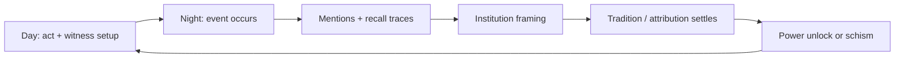

# A good place to start prototyping (the smallest slice that proves *Fantasia* is real)

If we zoom way out, *Fantasia* has two “this is either amazing or it doesn’t work” pillars:

1. **Dual-mode play** (Champion day / Pantheon night) feels coherent + fun.
2. **Belief / mentions / institutions** actually produce emergent myth + powers *without* needing constant LLM calls.

So the best starting prototype is the smallest thing that stress-tests **#2 first**, then bolts on **#1** once the substrate works.

---

## Prototype 0: “Myth Engine in a Box” (headless sim + debug UI)

### Why start here

This is your differentiator and your biggest unknown. If this feels alive, everything else becomes “just a game built on top.”

### Scope

* tiny map (even 20×20 grid is fine; hex/sphere can wait)
* 8–20 agents with:

  * needs (sleep/food/warmth/safety)
  * movement (random walk + simple goals)
  * semantic packets (no text needed at first)
  * memory activation + decay
  * facet graph (sparse frontier)
* 1–3 **event archetypes** (scripted or stochastic):

  * *winter cold snap*
  * *forest fire*
  * *lightning strike on enemy leader* (or any “rare + high impact” moment)
* 2 deities:

  * **Patron Fire**
  * **Rival Storm** (to force attribution competition)
* 1–2 institutions:

  * **Healers Guild** (non-religious service)
  * **Ember Knights** or **Temple** (explicit religious broadcaster)

### Player input (minimal)

Just three levers:

1. **Iconography weights** (what facets link to patron: fire/judgment/winter/mercy)
2. **Appoint a mouthpiece** (pick an agent to broadcast canonical bundles)
3. **Build one shrine marker** (adds environmental recall trigger for a facet)

### What you build as the “UI”

Not pretty graphics—**instrumentation**:

* list of current events + (Buzz, Tradition)
* attribution probabilities (P(deity \mid event))
* top facets currently active in:

  * the population (global)
  * a selected agent (local)
* “why did this mention occur?” trace:

  * stimulus → facets seeded → spread path → event recall → deity activation

> If you can *watch* “cold + trees → fire → patron → winter pyre event” happen in the trace, you’ve got gold.

---

## Exit criteria for Prototype 0 (the “is this working?” checklist)

You’re done when these are true **without scripting outcomes**:

* **Mentions are listener-driven**
  Same packet hits two listeners; one recalls the miracle, the other doesn’t.

* **Traditions stabilize (or schism)**

  * one narrative wins via institutions + repetition, **or**
  * it splits into two plausible variants depending on social structure

* **Player levers matter**
  If you crank “fire/judgment” iconography + shrine + preacher, patron attribution rises measurably.

* **Institutions can sacralize**
  A service org (healers) starts secular, then becomes “holy” if outcomes get framed that way.

---

## Prototype 1: “Day/Night Loop Skeleton” (minimal playable control)

Only after Prototype 0 feels alive:

### Day mode (Champion loop)

* top-down movement + LoS fog
* champion has needs → low needs reduces “direct control” (agency)
* player can place 1–2 **ghost jobs** (build campfire / gather wood)
* allies execute based on priorities

### Night mode (Pantheon loop)

* unbound camera
* edit priorities + assign mouthpiece + place shrine marker
* see the belief system shift

### The key integration test

Your **day actions** should influence:

* witness scores (who saw the miracle)
* social contact graph (who talks to who)
* evidence placement (burn scar, shrine, relic)
* institutional credibility (did the knights succeed? did the healers save lives?)

So night mode isn’t “menus”; it’s “steering a living society.”

---

## The smallest “vertical slice” scenario (recommended)

**Scenario: “The Winter Pyre”**

1. World enters a cold snap → warmth is urgent
2. Player gets wood + builds a fire pit (day)
3. Enemies approach at night
4. A rare event occurs (forest fire / lightning / panic rout)
5. Agents talk → mentions propagate
6. Institution tries to frame it (Temple/Knights)
7. Attribution settles (patron vs rival)
8. If it canonizes: unlock a tiny passive (e.g., warmth aura near shrines)

It’s compact, repeatable, and tests everything important.

---

## What I’d implement first (in order)

1. **Facet frontier + activation spread** (per-agent)
2. **Packet emission + listener association** (mentions)
3. **Buzz/Tradition ledger** (event+claim level)
4. **Institution broadcaster** (low entropy canonical bundles)
5. **Three player levers** (iconography / mouthpiece / shrine trigger)
6. Only then: Champion/Pantheon modes

---

## Pick-your-start: 2 concrete starting points

### Start A (best): headless sim + debug UI

Fastest path to answering “is this idea actually emergent?”

### Start B: tiny top-down toy + hardcoded events

Good if you need a “feel” test early, but riskier because you can fool yourself with scripted drama.

Given your design, I’d start with **A**, then bolt on **B** once the myth engine is behaving.

---

If you want, paste what language/runtime you want for the prototype loop (pure Clojure sim, or Clojure sim + minimal UI, or Clojure feeding a JS viewer), and I’ll outline the *exact* module boundaries + data shapes so you can start coding immediately.
