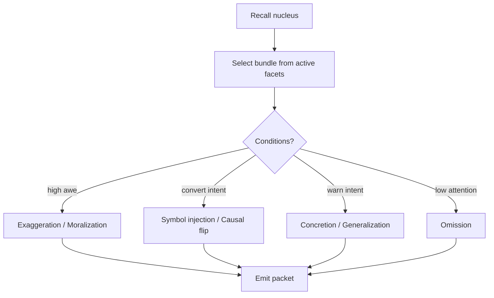

# Facet bundle selection + mutation (how myths evolve without feeling random)

You’ve already got the “packet → association → mention” chain. What’s left is the *engine that shapes the packet itself*:

* **which facets get transmitted**
* **which facets get dropped**
* **which facets get swapped/exaggerated**
* **how clergy + doctrine steer the drift**

This is where Fantasia becomes a culture simulator.

---

## 1) Speaker facet bundle selection (what gets said)

When an agent decides to communicate about a nucleus (event/claim/concept), they choose a *facet bundle* of size (N) (keep (N) small: 3–7).

### Candidate set

Candidates are:

* facets directly linked to the nucleus
* facets in the 1–2 hop neighborhood (because of co-occur/causal edges)
* a small set of *identity facets* (deity symbols, taboos, slogans) if intent is religious/political

### Scoring facets by intent

Define a facet score:

$$
Score(f) =
I(f) + E(f) + D(f) + A(f) - C(f)
$$

Where:

* (I(f)) **Intent fit**: does it help warn/boast/convert/coordinate?
* (E(f)) **Emotional charge**: awe/fear/anger facets get picked more when aroused
* (D(f)) **Doctrine bias**: clergy/text/iconography push certain facets up
* (A(f)) **Audience fit**: what this listener group tends to respond to
* (C(f)) **Cognitive cost**: complex/abstract facets are harder to transmit under stress

Then select:

* **1 anchor facet** (highly concrete: *fire*, *blood*, *river*, *commander died*)
* **1 outcome facet** (what changed)
* **0–2 affect/symbol facets** (awe, judgment, mercy)
* **optional deity/icon facet** if conversion/identity is involved

### Bundle assembly rule (keeps packets coherent)

You want bundles that “hang together.” Add a coherence bonus:

$$
Coherence({f}) = \sum_{i<j} w_{f_i,f_j}
$$

So a bundle like *(winter, cold, fire, judgment)* is favored over *(winter, fish, betrayal, geometry)*.

---

## 2) Compression: “storylets” instead of raw facets

Once the bundle is chosen, the speaker emits a packet whose `topic_vec` is computed from the bundle:

* `topic_vec = aggregate( facet_vecs + claim_vec + intent_vec + tone_vec )`

This means:

* even if you don’t generate text, the packet is still semantically meaningful
* if you *do* generate text, you generate it from the same bundle, so it stays consistent

**Important:** don’t always include explicit `facet_ids`.
Only include explicit ids when:

* the speaker is clergy / trained storyteller
* the speaker is intentionally referencing a shrine/text/icon
* the moment is high salience (battle speeches, miracles)

Otherwise, the packet is “fuzzy,” and the listener reconstructs it.

---

## 3) Partial hearing (why retellings diverge naturally)

When listener uptake is partial, don’t just drop the whole packet—drop *facets*.

### Facet survival probability

Each facet in the bundle survives reception with probability:

$$
P_{survive}(f) = \text{attention}\cdot (1-\text{noise})\cdot \text{salience}(f)
$$

Where `salience(f)` can be approximated by:

* concreteness (physical > abstract)
* emotional charge
* repetition count in the utterance (chanting helps)
* audience relevance (hungry people keep “food saved,” bored guards keep “commander died”)

Result: listeners often keep the anchor + outcome, but lose the subtle symbolic qualifiers… unless clergy reinforce them.

---

## 4) Retelling operators (telephone-game mechanics, but controllable)

When an agent later transmits the event/claim, they build a new bundle from memory. During this step, apply **mutation operators**—but *only* when conditions fit (intent, personality, arousal, doctrine, time).

### Operator set (use a small toolbox)

These operators are the “physics” of myth drift:

1. **Omission**
   Drop low-strength facets or high-cost facets.

2. **Concretion**
   Replace abstract with concrete: *“judgment” → “flames shaped like a spear”*

3. **Generalization**
   Replace specific with broad: *“enemy commander” → “their leaders”*

4. **Exaggeration**
   Scale impact facets upward under awe/boast: *“routed” → “annihilated”*

5. **Moralization**
   Add taboo/virtue link: *“we survived” → “because we were faithful”*

6. **Symbol injection** (clergy + doctrine favorite)
   Add deity/icon facet if intent is conversion and culture supports it: *“fire” + “flame sigil”*

7. **Attribution drift**
   If deity edges are weak/contested, swap the credited deity to whichever is most active in the speaker’s graph.

8. **Causal flip** (rare, but powerful)
   Turn correlation into purpose: *“storm happened” → “patron sent storm”*

You can implement this as a stochastic choice weighted by context:

---

## 5) Clergy interventions (how religion *stabilizes* drift)

Clergy are basically **low-entropy broadcasters**: they repeat canonical bundles with high fidelity.

### Clergy powers are cultural, not magical

They can:

* **standardize** which facets are always included (“never tell this story without the Flame Sigil”)
* **increase repetition** (chants, sermons) → boosts facet survival + recall thresholds
* **attach stories to places** (shrines) → environmental triggers for recall
* **publish texts** (scripture vectors) → persistent seeding in literate agents
* **denounce rival bundles** (rebuttals) → weaken competing attribution edges

### “Canonical bundle” concept

For each significant claim, clergy maintain a canonical facet set:

* `canonical_facets(claim_id) = {fire, winter, mercy, flame_sigil, answered_prayer}`

Whenever a clergy agent speaks on it:

* they emit that canonical bundle (or a close variant)
* they also reinforce facet↔deity edges in listeners

This is how you get stable religion over time.

---

## 6) Scripture vectors (your LLM-written holy texts as real mechanics)

Treat each holy text as:

* an embedding (or a set of section embeddings)
* a set of canonical facet anchors
* a distribution of “preferred interpretations”

When an agent reads (or hears quoted) scripture:

* it seeds activation on those facets + deity nodes
* it strengthens edges among them

So your earlier idea becomes concrete:

* if scripture emphasizes storms/lightning/sky, the population’s graphs develop strong paths from those facets to your patron
* later, a lightning event will “snap” to your attribution attractor

---

## 7) Example: winter forest fire miracle drifting through society

### Ground truth (sim event facets)

* physical: winter, cold, trees, fire, smoke
* outcome: enemy rout, no casualties
* affect: awe, judgment

### Priest’s canonical bundle (doctrine wants patron credit)

* fire, winter, judgment, flame_sigil, answered_prayer, enemy_rout

### Soldier retelling (boast intent + awe)

* enemy_rout, no_casualties, fire, “the flames chased them”
  (moralization maybe: “we were chosen”)

### Farmer retelling (relief intent)

* winter, fire, “saved the stores”, “kept the raiders away”
  (less commander focus)

Over time:

* if clergy infrastructure is strong, everyone’s bundles converge toward priest’s
* if it’s weak, the miracle fragments into local variants (still “about the same event,” but not the same claim)

---

## 8) Gameplay levers the player can pull (pantheon mode tools that affect drift)

This is where your god-game gets *teeth*:

### Stabilize a narrative (make a miracle become a power)

* build shrine at the site (adds environmental triggers)
* appoint storytellers/priests (low-entropy broadcasters)
* commission text / distribute copies (scripture seeding)
* host festival (synchronized high-mention window)
* create icon (flame sigil) and propagate it (symbol injection becomes easy)

### Compete / sabotage rival narratives

* sponsor skeptics (increase rebuttal pressure)
* encourage syncretism (merge attributions into your pantheon)
* seed doubt about rivals (attack their clergy trust graph)
* censor (works short-term but increases backlash/dread)

These actions don’t “flip a boolean.” They change *edge weights and mention flows*.

---

## 9) Implementation constraint that keeps this sane

**Keep bundle sizes tiny and graphs sparse in the active frontier.**

* Bundle: 3–7 facets
* Active frontier per agent: top 64–256 nodes
* Canonical bundles per claim: 6–12 facets max
* Mutation operators: small set, context-weighted

This preserves emergence while keeping compute bounded.

---

## Next continuation (most useful next chunk)

Next is the **“clergy + institution simulation”** layer:

* how priests gain reputation (medicine, leadership, literacy)
* how institutions form (orders, sects, schisms)
* how factions weaponize myth (propaganda vs sincere belief)
* how this plugs into your **pantheon vision network** (aligned LoS expands via cultural alignment)

I can write that as the next piece, including a “sect formation” state machine and how new gods appear vs cult splits.
