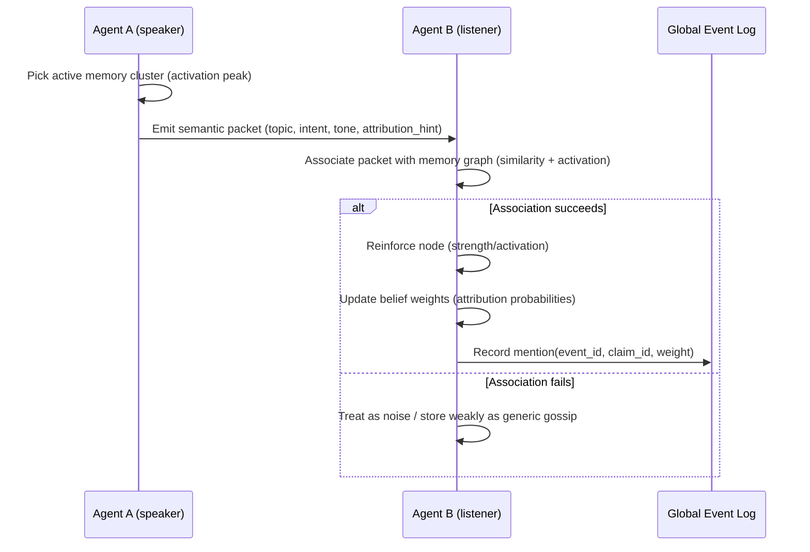

# Mentions as a living “belief network” (ant-colony vibes, but computable)

What you’re describing is *excellent* because it makes miracles and culture emerge from **local interactions + memory activation**, not from an authorial “storyteller.”

The trick is making “agents are talking all the time” **simulateable** without needing to LLM every bump.

Below is a design that preserves your intent:

* **agents constantly exchange *meaning***
* **mentions are only counted when the listener actually associates**
* **reputation shapes adoption**
* **memory fades unless reactivated**
* **knowledge graphs drift + diverge per agent**

---

## 1) Represent the world as “events” + “concepts” + “claims”

### Event record (global, objective-ish)

An *Event* exists because the sim says it happened.

* `event_id`
* `time`, `place`, `actors`
* `features` (tags + embedding): storm, blood, omen, harvest, etc.
* `impact` (outcome delta)
* `witnesses` (agent_ids)
* `evidence` (optional): scars, debris, corpse, shrine built later

### Claim record (social, subjective)

A *Claim* is “what people think the event means.”

* `event_id`
* `deity_id` (or “none” / “unknown”)
* `narrative` (short summary)
* `confidence` (speaker’s)
* `meme_vector` (embedding of narrative + symbolism)
* `origin_agent_id` / origin group

### Concept nodes (agent-local)

Each agent has a changing concept graph:

* deity symbols
* personal values
* traumatic memories
* local myths
* grudges, loyalties, taboos

This graph is what makes attribution *different* between agents.

---

## 2) Memory as activation + decay (your “timeline” idea, formalized)

Each agent maintains memory items like:

* `node_id` (event, claim, concept)
* `strength` (how “burned in” it is)
* `activation` (currently “on their mind”)
* `last_recalled`
* `source_trust` (who convinced them)
* `emotional_charge` (fear/awe/relief)
* `links`: to related concepts + symbols

### Forgetting / fading

You can model fading as:

* **strength decays slowly**
* **activation decays quickly**
* recalling/mentioning bumps both

Intuition:

* strength = “I’ll remember this next season”
* activation = “I’m thinking about this right now”

### Spreading activation (triggers)

Stimuli (seeing a shrine, hearing “lightning”, smelling smoke) inject activation into related nodes, then it spreads across graph edges.

That gives you:

* “why did they think about it?”
* “why didn’t the listener connect it?”

because they literally didn’t get enough activation on that cluster.

---

## 3) What counts as a “mention” (listener-driven association rule)

You already nailed the rule:

> If the listener can’t associate the stimulus with the event, it isn’t a mention.

So implement mentions as **(stimulus → association → reinforcement)**.

### Communication becomes “semantic packets”

When two agents bump / pass / chat, don’t always generate full dialogue.

Instead generate a small packet:

* `topic_vector` (embedding)
* `intent` (warn/boast/pray/gossip/request)
* `emotional_tone` (fear, awe, anger)
* `salience` (how strongly speaker cares)
* `attribution_hint` (optional: which deity they imply)

Only sometimes (near player / important agents / high salience) do you expand it into natural language.

### Listener association test

Listener receives `topic_vector` and tries to match it to their memory graph.

A simple rule:

* find top-k memory nodes by similarity + activation
* if best match exceeds threshold → it becomes a mention of that node
* otherwise: it’s just noise / unparsed chatter

This is the “ant colony pheromone” feeling, but semantic.

---

## 4) Reputation: “taken seriously” as a trust multiplier

Reputation shouldn’t just amplify volume; it should change **belief updating**.

Each agent keeps trust weights per speaker (or per social role/group):

* `trust(speaker)`
* `prestige(speaker)`
* `affinity(speaker)` (same faction, same cult, same crew)

When receiving a claim:

* higher trust increases chance they **store it**
* higher prestige increases chance they **repeat it**
* higher affinity increases chance they **attribute it the same way**

So the social loop becomes real:

* a respected veteran’s “I saw it” spreads farther than a nobody’s
* a famous priest anchors attribution to a particular god

---

## 5) Soap box yelling: make it a broadcast node with falloff

A “soap box” is basically:

* a **broadcast source** with range + audience size
* plus a “crowd memory resonance” effect

Mechanics:

* Speaker emits packets periodically
* Nearby listeners get packets based on attention + distance + noise
* Listeners who accept it become **secondary broadcasters** (“did you hear what X said?”)

This is how you get *town myths* without scripting.

---

## 6) Linking it back to miracles: Verification + Attribution become emergent

### Verification (consensus)

In your system, verification is just:

* the event stays activated across enough people
* the claim persists despite counter-narratives
* trusted nodes (clergy, respected witnesses) reinforce it over time

So your “tiers based on mentions” becomes:

* **tier based on sustained network activation + repetition**, not raw count

### Attribution (which deity gets credit)

Attribution is whichever claim becomes the **dominant attractor** in the network.

This is where your iconography vectors matter:

* if your patron’s symbol cluster is already strong in the populace,
  “lightning commander” snaps into that attractor easily
* if not, a rival god steals it, or a new god spawns

### The cool emergent failure case

If you *cause* a miracle but your culture has no symbolic handle for it,
it may become:

* “weird anomaly”
* “rival god flex”
* “new god”
* “science / coincidence”
  …depending on your society’s structure.

That’s exactly the kind of causally-tied narrative you want.

---

## 7) Knowledge graphs “always changing” (and why people remember differently)

Two mechanics make this feel alive:

### A) Reconstructive recall (memory drift)

Every time an agent recalls an event, they re-store a **compressed** version influenced by:

* current needs
* current fear/awe
* current doctrine
* who they’ve been listening to lately

Over time:

* the “same” event becomes a different internal object in different minds

This is how myths mutate naturally.

### B) Competing explanations as graph branches

Instead of overwriting, let agents store multiple claim nodes for the same event:

* “Storm god did it”
* “Commander was cursed”
* “Lucky coincidence”
  And whichever gets repeated gains strength.

That gives you internal doubt, heresy, schisms, etc. *for free.*

---

## 8) The performance reality: “always talking” without infinite LLM calls

To keep the vibe while staying sane, use **fidelity tiers**:

### Tier 0 — offscreen murmur (cheap)

* packets only (topic vectors + intent + tone)
* updates activation/strength/trust
* no generated text

### Tier 1 — near player / important moments

* generate short lines occasionally
* or generate one line that represents a *cluster* of similar packets

### Tier 2 — spotlight scenes (rare)

* full multi-turn dialogue
* inner-thought narration
* used for: miracles, betrayals, vows, leadership speeches

This preserves your “agents are constantly communicating” thesis **without** making your sim a language-model benchmark.

---

## 9) A simple interaction loop (bump-to-bump)

---

## 10) Design knobs you’ll want exposed (so you can tune the feel)

* **Association threshold**: how “literal” people are
* **Memory decay rates**: how quickly culture moves on
* **Prestige weight**: how hierarchical the society is
* **Noise / crowding**: how much chatter becomes incoherent
* **Doctrine rigidity**: how much clergy can force attribution
* **Syncretism**: how often new gods/merged myths occur
* **Trauma bias**: fear makes people fixate + spread faster

---

## One sharp follow-up (that unlocks implementation decisions)

When an agent “talks,” do you want them primarily to transmit:

1. **facts** (“it happened, here, like this”), or
2. **interpretations** (“this means our god is with us”), or
3. a mix, depending on personality + role?

If you answer that, the whole mention/claim pipeline becomes much easier to lock—because it determines whether *claims* are first-class objects from the start, or an emergent layer built later from factual gossip.

#game-design #fantasia #agents #knowledge-graph #miracles #simulation
