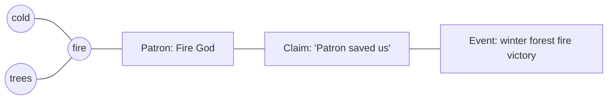

You’ve basically described a **semantic activation network** where *embeddings are the “content space”* and the **knowledge graph is the “experience space.”** Mentions happen when a packet *causes recall* of an event/claim/deity cluster in the listener.

Below is a spec-y way to lock that in.

---

# 1) The core object: a “semantic packet”

When an agent “talks,” it emits a packet with 3 layers:

* **Intent**: why they’re transmitting (warn, boast, recruit, soothe, pray, accuse…)
* **Literal content**: the words (optional at low fidelity)
* **Associative payload**: what matters for contagion (embedding + tone + salience)

**Packet fields**

* `topic_vec` — embedding of the utterance (or of its concept bundle)
* `tone` — arousal/valence/fear/urgency/etc.
* `salience` — how important the speaker feels it is (0..1)
* `attribution_hint` — optional (which deity they imply)
* `speaker_reputation` — how seriously others treat it
* `anchors` — optional explicit node IDs (if speaker is deliberately referencing something)

> Most of your sim can run on `topic_vec + tone + salience + reputation` without generating text every time.

---

# 2) Agent memory + knowledge graph as an activation system

Each agent has a **local graph** of nodes and edges:

## Node types

* **Concept nodes**: “cold”, “fire”, “trees”, “winter”, “shelter”
* **Event nodes**: “winter forest fire that saved us”
* **Claim nodes**: “this was *the Fire Patron’s* judgment”
* **Deity nodes**: “Patron: Fire”
* **Person nodes**: leaders, priests, enemy commander
* **Ritual/Icon nodes**: symbols, rites, chants, relics

## Node state

Each node carries:

* **embedding** (\vec{v_i}) (content similarity)
* **activation** (a_i \in [0,1]) (what’s “on mind” *now*)
* **strength** (s_i \in [0,1]) (how durable the memory is)
* **valence** (u_i \in [-1,1]) (positive/negative association)
* **last_recalled** (t_i)
* **source_trust** (who taught them this)

## Edge types (weights (w_{ij}))

* **co-occur**: cold ↔ fire (practical pairing)
* **causal**: fire → warmth, drought → hunger
* **symbolic**: fire ↔ patron deity
* **attribution**: event ↔ deity (this is the “miracle credit” edge)
* **social**: speaker ↔ claim (credibility path)
* **ritual**: deity ↔ rite ↔ community

---

# 3) The key mechanic: association is “embedding seed + graph spread + state bias”

When the listener receives a packet, do **three steps**:

## Step A — seed nodes via embedding similarity

Pick top-K nodes by similarity:

$$
seed(i) = \cos(\vec{topic}, \vec{v_i})
$$

Take the best K nodes as the initial active set.

## Step B — spread activation along experience edges

This is where “cold” can wake up “fire” even if their embeddings differ.

A simple spread rule:

$$
a_i \leftarrow \text{clamp}\Big(\lambda a_i + input_i + \sum_{j \in \mathcal{A}} (a_j \cdot w_{ji}),, 0,, 1\Big)
$$

* (\lambda): decay (close to 1 per short tick)
* (\mathcal{A}): the currently active set (keep sparse!)
* the sum is **graph proximity doing the work**

## Step C — bias everything by needs + mood + context (your “inner state”)

Represent the agent’s current state as a small vector (not huge):

* needs: hunger, thirst, sleep, safety
* environment: cold, darkness, crowding
* emotions: fear, awe, anger, hope

Each node has affinities to these axes.

Then:

$$
input_i = \alpha \cdot seed(i) + \beta \cdot (m \cdot f_i) + \gamma \cdot \text{recencyBoost}(i) + \delta \cdot \text{speakerTrust}
$$

So if they’re freezing, “cold” nodes get a boost, which then spreads to “fire”, which spreads to “patron fire god”, which spreads to “winter fire miracle”.

That’s exactly your desired phenomenon.

---

# 4) What counts as a “mention” (listener-driven, precise)

A “mention of event (e)” happens **only if the packet causes recall** of (e).

You can define recall as:

* activation crosses a threshold **and**
* activation increased because of this packet (not just already thinking about it)

$$
\text{Mention}(e)=\big(a_e > \theta_{recall}\big)\ \land\ \big(\Delta a_e > \theta_{mention}\big)
$$

Optionally require positive recall (your “recalled in a positive way”):

$$
u_e > 0
$$

And your “if they don’t associate, it isn’t a mention” rule is enforced because if the event node never becomes active, it’s not counted.

### Mention weight (for your miracle significance counters)

Mentions should be weighted, not raw counts:

$$
w_{mention} = \Delta a_e \cdot \text{reputation}(speaker) \cdot \text{attention}(listener) \cdot \text{confidence}(listener)
$$

This bakes in “respected agents matter more.”

---

# 5) How “cold” and “fire” get close in the graph (even if vectors differ)

Your mechanism is basically Hebbian learning: “nodes that activate together wire together.”

Whenever nodes (i) and (j) co-activate:

$$
w_{ij} \leftarrow (1-\eta)w_{ij} + \eta \cdot (a_i a_j)
$$

So:

* winter → cold activates
* cold → fire activates (because you make fire)
* over time the cold↔fire edge strengthens
* later, hearing “cold” often pulls “fire” into mind

This is *experience* overriding embedding distance.

---

# 6) Miracle attribution becomes an attractor in the graph

You want: if patron is fire god, then “winter forest fire victory” becomes tied to that deity and later stimuli re-trigger it.

That’s an **attribution edge** between:

* event node (E)
* deity node (G)
* claim node (C) (“Fire Patron saved us”)

### Strengthening attribution (verification/canonization as reinforcement)

When a mention occurs and the agent leans toward a deity, reinforce that edge:

$$
w_{E,G} \leftarrow w_{E,G} + \eta \cdot w_{mention}
$$

If they lean toward a rival narrative, reinforce a competing edge instead.

Over time, the social network converges (or fractures) around dominant attribution edges.

---

# 7) Walkthrough of your exact example (cold + trees → fire → god → event)

**Stimulus:** listener encounters cold + trees

* seeds: Cold, Trees
* state bias: freezing boosts Cold activation
* graph spread: Cold → Fire (learned co-occur edge)
* Fire → Patron (symbolic edge)
* Patron → Claim → Event (attribution chain)

If that packet causes (a_{Event}) to jump enough: ✅ **mention recorded**

If not (graph weaker, or listener distrusts speaker, or listener has rival god edges): ❌ not a mention

---

# 8) “Agents talk all the time” without melting the CPU

Keep the *semantics always-on* but generate *text rarely*.

### Three-fidelity model

* **F0 (background):** packets only, no text
* **F1 (near player / high salience):** short generated utterance occasionally
* **F2 (spotlight):** full dialogue + inner monologue, rare and expensive

This keeps your world alive *and* lets important miracle moments get authored-feeling dialogue.

---

# 9) The one thing to lock next: node granularity

To make this work smoothly, decide how “atomic” nodes are:

* Do you store one node for **the whole event** (“winter fire victory”), or
* do you also store **facets** (“fire”, “winter”, “enemy commander died”, “no casualties”) as sub-nodes?

My strong recommendation:

* **event node + facet nodes**
* facets make association far more natural and reduce “all-or-nothing recall” behavior.

---

If you want, I can propose a minimal schema for:

* `AgentGraph` storage (sparse active set, decay, hebbian updates)
* `MentionLedger` (how you count significance + tradition)
* `AttributionCompetition` (how rival claims tug edges over time)

#game-design #fantasia #agents #knowledge-graph #miracles #simulation
