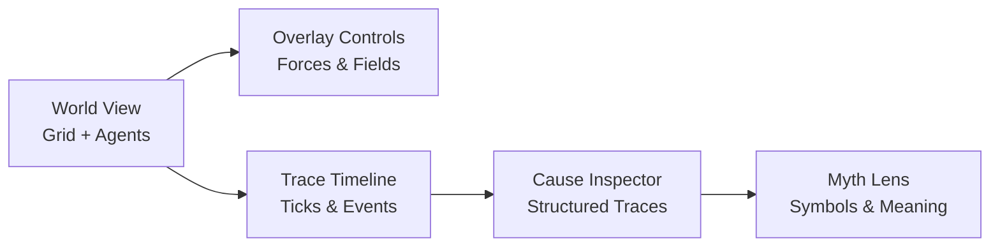

Got it. I’ll treat this as a **design synthesis + next-step proposal**, grounded in what the debugger UI already shows.

---

## What you already have (implicit design intent)

From the screenshot, the system is already expressing a few *strong* ideas:

### 1. **The world is legible**

* Agents live on a grid
* Forces (fire, cold, density, judgment) are numeric and inspectable
* Nothing is “magic”; everything leaves a trace

This is excellent. You’re already halfway to a *scientific instrument*, not just a game UI.

### 2. **Time is first-class**

* Tick slider
* Replay / pause / step
* Traces per tick

This implicitly says:

> “Reality is a sequence of evaluated causes.”

That’s a very solid Fantasia core principle.

### 3. **Judgment is observable**

You’re already surfacing:

* packet witnesses
* spread
* per-element attribution
* final flame score

That’s huge. Most systems hide this.

---

## Design direction: turn this into a **Myth Microscope**

Right now the UI is *dense but honest*. The goal isn’t to simplify — it’s to **layer meaning**.

I’d formalize the UI into **four conceptual planes**.

---

## Plane 1 — World (what exists)

**Already present:**

* Grid
* Agents
* Selection

**Refinements**

* Add *semantic overlays* (toggleable):

  * 🔥 fire influence
  * ❄️ cold influence
  * ⚖️ judgment pressure
  * 🌫 density / crowding
* Heatmaps should be *derived*, not decorative

**Rule of thumb**

> Every pixel must correspond to a value in the trace.

---

## Plane 2 — Causality (why it happened)

This is your strongest differentiator.

### Current state

* Traces are textual, raw, correct

### Proposed evolution

Introduce **causal blocks** per tick:

```
Tick 266
├─ Inputs
│  ├─ Nearby fire sources (3)
│  ├─ Density pressure
│  └─ Cold suppression
├─ Interactions
│  ├─ Fire × Judgment → Amplification
│  └─ Cold × Fire → Dampening
└─ Outcome
   └─ winter-prey: ignited (0.653)
```

Still textual. Still inspectable. Just *structured*.

---

## Plane 3 — Myth (what it means)

This is where Fantasia becomes *Fantasia* instead of “cool sim”.

### Myth tokens

You already have them implicitly:

* `winter-prey`
* `judgment-flame`
* `witness`
* `spread`

Make them explicit **symbols**, not just strings.

Example:

| Symbol      | Meaning               | Mechanical Role       |
| ----------- | --------------------- | --------------------- |
| ❄️ Winter   | Preservation, inertia | Dampens fire          |
| 🔥 Flame    | Change, revelation    | Spreads               |
| ⚖️ Judgment | Alignment pressure    | Amplifies or condemns |
| 👁 Witness  | Awareness             | Enables propagation   |

This gives you:

* Lore
* Teachability
* Consistency

Without hardcoding narrative.

---

## Plane 4 — Introspection (what the system believes)

This is the **Myth Debugger’s final form**.

### Add a “Why I think this happened” panel

Generated *from the same data*, not LLM fluff.

Example:

> “I judged this ignition as justified because three aligned witnesses reinforced flame beyond cold suppression.”

This should be:

* Deterministic
* Reproducible
* Loggable

Later, *then* you can let narrative agents reinterpret it.

---

## UI layout evolution (proposed)



---

## What I would design next (concrete steps)

### 1. **Normalize trace structure**

Before UI polish:

* Convert traces into a typed map / EDN schema
* Stop relying on raw strings for meaning

### 2. **Introduce field overlays**

Even crude ones.
Seeing force fields will unlock intuition fast.

### 3. **Symbol glossary panel**

Static at first.
This anchors myth without narration.

### 4. **One “belief sentence” per tick**

Purely derived.
No creativity yet.

---

## Important constraint (and you’re already honoring it)

Do **not**:

* Anthropomorphize prematurely
* Hide uncertainty
* Smooth over conflicting causes

Fantasia should feel like:

> watching a god reason in slow motion
> and realizing it isn’t always sure either

---

If you want, next we can:

* design the **trace schema**
* design **myth symbol rules**
* or sketch a **clean v2 layout** (no new features, just clarity)

Just tell me which layer you want to solidify first.
