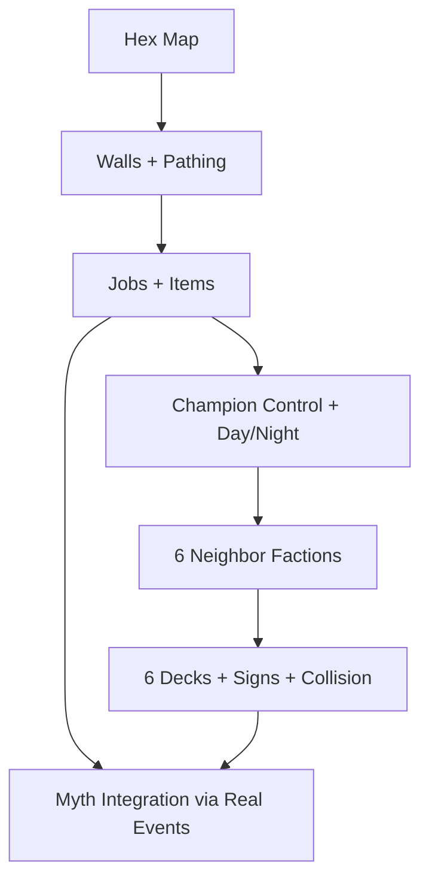

What we keep vs replace (review) #architecture
----------------------------------------------

### Keep (it’s valuable)

*   `tick-once` spine and WS broadcast model (server is simple and good)

*   `facets.clj`, `events.clj`, `myth.clj` as the **narrative metabolism**

*   “institution broadcast” concept (later becomes temples/courts/etc)


### Replace / evolve

*   Square grid (`:size [20 20]`, `neighbors`, `manhattan`) → **hex axial**

*   `:trees` as a set → unify into `:tiles` with `:resource/:structure`

*   `gen-event` (world magic bolt) → becomes **event candidates** produced by factions/cards/world state
    _We can keep a “weather/titan” layer later, but not as the primary drama source._


* * *

North Star MVP (definition of done)
-----------------------------------

A playable loop where you can:

*   See a **hex map**, place **wall ghosts**, and watch pawns **path around** walls.

*   Directly control a **champion during Day**.

*   Put champion to **sleep** → enter **Night** → deities (including 6 neighbors) **play cards**.

*   6 neighbor factions exist (one per hex direction), each with a **deck**.


_(You’ll probably also have a 7th deck: yours. But your requirement “6 decks” maps cleanly to the 6 neighbors.)_

* * *

Epic dependency graph (high-level) #epic
----------------------------------------



* * *

Milestones → Sprints (vertical slice first)
===========================================

Sprint 1 — Hex map backbone + renderer #sprint
----------------------------------------------

**Goal:** Make the map real (axial coords everywhere, UI draws hexes).

**Backend deliverables**

*   New namespace: `fantasia.sim.hex`

    *   axial `dirs`, `neighbors`, `distance`, `in-radius?` (start with radius disk)

*   World schema shift:

    *   `:size` → `:map {:kind :hex :layout :pointy :bounds {:shape :radius :r 18}}`

    *   agent `:pos [x y]` → `:pos [q r]`

    *   introduce sparse `:tiles { [q r] {:terrain :ground :resource :tree} ... }`

*   Snapshot includes:

    *   `:map`, plus `:tiles` as **position lists** at first (`:trees`, `:walls`, `:shrine`)


**Frontend deliverables**

*   `web/src/hex.ts` utilities:

    *   axial→pixel, pixel→axial (cube round), hex polygon points

*   Canvas renders:

    *   hexes in radius, trees, shrine, agents

*   Clicking selects hex + agent


**Acceptance test**

*   You can click a hex, “Place shrine”, see it on the hex grid, and agents move on hex neighbors.


* * *

Sprint 2 — Walls + passability + “ghost build” #sprint
------------------------------------------------------

**Goal:** First RimWorld-feel: build walls, watch pathing respond.

**Backend**

*   Tile structure: `:structure :wall` blocks movement

*   WS op: `place_wall_ghost` `{pos [q r]}`

*   Job: `:job/build-wall` converts ghost → wall

*   Pathing: start with BFS “next step toward target”; upgrade to A\* later


**Frontend**

*   Build tool: click to place wall ghost

*   Render ghost vs built wall differently


**Acceptance test**

*   Build a small enclosure and pawns route around it.


* * *

Sprint 3 — Colony core loop (jobs/items/needs) #sprint
------------------------------------------------------

**Goal:** Colony behaves without you micromanaging every tick.

**Backend**

*   Item stacks: `:items {pos {resource qty}}`

*   Jobs queue + reservations:

    *   `:chop-tree` → produces `wood`

    *   `:haul` → moves items to stockpile

    *   `:eat`, `:sleep`

*   Basic stockpile zone


**Frontend**

*   Inspect pawn: current job, needs

*   Inspect tile: items, structure/resource

*   Simple log panel: “pawn started job X”


**Acceptance test**

*   Colony can gather wood and keep itself alive while you build walls.


* * *

Sprint 4 — Champion control + Day/Night gate (Aker loop) #sprint
----------------------------------------------------------------

**Goal:** Player agency in day; deity agency in night (only when champion sleeps).

**Backend**

*   Define champion (either a special agent role or separate entity):

    *   `:champion/id` and `:champion/asleep?`

    *   `:world/phase :day|:night`

*   WS ops:

    *   `champion_move` / `champion_action`

    *   `champion_sleep` / `champion_wake`

*   Rule: Night abilities only tick when `:champion/asleep? true`


**Frontend**

*   Champion selection + move controls (click-to-move is enough)

*   Sleep button (and wake)

*   Day/Night indicator + transition panel


**Acceptance test**

*   You can walk the champion, then sleep to trigger Night behavior.


* * *

Sprint 5 — 6 neighbor factions (ring settlements) #sprint
---------------------------------------------------------

**Goal:** World becomes political: 6 neighbors, each with territory + behavior.

**Backend**

*   Place settlements:

    *   player at center

    *   6 neighbors at ring distance `D` in each hex direction

*   Each faction has:

    *   `:faction/id`

    *   `:faction/settlement-pos`

    *   `:faction/attitude` toward player

    *   basic intents: scout, trade caravan, probe raid


**Frontend**

*   Draw settlement markers

*   Simple “intel” log: scouts seen, caravan spotted, etc.


**Acceptance test**

*   Neighbors exist and generate observable activity (even if crude).


* * *

Sprint 6 — 6 decks of cards + signs + collisions #sprint
--------------------------------------------------------

**Goal:** Powers become the driver of conflict, but remain causal + telegraphed.

**Backend**

*   Card engine:

    *   deck/hand/discard per faction

    *   play policy (AI): pick 0–1 card per boundary

*   Collision resolution by primary keys:

    *   winner applies full effect

    *   runner-up becomes “complication” (smaller sideways effect)

*   Card effects **do not spawn raids directly**:

    *   they emit `:signs` + apply `:modifiers`

    *   modifiers generate `:event-candidates`

*   Event families (start with 3):

    *   `:ultimatum-raid-feud`

    *   `:trial-verdict`

    *   `:trade-scarcity-blackmarket`


**Frontend**

*   Night panel shows:

    *   your hand (if you also have a deck)

    *   signs feed (telegraphs)

    *   event chain viewer (telegraph → escalation → resolution)


**Acceptance test**

*   When champion sleeps, at least one neighbor plays a card and you see signs before the event resolves.


* * *

Concrete “6 decks” structure (minimal but scalable) #cards #decks
=================================================================

### Card schema (EDN map)

*   `:card/id`

*   `:card/phase` `:day|:night|:always`

*   `:card/cost` `{:favor n :cred n :attention n}`

*   `:card/keys` `{:primary [...] :secondary [...]}` (collision grouping uses primary)

*   `:card/tags` (for recency/samey suppression)

*   `:card/effect` (returns signs + modifiers)


### Minimal deck contents per neighbor (starter 8 cards)

*   2× **scouting/info** (Herald-ish)

*   2× **law/order** (Sun-ish)

*   2× **shadow/sabotage** (Moon-ish)

*   1× **relief/aid** (only when damaged)

*   1× **wild consequence** (only when taboo triggered)


That gives you identity without needing 40 cards.

* * *

How this plugs into your existing myth engine #myth
===================================================

Right now, myth is fed by:

*   talk packets

*   institution broadcasts

*   synthetic `gen-event`


In the MVP, myth should be fed by **world events**:

*   “wall built”

*   “trade caravan arrived”

*   “ultimatum issued”

*   “raid occurred”

*   “trial held”

*   “animals vanished”


### Add one bridge: `:world/event-bus`

Each tick appends structured events (maps) to an event list. Then:

*   myth consumes events into mentions/claims

*   cards can bias belief by manipulating info channels (signs/rumors), not by conjuring outcomes


This is the key to “many storytellers competing for the narrative.”

* * *

First sprint backlog (board-ready checklist) #sprint #todo
==========================================================

Sprint 1 tasks (HexMap)
-----------------------

*    Create `backend/src/fantasia/sim/hex.clj` (axial dirs, neighbors, distance, in-radius?)

*    Convert `initial-world`:

    *    add `:map` (radius bounds)

    *    agent positions become axial

    *    create sparse `:tiles` and migrate `:trees` into it

*    Update movement + proximity checks:

    *    `neighbors` uses hex dirs

    *    `near-shrine?` uses hex distance

*    Extend `snapshot` to include:

    *    `:map`

    *    `:tiles` as `{ :trees [[q r] ...] :walls [] :shrine [q r] }`

*    Frontend:

    *    add `web/src/hex.ts`

    *    rewrite canvas renderer to draw hexes + markers + agents

    *    implement click→axial selection

*    Smoke test:

    *    place shrine works on hex grid


* * *

A tiny Clojure-ish skeleton for the deck/night loop (so Sprint 6 doesn’t surprise you)
======================================================================================

```clojure
(defn aker-boundary? [world] ; optional
  true)

(defn play-night-phase! [world]
  (if (and (= (:world/phase world) :night) (get-in world [:champion :asleep?]))
    (let [plays (mapcat (fn [[fid faction]]
                          (when-let [card (ai/pick-card world fid)]
                            [{:faction fid :card card}]))
                        (:factions world))
          resolved (cards/resolve-collisions world plays)
          world' (reduce cards/apply-play world resolved)]
      world')
    world))
```

* * *

What I’d do _next_ if you keep saying “continue”
------------------------------------------------

1.  Write the **exact world schema** you can paste into `docs/notes/world-schema.md` (#obsidian friendly)

2.  Draft the **6 starter decks** as EDN (8 cards each) using the “phase + keys + signs + modifiers” model

3.  Outline the **three initial event families** as parameterized generators (ultimatum/trial/trade), matching your current myth vocabulary


Just say “continue” and I’ll generate those artifacts.
