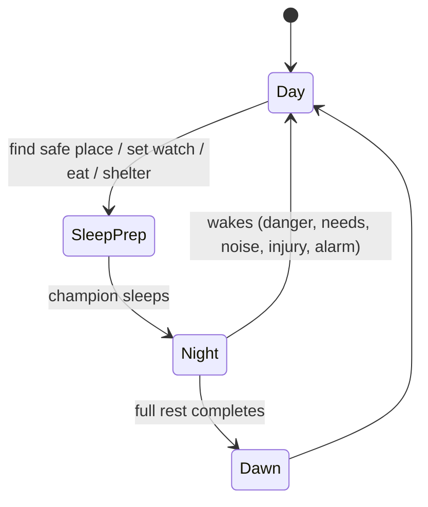

# Fantasia — design pass (turning the vibe into a runnable loop)

## 1) The fantasy you’re selling

You’re not “a god *or* a pawn” — you’re **both**, but *at different scales* and with hard constraints:

* **Day = embodied leadership**
  *Limited perception, physical risk, precise action.*
  You’re the champion making things happen with your own hands/feet/voice.

* **Night = mythic governance**
  *Wide perception (bounded by faith/LOS), soft power, planning, doctrine.*
  You’re the patron deity shaping incentives and probabilities, not puppeteering.

That split is your signature. Everything else should reinforce it.

---

## 2) Core loop: what the player does minute-to-minute

### Day loop (embodied)

* Explore / fight / build / repair as the champion
* Resolve local crises the colony AI can’t handle alone
* Establish comms + logistics so orders can propagate while you’re “blind”
* Set up **sleep windows** (safe beds, guards, alarms) to earn night-time

### Night loop (divine)

* Review intel (what aligned LOS reveals + reports)
* Issue *doctrines/edicts* (policy, priorities, roles, production goals)
* Spend divine resources on **influence** (buffs, visions, omens, miracles)
* Queue construction / assignments / long projects
* React to threats with *indirect* tools (warnings, courage, panic, fog, luck)

### The hard transition rule

Night mode exists only while the champion remains asleep. Anything that wakes them snaps you back into day.

This creates a delicious tension: **build a world stable enough that you’re allowed to be omniscient.**

#### State machine (so it’s crisp)

---

## 3) Fog of war that actually matters (and doesn’t annoy)

You have two overlapping fog systems:

### A) Champion fog (day)

* You only see what the champion can see.
* Orders must be communicated through **channels** (shouts, runners, radio, magic, drums, signal towers, etc.)
* “Colony view” is not free. You’re *not RimWorld camera* in the day.

### B) Faith/Alignment fog (night)

* At night, you see **everything your aligned characters can see** (union of LOS + their reports).
* Misaligned/hostile factions are foggy unless you infiltrate/convert.
* Certain divine powers temporarily pierce fog *but leave traces* (risk of divine escalation).

This makes recon, scouting, conversion, and comms into real gameplay systems—not UI toggles.

---

## 4) Agents: keep the LLM where it adds magic (not where it breaks the sim)

### Recommended architecture (3 layers)

1. **Hard sim layer** (deterministic-ish): needs, inventory, pathing, construction, combat primitives
2. **Planner layer** (cheap + reliable): GOAP/utility scoring for tasks, role selection, schedules
3. **Narration layer** (LLM): inner thoughts, conversations, interpretations, lore consistency

**Key rule:** the LLM should *explain* and *color* decisions more than it *makes* them.
If the LLM is the decision-maker, you’ll fight cost, latency, non-repro bugs, and “why did you do that??” moments.

### Player control over agents = “priorities as fields”

Instead of direct orders everywhere, you broadcast:

* colony priorities (food > shelter > defense)
* role emphasis (miners +2, scouts +1)
* risk posture (cautious vs bold)
* doctrine constraints (no theft, honor duels, protect children, etc.)

Agents then act “like people,” and their *thoughts* rationalize it.

---

## 5) Communication as gameplay (the glue between day and night)

If you want causal storytelling, comms must be physical/social:

* **Channel types**

  * Local voice (LOS + distance)
  * Messengers (requires travel time + safety)
  * Signal networks (towers/drums/flags)
  * Tech networks (wires/radio)
  * Magic networks (cost, rare, deity-flavored)

* **Failure modes**

  * messages delayed, intercepted, misunderstood
  * morale impacts (bad news vs inspiring speeches)
  * rumor propagation as a system (truth decays with hops)

This supports your “raids happen because someone planned it” goal: *plans spread through social channels.*

---

## 6) Pantheons: divine power that isn’t just “god-mode RTS”

Give the gods an economy and constraints so night mode is a *strategic layer*:

### Divine resource model (simple but rich)

* **Faith**: generated by aligned characters performing rites / surviving / building temples / telling stories
* **Favor**: short-term spending currency (regen daily or via rituals)
* **Wrath/Attention**: escalation meter; heavy miracles raise world response (other gods, factions, nature)

### Power tiers (matches your Patron/Major/Lesser idea)

* **Lesser**: subtle nudges (luck, minor buffs, mood shifts, whispers)
* **Major**: weather bends, visions, temporary wards, “miracle builds”
* **Patron**: covenant-level changes (new laws of nature *locally*, resurrection, plagues) — expensive, world reacts

### Important limiter

Divine actions should rarely be “click unit to move.”
They should be:

* **environmental** (wind, fog, fertility, rot)
* **psychological** (courage, despair, obsession)
* **informational** (visions, false omens, reveal/obscure)
* **covenantal** (edicts, taboos, vows)

That keeps day mode meaningful.

---

## 7) The spherical hex world + “tiles are instances” (make it coherent)

Your “tile instances fast-forward” idea is strong, but it needs rules so it stays believable.

### Three simulation fidelities (LOD for time + distance)

* **Loaded tile (high fidelity):** full physics, AI, combat, production
* **Adjacent tiles (medium):** aggregated agents, simplified combat, resource flows, scheduled events
* **Far tiles (low):** state machines + “pressure” variables (population, hunger, hostility, weather trend)

When you enter a tile:

1. generate base from seed (only once)
2. apply persisted state deltas
3. fast-forward with the *LOD model* based on how long it was unloaded
4. produce a consistent outcome + a “history log” (for storytelling + LLM narration)

### World geometry note (practical)

A pure hex sphere is tricky (you need a few non-hex cells or a projection trick). You can:

* use an icosahedron subdivision (mostly hexes + 12 pentagons), or
* accept “seams” and make them lore (leyline boundaries)

Either is fine as long as it’s intentional.

---

## 8) Making RimWorld-style drama without dice-events

Your example (“raid because an agent planned it”) suggests an **intent-driven threat model**.

### Threats come from agents, not from the sky

* nearby factions have goals (resources, revenge, ideology)
* they gather intel (scouts, rumors, spies)
* they commit when conditions are favorable (your weakness is observable)

So the “storyteller” becomes:

* a *world pressure system* that influences what agents/factions care about
* not a random event injector

You can still have “fate,” but it should feel like:

* weather cycles
* migrations
* disease ecology
* political cascades

All of which are causal.

---

## 9) New game flow (make it fun, not homework)

### The Pantheon creator should output gameplay knobs

When the player writes myth, it should map to:

* deity domains (war, hearth, storms, secrets, craft, decay…)
* favored rituals (what generates faith)
* taboo actions (what drains faith or causes dissent)
* miracle palette (what powers exist)
* faction personality bias (bold/cautious/communal/greedy/etc.)

### Champion creator should define day gameplay

* movement/combat style (heavy / agile / ranged / tool-user)
* social authority (how well they command)
* vulnerability (what wakes them; what threatens sleep)
* bond traits (who follows them and why)

---

## 10) The “MVP slice” that proves the concept

If you want the smallest playable proof that still feels like *Fantasia*:

### MVP features

* 1 loaded tile + 6 neighbors (hex ring), with LOD fast-forward for neighbors
* 6–10 agents with needs + roles + simple comms via messenger
* day control of champion (build + fight + talk)
* night mode with:

  * LOS-based omniscience from aligned agents
  * 3 lesser powers + 1 major power
  * edicts/priorities UI (production + defense + scouting)
* one nearby faction with a goal-driven plan to raid (scout → decide → attack)

If that’s fun, you’ve got it.

---

## 11) The 5 design decisions you should lock next (everything else depends on them)

1. **What wakes the champion?** (danger only? needs? alarms? nightmares?)
2. **What is the unit of “divine spending”?** (faith/favor/wrath or something cleaner)
3. **How do orders propagate in day mode?** (instant UI? or physical channels only?)
4. **How lethal is combat?** (RimWorld brutal vs action-adventure forgiving)
5. **How permanent is death?** (champion death = game over? succession? patron intervention?)

---

If you want, paste what you currently imagine for:

* the champion’s moment-to-moment controls (movement/combat/building), and
* 10 example divine powers across Lesser/Major/Patron

…and I’ll help you tighten them into a balanced “day kit vs night kit” that makes the switch feel inevitable instead of arbitrary.

#game-design #fantasia #colony-sim #systems-design
