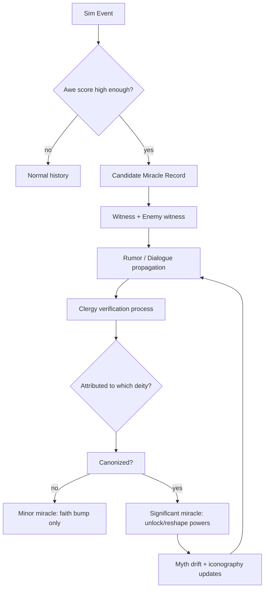

# Miracle system — make it sim-first, story-rich, and tunable

What you’ve sketched is *exactly* the right direction: miracles aren’t “spells,” they’re **social consensus about an improbable event**.

Below is a way to formalize it so:

* the **sim** produces candidate events,
* the **culture** argues about them,
* the **religion structure** determines what becomes canon,
* and canon **feeds back** into your pantheon’s power palette.

---

## 1) Core pipeline

---

## 2) Candidate miracles: “Awe score” from the simulation

You want the sim to nominate candidates *without dicey authorial cheating*.

Define an **Awe score** (W) for events:

$$
W = \text{Rarity} \cdot \text{Impact} \cdot \text{NeedMatch} \cdot \text{WitnessFactor}
$$

Suggested components:

* **Rarity**: how unlikely in-world (lightning strike *can* happen, but hitting the commander at the decisive moment is rare)
* **Impact**: change in outcome magnitude (saved harvest, prevented wipe, decisive victory swing)
* **NeedMatch**: did it occur during acute fear/drought/starvation/siege? (people interpret “meaning” more under stress)
* **WitnessFactor**: number of witnesses *and* their social weight (clergy, officers, storytellers, outsiders)

**Key:** this score doesn’t decide “miracle” — it decides “people will talk about this.”

---

## 3) Verification = consensus shaped by religion structure

Instead of a single “verified yes/no,” model **verification pressure** as an evolving consensus value.

### Religion structure knobs (super important)

These parameters define *how verification happens*:

* **Centralization**: do clergy councils dominate, or is it folk consensus?
* **Orthodoxy rigidity**: tolerance for new interpretations / new gods
* **Syncretism**: willingness to merge symbols or accept “this was also X”
* **Evangelism**: how hard the faith pushes a single narrative
* **Literacy / Text Reliance**: how much “holy documents” matter vs oral tradition
* **Clergy competence**: credibility multiplier (medicine example lives here)

### Verification score

For an event (e), per day (or per “culture tick”):

$$
V_{t+1}(e) = V_t(e)\cdot \lambda + \big(\alpha \cdot M_t(e)\big) + \big(\beta \cdot C_t(e)\big) - \big(\gamma \cdot R_t(e)\big)
$$

Where:

* (\lambda) = memory decay
* (M_t(e)) = weighted mentions today
* (C_t(e)) = clergy endorsement weight today
* (R_t(e)) = rebuttals / rival narratives / “naturalist” explanations

**Centralization** changes (\beta) dramatically.

---

## 4) Attribution = “which god gets credit” (the fun part)

Treat attribution as a **competition among interpretations**, not a binary.

### Event → symbol vector

You already have a great hook: symbolic ties via embeddings / cosine similarity.

Let:

* each deity (g) have an **iconography vector** (\vec{I_g}) (built from myths, symbols, domains, holy texts)
* the event (e) have a **feature vector** (\vec{E_e}) (storm/lightning/river/vision/medicine/metal/etc)

Then a baseline “symbolic fit”:

$$
S(g,e) = \cos(\vec{I_g}, \vec{E_e})
$$

### Witness priors matter

Each witness has:

* faith in pantheon (F)
* loyalty/alignment (L)
* status (P) (prestige / social amplification)
* bias toward a specific deity (personal devotion)

Attribution probability can be a softmax:

$$
P(g|e) = \frac{\exp\big(k_s S(g,e) + k_f F + k_l L + k_p P + k_{pr} \text{PrayerMatch}\big)}{\sum_{g'} \exp(\cdots)}
$$

**PrayerMatch** is your “God smite them with lightning” moment:

* if a specific prayer was spoken publicly *and* the event answered it literally/symbolically, this term spikes.

### Rival-god steals

If another god’s symbols match better, attribution drifts unless:

* your clergy spin it,
* your religion is monotheistic/rigid,
* or your patron has already claimed that domain culturally.

---

## 5) “New god created” and myth drift (this is the spice)

### When a new god appears

If:

* Awe (W) is high,
* but no god has strong fit (S(g,e)),
* and syncretism is high…

Then people may invent a **new minor deity** to explain it.

Mechanically:

* create god (g_{new}) with (\vec{I}) seeded from (\vec{E_e})
* attach it to pantheon if loyalty to pantheon is high (“it’s one of ours”)
* if loyalty is fractured, it becomes a **schismatic cult** or rival faith

### Myth drift tradeoffs

If your patron “absorbs” the miracle anyway, you can allow:

* **Myth expands** → patron gains new symbolic neighborhood (new powers possible)
* but **identity dilutes** → old domain powers can weaken, or become more costly

That gives you a strategic choice:

* keep your patron pure and strong in a narrow domain
* or become syncretic and broad but less focused

---

## 6) Significance: make “later mentions count more” *without being weird*

You want: early chatter is cheap; persistent tradition is powerful.

A clean way: split mentions into two phases.

### Phase A: buzz (early)

* many mentions, low stability
* decays fast
* mostly produces **faith bump**

### Phase B: tradition (late)

* fewer mentions, but they happen *because it became part of identity*
* decays slowly
* unlocks **significant miracles**

Mechanic: “ritualization” converts buzz → tradition.

* Buzz (B) grows quickly with mentions
* Tradition (T) grows slowly, but only if clergy + repetition sustain it

Example update:

$$
B_{t+1} = B_t \cdot \lambda_b + m_t
$$

$$
T_{t+1} = T_t \cdot \lambda_t + \rho \cdot \log(1 + B_t)\cdot \text{RitualSupport}_t
$$

Where:

* (m_t) = mentions today (weighted by prestige + diversity of social groups)
* (\text{RitualSupport}_t) comes from clergy actions, shrines, festivals, texts, sermons
* (\lambda_b < \lambda_t) (buzz fades fast, tradition fades slow)

**Why “later mentions are worth more” here:** they only appear if (T) has formed, and (T) is the real power multiplier.

### Tiers

Use tradition (T) for tiers:

* **Minor**: (T < T_1) → faith bump, morale shift
* **Significant**: (T_1 \le T < T_2) → unlock/upgrade a power
* **Foundational**: (T \ge T_2) → permanent doctrine change / new ritual / domain reshaping

---

## 7) Priors you listed — map them into the model

Your priors are excellent; here’s where they plug in:

* **Allies unconfident** → increases NeedMatch and witness receptivity (higher (F) effect)
* **Enemies shaken** → increases witness factor + “outsider corroboration” (big credibility bump)
* **Specific prayer answered** → PrayerMatch term spikes (huge attribution anchor)
* **Holy-text emphasis (lightning/sky/etc.)** → increases (S(g,e)) via iconography vector
* **Monotheism vs polytheism**

  * monotheism: high orthodoxy, low syncretism → attribution concentrates, fewer new gods
  * polytheism: higher syncretism → domain competition and new gods are common

---

## 8) Your example miracles — what they look like as game objects

### A) Lightning strikes enemy commander

**Trigger (sim):**

* storm active
* battle event at high awe context
* lightning hits high-value target (rare)

**Candidate miracle record:**

* tags: storm, sky, judgment, fate, war, omen
* witness set includes: allies + enemies

**Attribution pressure:**

* if your iconography includes storm/sky/javelin/light → high (S(patron,e))
* if an ally prayed for lightning publicly → PrayerMatch anchors it
* enemy shaken → credibility multiplies mentions

**Player pantheon actions that matter:**

* sponsor a chronicler to write “The Judgment at Black Ridge”
* build a shrine where it happened
* forbid alternative explanations (“it was just weather”) — risky (dread/backlash)

**Canonization result:**

* unlock: *“Judgment Bolt”* (lesser) or *“Storm Omen”* (information power)
* myth drift: patron becomes more storm-aligned over time

---

### B) River floods during drought saving harvest

**Trigger (sim):**

* drought long enough to create need
* upstream rain pattern + terrain leads to unusual flood timing

**Why it’s a great miracle:**

* high NeedMatch, high Impact
* also ambiguous enough to be contested → politics

**Attribution battle:**

* water/river gods may steal credit unless your patron has fertility / providence symbols
* clergy competence can “frame” it (“our rites opened the river”)

**Canonization result:**

* unlock: *“Blessed Irrigation”* (production buff) or *“Mercy Flow”* (drought mitigation)
* side effect: rival cults may form if your story doesn’t fit local traditions

---

### C) Effective clergy medicine as “miracle”

This is *perfect* because it’s materially grounded but culturally interpreted.

Mechanics:

* clergy competence increases survival outcomes
* clergy evangelism ties success to doctrine
* illiterate population + high trust → verification rises rapidly
* skeptics emerge if literacy/science rises, creating an internal tension arc

Canonization can unlock:

* *“Hands of the Patron”* (healing efficacy)
  …but also pushes the faith toward **institutional authority**, which might reduce syncretism or increase orthodoxy.

---

## 9) The one UI you probably want: the **Myth Ledger**

Night mode gets a ledger view:

* candidate miracle list (ranked by Awe + current buzz)
* per-candidate:

  * verification (V)
  * leading attribution probabilities (P(g|e))
  * buzz (B) and tradition (T)
  * competing narratives (top 2–3)
  * recommended interventions (“build shrine”, “commission text”, “public rite”)

This turns belief into *strategy*, not vibes.

---

## 10) Two design questions to lock (and you’ll suddenly know what to build)

1. **Who generates mentions?**
   Is it passive ambient chatter, or does it mostly come from:

   * storytellers/bards
   * clergy sermons
   * soldiers recounting trauma
   * written texts being copied

2. **What counts as a “rebuttal”?**
   Do skeptics exist as a role/culture trait, or do rebuttals mainly come from:

   * rival pantheons
   * internal politics
   * increased literacy/technology

---

If you give me **your intended religion-structure sliders** for the default pantheon (centralization, orthodoxy, syncretism, evangelism, literacy reliance), I’ll turn this into a tight “numbers + behaviors” spec and propose 8–12 starter miracles that naturally emerge from those values.

#game-design #fantasia #miracles #pantheon #simulation #belief-systems
