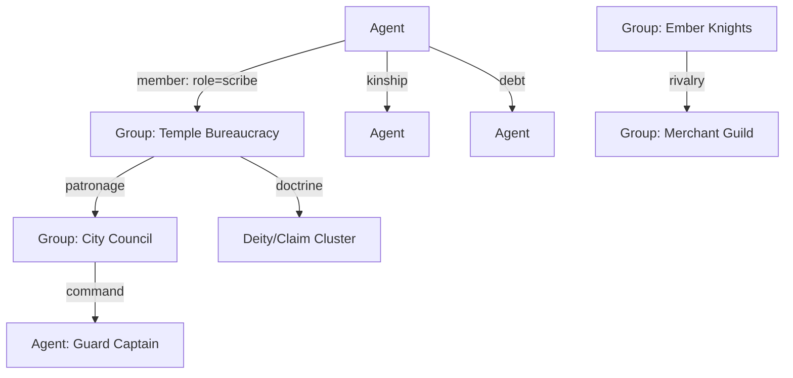
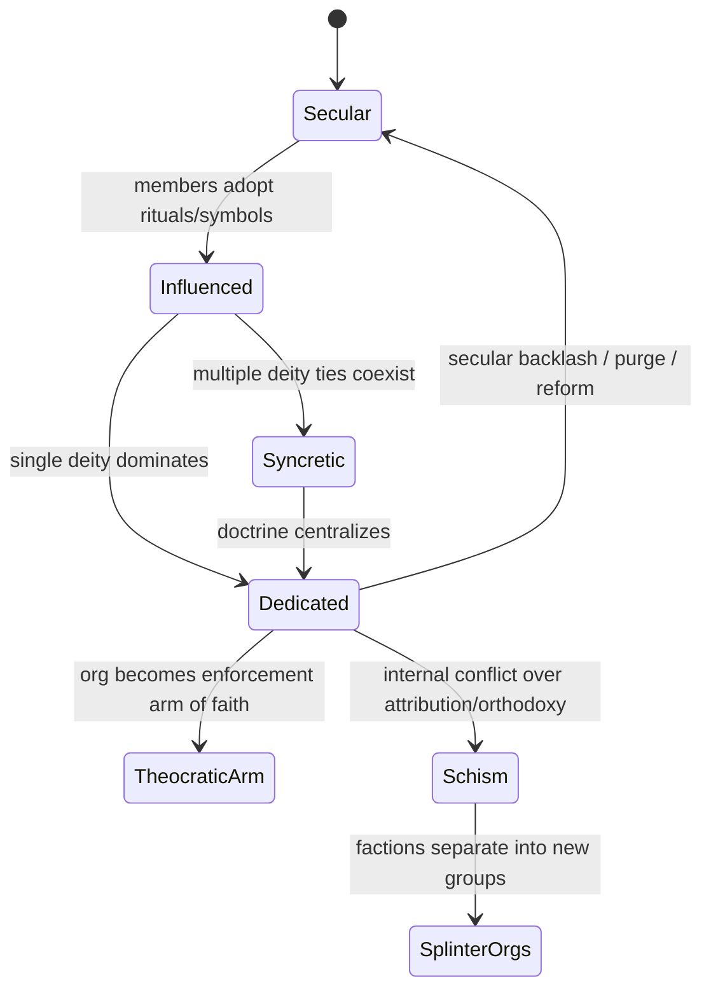

# Organizations as first-class “belief machines” (groups have facets too)

Treat *groups* the same way you treat *events* and *agents*: as nodes with facets, edges, memory, and broadcast behavior. Then “the militia became a holy order” stops being a lore note and becomes an emergent phase transition.

---

## 1) Make “Group” a real entity in the graph

A **Group** (guild, church, government, knightly order, merchant house, clinic, caravan company) should have:

### Group facets (examples)

* **Function**: defense, trade, law, medicine, education, logistics
* **Values**: discipline, mercy, profit, honor, secrecy, purity
* **Symbols**: sigils, colors, uniforms, relics, slogans
* **Rituals**: oaths, prayers, initiations, feast days, penance
* **Competencies**: surgery, metallurgy, scouting, bureaucracy
* **Constraints**: membership requirements, taboos, doctrine tests

### Group memory (institutional timeline)

* chronicles, rules, case logs, rosters, relic inventories
* “canonical bundles” the org repeats (like clergy packets, but for any institution)

### Group reputation (meta-trust)

* perceived competence
* legitimacy
* holiness (see sacralization)
* coercive power (can they punish?)

This lets “a clinic that does medicine” behave differently from “a church that does medicine,” even if both heal people.

---

## 2) Relationship edges: *why* people are related matters

Instead of one generic “relationship,” use typed edges with weights.

### Core edge types (good minimum set)

* **Membership**: agent → group (with role, status, initiation date)
* **Command**: agent ↔ agent, group ↔ agent (chain of authority)
* **Patronage**: “I fund you / protect you” (money, favors, security)
* **Kinship/Household**: family, lovers, dependents
* **Debt/Oath**: obligations, vows, blackmail
* **Rivalry**: competing groups, feuds, factional splits
* **Doctrine alignment**: agent/group ↔ deity/claim

Each edge can carry:

* `strength`
* `trust`
* `visibility` (public vs secret)
* `context tags` (war-time, trade, ritual, etc.)

This is how you get “two members of the same faith, but enemies” or “same order, different sect.”

---

## 3) Groups also transmit “packets” (institutions are megaphones)

If agents are ants, institutions are **pheromone amplifiers**.

### Institutional packets

* sermons, proclamations, training drills, “standard operating procedure”
* lower entropy (more consistent facet bundles)
* higher reach (broadcast radius, copyable texts, rituals)
* higher credibility (if the institution is trusted)

Mechanically:

* group broadcasts seed activations in members + nearby listeners
* members become secondary broadcasters (retellings), causing spread

So a government decree can compete with a priest’s sermon, and both compete with tavern gossip.

---

## 4) Membership requirements as gates on influence

An organization can require:

* shared religion
* oath/vow compliance
* skill/competence tests
* bloodline/citizenship
* property ownership
* ideological purity
* secret knowledge

This matters because it determines:

* who receives the group’s broadcasts
* whose reputations are boosted by belonging
* who is eligible for “direct command” or “ritual roles” in pantheon mode

### Example

**Religious knights**

* requires: patron faith ≥ threshold + martial training + vow (no theft)
* function: border defense + law enforcement
* rituals: oath renewal, vigil nights, relic parades
* society role: policing + legitimacy projection (“order keeps peace”)

They aren’t just “worshipers with swords”—they’re a social technology.

---

## 5) Sacralization: how a non-religious org becomes religious

You want: “sometimes it wasn’t created religious, but members make it religious.”

Model this as **Sacrality** (S) per group *per deity/claim cluster*.

### What increases sacrality?

* repeated ritual behavior inside the org (oaths, prayers before duty)
* symbol injection (sigil on uniforms, shrines in offices)
* leadership endorsement (“we serve the patron”)
* miracles tied to the org’s success (“the clinic saved us—patron’s hands”)
* recruitment filtering by faith
* external recognition (“people say they’re holy”)

### What decreases it?

* scandals (hypocrisy breaks holiness)
* competing interpretations (rival deity claims credit)
* secular reforms (“stop praying at work”)
* faction splits (internal schisms)

### State machine (handy mental model)

This makes “religious drift” a controllable system with risks.

---

## 6) Groups have “facets” the same way events do (and they mutate)

A group’s facet signature should be derived from:

* **Charter** (explicit rules)
* **Practices** (what they actually do)
* **Member composition** (who joins)
* **Success stories** (what people retell)
* **Sacrality ties** (which deity/claims are attached)

Just like events, group facets drift via retelling + reinforcement:

* “city guard” becomes “holy watch” if enough narrative + ritual accumulates
* “merchant guild” becomes “prosperity cult” if wealth successes are framed as blessings

---

## 7) Why this matters for miracles specifically

Institutions are the difference between:

* a cool story that fades, and
* a canonized miracle that becomes a power.

### Verification as institutional behavior

A “miracle council” is just a group process:

* who gets to vote
* what evidence counts
* whether orthodoxy matters
* whether political usefulness overrides truth

So “verification” becomes a struggle between:

* clergy institutions
* government institutions
* professional institutions (medics, engineers)
* informal networks (soldiers, families, gossip hubs)

And each has its own facet biases.

---

## 8) Gameplay hooks: what the player can do with all this

### Pantheon-mode levers (institutional scale)

* Found a new order (charter + vows + uniforms + role)
* Appoint leadership (trusted nodes become high-weight broadcasters)
* Sponsor institutions (resources → competence → reputation → belief influence)
* Seed symbols into org spaces (shrines in barracks, icons in clinics)
* Force reforms (reduce sacrality, increase secular legitimacy—risky backlash)
* Encourage splinters (weaponize schisms against rivals)

### Day-mode levers (embodied scale)

* Champion participates in rituals (boosts sacrality / credibility)
* Champion acts as living proof (witnessed deeds become institutional myths)
* Champion negotiates charters / mediates schisms (political play)

---

## 9) Minimal data model that supports all of this

### Group

* `id`, `name`
* `facets` (weighted)
* `charter` (rules + membership gates)
* `roles` (knight, scribe, medic…)
* `broadcast_channels` (sermons, decrees, texts, drills)
* `reputation` (competence/legitimacy)
* `sacrality[deity_or_claim_id]`
* `relationships[group_id]` (rivalry, patronage, alliance)

### Membership edge

* `agent_id`, `group_id`, `role`
* `status` (novice/full/exiled)
* `oaths` (active vows)
* `trust_in_institution`
* `visibility`

This is enough to simulate complicated social order without hardcoding “church vs state.”

---

## 10) Next piece to lock (and it’s the big one)

To make this *playable*, you’ll want a **Group Charter DSL** (even if it’s simple at first):

* membership requirements
* vows/taboos
* promotion rules
* punishments
* ritual schedule
* what they broadcast (canonical bundles)
* what they *do* for society (services)

If you want, I’ll sketch that DSL in a compact, data-driven format and show how it plugs into:

* sacrality growth
* packet broadcasting
* miracle verification/attribution
* pantheon “draft the faithful” mechanics

#game-design #fantasia #institutions #social-sim #knowledge-graph #miracles
