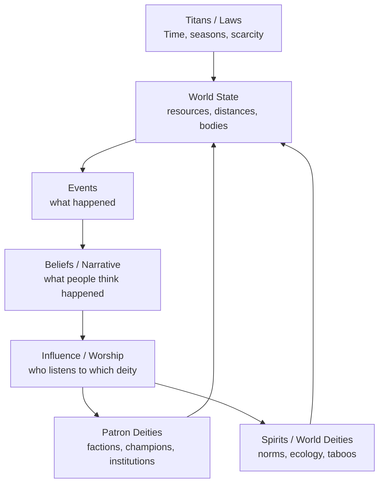

Three-tier pantheon that stays causal
-------------------------------------

### 1) Patron Deities (political storytellers)

*   Attached to peoples/factions/cities/orders

*   Goal: “my people win / my doctrine spreads / my champion ascends”

*   They _compete directly_ over territory, legitimacy, and the narrative

### 2) World Deities / Spirits (ethical/ecological storytellers)

*   Not loyal to any one group

*   Goal: “protect wolves / keep rivers clean / punish oathbreakers”

*   They create consequences that feel like _moral physics_ rather than politics

### 3) Titans / Laws (physics storytellers)

*   Not “trying to win,” just enforcing invariants

*   Time, famine, entropy, seasons, death, geometry, scarcity

*   They don’t “intervene” so much as **constrain what’s possible**

This gives you a setting where **nothing is random**:

*   something happened because a patron god pushed

*   or because a spirit enforced a norm

*   or because a titan made it inevitable

Deities as competing “narrative optimizers”
-------------------------------------------

Each deity is basically:

*   **Utility function**: what “winning” means to them

*   **Influence graph**: who listens (priests, champions, cults, beasts, weather signs)

*   **Budget**: how hard they can push reality right now

*   **Style**: their preferred _shapes_ of events

### The key: Deities don’t spawn events out of nowhere

They place _pressure_ through channels they plausibly control:

*   sponsor a messenger network → rumors travel faster

*   bless harvest → economy stabilizes → a faction can afford an army

*   inspire zealotry → institutions harden

*   send omen → leaders change plans

*   curse oathbreakers → social trust collapses

So the “storyteller” is inside the world, not above it.

“Historical narrative” becomes a battlefield
--------------------------------------------

Model narrative explicitly as a second layer over events:

*   **Event layer**: what actually happened

*   **Belief layer**: what people think happened (and why)

Deities compete mostly in the **belief layer**, because belief:

*   changes who cooperates with whom

*   changes legitimacy and access

*   changes what “counts” as a miracle

*   changes the next generation (your prestige mechanic)

### Simple rule

> Deities gain power from **belief density** in populations they can reach.

So your god doesn’t just want victories; they want **victories that become canon**.

How competing deities produce pacing without “RimWorld randomness”
------------------------------------------------------------------

At each Aker boundary (dawn/dusk works great), every deity submits **candidate moves** drawn from the world state:

*   Patron deity: “Push rival city into scandal” / “Enable a caravan” / “Inspire a champion”

*   Spirit: “Punish overhunting” / “Protect a grove” / “Rage against pollution”

*   Titan: “Winter arrives” / “Age advances” / “Supply decays”

Then the world resolves them like a _market / collision system_:

*   Moves that violate titan laws simply fail

*   Moves that conflict collide and transform into a third thing (compromise, backlash, weird emergent event)

*   Repetition is naturally limited because deities spend budget and burn credibility when they overuse a tactic

This gives you “adaptive fairness” as an emergent property:

*   If your society got wrecked, **your deity is also damaged** (loss of believers, institutions, morale)

*   Relief comes from _allies and systems you built_, not pity-loot from the sky

Your prestige mechanic fits perfectly here
------------------------------------------

When a champion retires, what you’re “banking” isn’t abstract points—it’s:

*   **Narrative capital** (how much your version of history is believed)

*   **Institutional capital** (temples, orders, routes, laws)

*   **Mythic capital** (relatable symbols, relics, taboos)

So choosing a new champion is literally:

> “Pick the next vector for your deity’s narrative war.”

A clean mental model diagram
----------------------------

