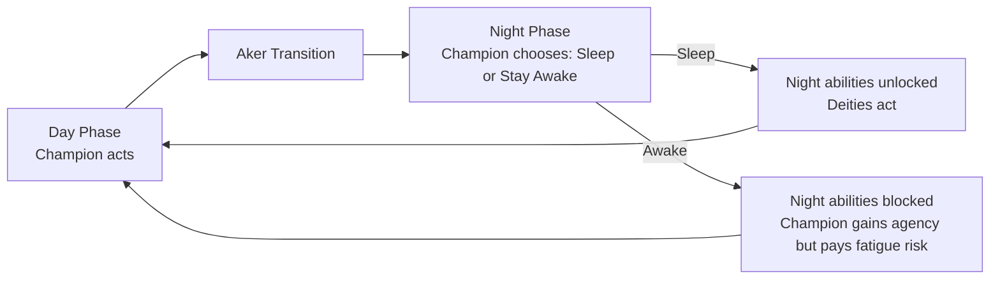

## User
yea let's do it. 
Major deities get 3 abilities each:
Night ability =  only usable by deity when champion is asleep
Day ability = only usable by the champion
Harald abilities = always usable 
Then 3 lesser deities who each get 1 ability each, with more specific conditions related to the associated deity.

## ChatGPT
Deity Move Set v0.1 (triad + 3 lesser)
--------------------------------------

This is a **minimal, skinnable** “many storytellers competing” kit where _nothing_ spawns from nowhere—abilities mostly **change constraints, information, legitimacy, and access**, which then causes factions/agents to act.

### Core rules (small, but important)

*   **Day / Night** is a hard phase boundary (**Aker**).

*   **Champion Sleep** is a player choice with strategic weight:

    *   If the champion is **asleep**, major deities may use **Night** abilities (deity-only).

    *   If the champion stays awake, you deny those Night abilities—at the cost of fatigue / missed recovery / other risks.

*   Each **Major Deity** has 3 abilities:

    *   **Night** (deity-only; _requires champion asleep_)

    *   **Day** (champion-only; used as an action)

    *   **Harald/Herald** (always usable; phase-independent utility)

*   Each ability has:

    *   **Cost**: `Favor` (power), `Cred` (credibility), `Attention` (how visible your hand is)

    *   **World effect**: changes routes/resources/relationships/permissions

    *   **Belief effect**: changes what people think happened + who they trust

    *   **Counterplay**: how rivals respond

### Minimal shared resources

*   **Favor**: generated by worship + “canon wins” (your narrative believed)

*   **Cred**: “did reality match the myth?” (drops if you overreach / get exposed)

*   **Attention**: heat / notice (high attention invites counters, inquisitions, hunters)

* * *

The Three Major Deities (archetypes, not locked to any myth)
------------------------------------------------------------

### 1) **The Herald** (messages, trade, rumor, translation)

**Domain:** connectivity, memetics, couriers, bargains
**Wins by:** controlling _what travels_ and _what sticks_

#### Night (deity-only): **Dream Courier**

*   **Preconditions:** champion is asleep; at least 1 active route or social tie to target

*   **Cost:** Favor (med), Attention (low), Cred (low)

*   **World:** mark one target (person/group) with a _Dream Seed_ (a subtle directive or suspicion)

*   **Belief:** inject a “soft narrative” (e.g., _“I had a sign…”_) that increases rumor spread _from that target_

*   **Counterplay:**

    *   **Sun** can “audit” and publicly reframe it as hysteria

    *   **Moon** can hijack the dream into paranoia / misinformation

*   **Failure modes:** if target has strong institutional shielding, seed becomes _folk tale_ (weaker but wider)

#### Day (champion-only): **Public Proclamation**

*   **Preconditions:** champion has access to a crowd OR an official forum OR a notable witness

*   **Cost:** Favor (low), Attention (high), Cred (med if untrue)

*   **World:** creates/updates a **Public Claim** node (promise, accusation, call-to-action)

*   **Belief:** immediately shifts local belief weights; creates a “sticky” story tag

*   **Counterplay:**

    *   Rivals can demand proof (Sun), undermine witnesses (Moon), or flood the channel (other Heralds)

*   **Failure modes:** if proclamation is disproven, Cred loss is sharp and long-lived

#### Harald/Herald (always): **Whisper Network**

*   **Preconditions:** at least 2 connected nodes (route, messenger, market, tavern, temple)

*   **Cost:** Favor (low→med), Attention (variable)

*   **World:** choose one:

    *   **Accelerate** message latency on a route

    *   **Intercept** one message edge (delay / redirect)

    *   **Amplify** one rumor (increase propagation)

*   **Belief:** doesn’t force outcomes—just changes who learns what, when

*   **Counterplay:** rivals can compete on the same edges by spending Favor/Influence

*   **Anti-samey:** this generates _different_ downstream events naturally, because factions act on different intel

* * *

### 2) **The Sun** (public order, legitimacy, law, ceremony)

**Domain:** institutions, councils, oaths (public), justice (public)
**Wins by:** stabilizing society + defining the “official truth”

#### Night (deity-only): **Dawn Decree**

*   **Preconditions:** champion asleep; at least one institution under Sun influence (court, temple, council, militia)

*   **Cost:** Favor (med), Cred (med), Attention (med)

*   **World:** sets a **Tomorrow Law** (a temporary rule modifier for the next Day phase)

    *   examples: “weapons forbidden in forum,” “debt collection paused,” “trials expedited”

*   **Belief:** increases legitimacy of Sun-aligned institutions _if enforced_

*   **Counterplay:**

    *   **Herald** can route around enforcement (messages/markets elsewhere)

    *   **Moon** can create exceptions/black markets that erode legitimacy

*   **Failure modes:** if the law can’t be enforced, Cred bleeds slowly (the Sun looks weak)

#### Day (champion-only): **Writ of Authority**

*   **Preconditions:** champion holds recognized title/symbol OR has accumulated enough local trust

*   **Cost:** Favor (med), Attention (high)

*   **World:** force an _institutional action_:

    *   convene council, call militia, seize contraband, grant amnesty, formalize alliance

*   **Belief:** converts “what happened” into **canon** faster (records, seals, witnesses)

*   **Counterplay:** rivals contest legitimacy (Moon scandal) or contest jurisdiction (other polities)

*   **Failure modes:** misuse produces _resentment debt_ (future unrest)

#### Harald/Herald (always): **Seal of Sanction**

*   **Preconditions:** a document/rite/authority chain exists (paperwork, ritual, witnesses)

*   **Cost:** Favor (low), Cred (low)

*   **World:** attach a **Seal** to a claim, route, title, or institution:

    *   increases compliance; reduces corruption on that edge for a time

*   **Belief:** makes narratives “harder to change” (sticky official version)

*   **Counterplay:** Moon can forge/steal seals; Herald can leak contradictory evidence

* * *

### 3) **The Moon** (secrecy, liminal power, hunters, taboo, shadow ties)

**Domain:** hidden networks, night economy, clandestine bargains
**Wins by:** controlling _what cannot be said_, and who can move unseen

#### Night (deity-only): **Veilwalk**

*   **Preconditions:** champion asleep

*   **Cost:** Favor (med), Attention (low), Cred (low)

*   **World:** place a **Veil** over a location/route/person:

    *   reduces detection, increases stealth success, increases “unknown unknowns”

*   **Belief:** creates uncertainty; “nobody’s sure what happened”

*   **Counterplay:**

    *   Sun can light it up (audits, patrols, trials)

    *   Herald can triangulate with witnesses / message intercepts

*   **Failure modes:** too much Veil attracts hunters/inquisitors (Attention spike later)

#### Day (champion-only): **Quiet Step**

*   **Preconditions:** champion is in a watched place OR is being tracked

*   **Cost:** Favor (low→med), Attention (med)

*   **World:** perform one clandestine action **as if it were Night**:

    *   shadow meeting, theft, sabotage, extraction, secret oath, covert travel

*   **Belief:** if successful, leaves conflicting accounts (harder to pin blame)

*   **Counterplay:** Sun forces witnesses into testimony; Herald reconstructs with info edges

#### Harald/Herald (always): **Mask & Doubt**

*   **Preconditions:** there exists at least one claim/story in circulation

*   **Cost:** Favor (low), Cred (low), Attention (low)

*   **World:** attach a **Doubt** modifier to a narrative or an accusation

*   **Belief:** reduces confidence; makes audiences split; delays “canonization”

*   **Counterplay:** Sun can issue sealed verdicts; Herald can flood with consistent corroboration

* * *

The Three Lesser Deities (1 ability each, tied to a Major)
----------------------------------------------------------

These are **narrow**, flavorful, and condition-heavy. They prevent the majors from feeling like they do everything.

### Lesser of the Herald: **The Covenant (Oath-Thread)**

**Ability:** **Bind Contract**

*   **Conditions:** two parties must consent OR the agreement must be witnessed/recorded on a Herald channel

*   **Effect (World):** creates a **Contract Edge** with consequences if broken

*   **Effect (Belief):** “oath weight” rises—breaking it damages reputation hard

*   **Counterplay:** Moon can tempt breach (secret loopholes); Sun can adjudicate disputes (interpretation battles)

### Lesser of the Sun: **The Hearth (Granary / Mercy)**

**Ability:** **Public Relief**

*   **Conditions:** only after significant damage/unrest OR during famine; requires a Sun-aligned institution present

*   **Effect (World):** converts institutional stores into stability (heals unrest, prevents collapse spiral)

*   **Effect (Belief):** increases legitimacy _only if the relief is seen_

*   **Counterplay:** Herald can spread news to maximize belief gain; Moon can create theft/scandal to flip it

### Lesser of the Moon: **The Warden (Beast / Wild Oath)**

**Ability:** **Warden’s Reckoning**

*   **Conditions:** triggered only if a taboo is broken (overhunting, cruelty, sacred grove harmed), OR invoked to protect animals if your faction has shown restraint

*   **Effect (World):** spawns a **consequence chain** (predators migrate, mounts refuse, disease risk, guides vanish)

*   **Effect (Belief):** “the wild watches” becomes culturally real; affects future choices

*   **Counterplay:** Sun can formalize conservation law; Herald can reshape narrative (“it wasn’t us”) but risk Cred

* * *

Conflict resolution (how “many storytellers” compete without nonsense)
----------------------------------------------------------------------

When multiple deities target the same node/edge this phase:

1.  Each submits a **Move** with `Cost` and `Target`

2.  Compute effective strength:

    $$\text{Strength} = \text{InfluenceOnTarget} + \text{FavorSpent} - \text{AttentionPenalty} + \text{CredBonus}$$

3.  Highest strength wins **primary effect**, runner-up becomes **backlash** or **complication** instead of “nothing”

    *   This is how you get drama without pure randomness.

**Repetition control:** each move has a `recency` tag; recency increases Attention cost and lowers Cred gain → naturally discourages spam/samey loops.

* * *

The Day/Night loop as a player-facing choice
--------------------------------------------

* * *

What you can build immediately from this
----------------------------------------

*   A **candidate-move generator** for each deity (preconditions + targets they have influence over)

*   A simple **belief layer**: per group, a set of claims with weights (confidence + alignment)

*   A **routing layer**: edges with latency + interception + amplification modifiers

*   A tiny UI that shows:

    *   “What your deity can do right now”

    *   “What rivals are probably doing” (fog-of-war via Herald/Moon)

If you want the next step, I’ll write **12 concrete example moves** (2 per ability) as fully-specified “cards” with exact targets and outcomes—so you can start playtesting the feel in a tiny sim.
