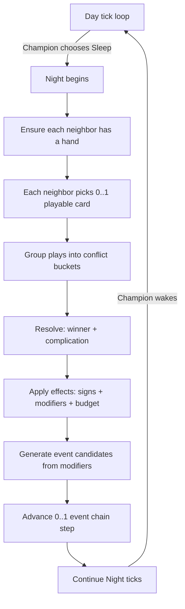

Aker boundary control flow (where cards happen) #aker #cards
============================================================



* * *

1) `backend/deps.edn` (full replacement)
========================================

So you can load EDN from `backend/resources/...` via `io/resource`.

```clojure
{:paths ["src" "resources"]
 :deps
 {org.clojure/clojure {:mvn/version "1.11.3"}
  http-kit/http-kit {:mvn/version "2.8.0"}
  metosin/reitit-ring {:mvn/version "0.7.2"}
  cheshire/cheshire {:mvn/version "5.13.0"}
  io.github.clojure/tools.build {:mvn/version "0.10.5"}}

:aliases
 {:server
  {:main-opts ["-m" "fantasia.server"]}
  :watch-server
  {:exec-fn fantasia.dev.watch/watch-server}}}
```

* * *

2) Add EDN file path (resource)
===============================

Create:

*   `backend/resources/decks/neighbor-decks.edn`


Use the EDN structure you already drafted (`{:cards {...} :decks {...}}`).

* * *

3) New backend namespace: `backend/src/fantasia/sim/cards.clj` (full file)
==========================================================================

This file covers:

*   EDN load

*   deterministic shuffle

*   deck state (draw/hand/discard)

*   AI selection heuristic

*   collision resolution (winner + complication)

*   apply effects (signs/modifiers) + expire TTL


```clojure
(ns fantasia.sim.cards
  (:require [clojure.edn :as edn]
            [clojure.java.io :as io]))

;; -----------------------------------------------------------------------------
;; Resource loading
;; -----------------------------------------------------------------------------

(defn slurp-resource [path]
  (when-let [url (io/resource path)]
    (slurp url)))

(defn load-card-packs!
  "Loads EDN from resources and returns {:cards ... :decks ...}.
   Path example: \"decks/neighbor-decks.edn\""
  [path]
  (let [s (slurp-resource path)]
    (when-not s
      (throw (ex-info (str "Missing resource: " path) {:path path})))
    (edn/read-string s)))

;; -----------------------------------------------------------------------------
;; Deterministic shuffle (stable across JVM runs if you keep seed inputs stable)
;; -----------------------------------------------------------------------------

(defn rng
  ^java.util.Random [seed]
  (java.util.Random. (long seed)))

(defn next-int ^long [^java.util.Random r n]
  (.nextInt r (int n)))

(defn shuffle-seeded
  "Fisher-Yates deterministic shuffle."
  [seed xs]
  (let [r (rng seed)
        a (object-array xs)
        n (alength a)]
    (loop [i (dec n)]
      (if (<= i 0)
        (vec (seq a))
        (let [j (next-int r (inc i))
              tmp (aget a i)]
          (aset a i (aget a j))
          (aset a j tmp)
          (recur (dec i)))))))

(defn stable-seed
  "Derive a stable numeric seed from arbitrary inputs.
   WARNING: Clojure hash is stable within a process, but can vary by JVM version.
   If you want ultra-stability later, replace this with a real hash (xxhash/sha1)."
  [& xs]
  (long (hash xs)))

;; -----------------------------------------------------------------------------
;; Deck state
;; -----------------------------------------------------------------------------

(defn init-deck-state
  "Create deck state from a draw list of card ids. Deterministically shuffled."
  [{:keys [world-seed faction-id draw]}]
  (let [seed (stable-seed world-seed :deck faction-id)]
    {:draw (shuffle-seeded seed draw)
     :hand []
     :discard []
     :cooldowns {}}))

(defn refill-draw
  "If draw is empty, shuffle discard into draw."
  [world-seed faction-id {:keys [draw discard] :as deck}]
  (if (seq draw)
    deck
    (let [seed (stable-seed world-seed :refill faction-id (count discard))]
      (-> deck
          (assoc :draw (shuffle-seeded seed discard))
          (assoc :discard [])))))

(defn draw-one
  [world-seed faction-id deck]
  (let [deck (refill-draw world-seed faction-id deck)
        top (first (:draw deck))]
    (if-not top
      deck
      (-> deck
          (update :draw subvec 1)
          (update :hand conj top)))))

(defn ensure-hand
  "Draw until hand-size reached (or no cards exist)."
  [world-seed faction-id hand-size deck]
  (loop [d deck]
    (if (>= (count (:hand d)) hand-size)
      d
      (let [before (count (:draw d))
            d' (draw-one world-seed faction-id d)]
        (if (= before (count (:draw d')))
          d' ;; can't draw any more
          (recur d'))))))

(defn discard-card
  [deck card-id]
  (-> deck
      (update :hand (fn [h] (vec (remove #(= % card-id) h))))
      (update :discard conj card-id)))

;; -----------------------------------------------------------------------------
;; Phase gating + budget checks
;; -----------------------------------------------------------------------------

(defn phase-allowed?
  "Card phases: :day | :night | :always.
   For MVP, pass world keys:
   - :phase :day/:night
   - [:champion :asleep?] boolean"
  [world card]
  (let [p (:phase world)
        asleep? (boolean (get-in world [:champion :asleep?]))
        cp (:card/phase card)]
    (case cp
      :always true
      :day (= p :day)
      :night (and (= p :night) asleep?)
      false)))

(defn get-budget [world faction-id]
  (get-in world [:factions faction-id :deity :budget] {:favor 0 :cred 0 :attention 0}))

(defn affordable?
  [world faction-id card]
  (let [b (get-budget world faction-id)
        c (:card/cost card)]
    (and (<= (get c :favor 0) (get b :favor 0))
         (<= (get c :cred 0) (get b :cred 0))
         ;; attention is weird because it's often “heat”; for MVP treat it as a cap:
         (<= (+ (get b :attention 0) (get c :attention 0))
             (get-in world [:rules :attention-cap] 9999)))))

(defn playable?
  [world faction-id card]
  (and (phase-allowed? world card)
       (affordable? world faction-id card)))

;; -----------------------------------------------------------------------------
;; Scoring (AI) and collision strength
;; -----------------------------------------------------------------------------

(defn influence
  "World stores influence sparsely: [:influence [actor key]] -> 0..1.
   Key should be one of the card primary keys (tuples like [:tile [q r]] etc)."
  [world deity-id primary-key]
  (double (get-in world [:influence [deity-id primary-key]] 0.0)))

(defn recency-penalty
  "Very simple: if tag is present in :recency with r>0, penalize."
  [world tags]
  (let [r (reduce max 0 (for [t tags] (get-in world [:recency (name t)] 0)))]
    (-> (/ r 5.0) (max 0.0) (min 1.0))))

(defn seeded-noise
  "Deterministic 'uncertainty' in [-0.25..+0.25]."
  [world conflict-key]
  (let [seed (long (get world :seed 0))
        tick (long (get world :tick 0))
        h (hash [seed tick conflict-key])
        u (double (/ (mod (Math/abs (long h)) 10000) 9999.0))]
    (- (* 0.5 u) 0.25)))

(defn move-strength
  "Strength used for collision resolution."
  [world {:keys [faction-id deity-id card conflict-key]}]
  (let [pkey (first (get-in card [:card/keys :primary]))
        I (influence world deity-id pkey) ;; 0..1
        cost (:card/cost card)
        F (-> (/ (double (get cost :favor 0)) 6.0) (max 0.0) (min 1.0))
        A (-> (/ (double (get cost :attention 0)) 6.0) (max 0.0) (min 1.0))
        C (-> (/ (double (get cost :cred 0)) 6.0) (max 0.0) (min 1.0))
        R (recency-penalty world (:card/tags card))
        eps (seeded-noise world conflict-key)]
    (+ (* 2.0 I)
       (* 1.5 F)
       (- (* 1.0 A))
       (* 0.8 C)
       (- (* 1.2 R))
       eps)))

(defn ai-score
  "Heuristic: play cards that are playable, influential, novel, and cheap."
  [world {:keys [faction-id deity-id card]}]
  (let [pkey (first (get-in card [:card/keys :primary]))
        I (influence world deity-id pkey)
        cost (:card/cost card)
        cheap (+ (* 0.10 (get cost :favor 0))
                 (* 0.08 (get cost :attention 0))
                 (* 0.10 (get cost :cred 0)))
        nov (- 1.0 (recency-penalty world (:card/tags card)))]
    (+ (* 1.8 I)
       (* 0.7 nov)
       (- cheap))))

;; -----------------------------------------------------------------------------
;; Choosing a card for a faction (AI)
;; -----------------------------------------------------------------------------

(defn choose-card
  "Pick the best playable card from hand, or nil."
  [world cards-db faction-id]
  (let [hand (get-in world [:factions faction-id :deck :hand] [])
        deity-id (get-in world [:factions faction-id :deity :id] faction-id)
        candidates (for [cid hand
                         :let [card (get cards-db cid)]
                         :when (and card (playable? world faction-id card))]
                     {:faction-id faction-id
                      :deity-id deity-id
                      :card-id cid
                      :card card})]
    (when (seq candidates)
      (->> candidates
           (map (fn [c] (assoc c :score (ai-score world c))))
           (sort-by :score >)
           first))))

;; -----------------------------------------------------------------------------
;; Conflict bucketing (collision grouping)
;; -----------------------------------------------------------------------------

(defn conflict-key
  "MVP: bucket by the first primary key; if none, a global bucket."
  [card]
  (or (first (get-in card [:card/keys :primary]))
      [:global :global]))

(defn group-by-conflict
  [plays]
  (reduce (fn [m p]
            (let [k (conflict-key (:card p))]
              (update m k (fnil conj []) (assoc p :conflict-key k))))
          {}
          plays))

(defn resolve-conflict
  "Winner gets full; runner-up becomes complication (optional)."
  [world plays]
  (let [scored (->> plays
                    (map (fn [p] (assoc p :strength (move-strength world p))))
                    (sort-by :strength >))
        win (first scored)
        runner (second scored)]
    {:winner win
     :complication runner
     :margin (if runner (- (:strength win) (:strength runner)) 999)}))

(defn resolve-collisions
  [world plays]
  (let [buckets (group-by-conflict plays)]
    (->> buckets
         (map (fn [[k ps]] (assoc (resolve-conflict world ps) :conflict k)))
         vec)))

;; -----------------------------------------------------------------------------
;; Applying effects: spend budget, emit signs, apply modifiers, discard card
;; -----------------------------------------------------------------------------

(defn spend-budget
  [world faction-id cost]
  (-> world
      (update-in [:factions faction-id :deity :budget :favor] - (get cost :favor 0))
      (update-in [:factions faction-id :deity :budget :cred] - (get cost :cred 0))
      (update-in [:factions faction-id :deity :budget :attention] + (get cost :attention 0))))

(defn stamp-sign [world faction-id sign]
  (assoc sign
         :sign/tick (:tick world)
         :sign/origin [:faction faction-id]))

(defn stamp-mod [world faction-id mod]
  (assoc mod
         :mod/tick (:tick world)
         :mod/source (or (:mod/source mod) [:faction faction-id])
         ;; normalize ttl key names if needed
         :mod/ttl (long (or (:mod/ttl mod) 1))))

(defn apply-effect
  "Effect is data-only:
   {:emit/signs [...], :apply/mods [...]}.
   Signs and mods get stamped with tick + origin/source."
  [world faction-id effect]
  (let [signs (mapv #(stamp-sign world faction-id %) (get effect :emit/signs []))
        mods  (mapv #(stamp-mod world faction-id %) (get effect :apply/mods []))]
    (-> world
        (update :signs into signs)
        (update :modifiers into mods))))

(defn apply-play
  "Apply a single play (winner or complication).
   If `free?` true, do not spend budget; still emit signs/modifiers."
  [world cards-db {:keys [faction-id card-id card free?] :as play}]
  (let [cost (:card/cost card)
        effect (:card/effect card)]
    (-> world
        (cond-> (not free?) (spend-budget faction-id cost))
        (apply-effect faction-id effect)
        (update-in [:factions faction-id :deck] discard-card card-id))))

(defn apply-resolutions
  "Apply all conflicts: winner full, complication free (side effect only)."
  [world cards-db resolutions]
  (reduce
    (fn [w {:keys [winner complication]}]
      (let [w (if winner (apply-play w cards-db (assoc winner :free? false)) w)
            w (if complication (apply-play w cards-db (assoc complication :free? true)) w)]
        w))
    world
    resolutions))

;; -----------------------------------------------------------------------------
;; TTL expiration
;; -----------------------------------------------------------------------------

(defn decay-signs
  "MVP: keep only last N signs."
  [world]
  (let [n (get-in world [:rules :sign-cap] 60)]
    (update world :signs (fn [s] (vec (take-last n s))))))

(defn tick-modifiers
  "Decrement :mod/ttl each tick; remove expired."
  [world]
  (update world :modifiers
          (fn [ms]
            (->> ms
                 (map (fn [m] (update m :mod/ttl dec)))
                 (filter (fn [m] (pos? (long (get m :mod/ttl 0)))))
                 vec))))

;; -----------------------------------------------------------------------------
;; Night step: draw hands, pick plays, resolve, apply
;; -----------------------------------------------------------------------------

(defn ensure-all-hands
  [world cards-db {:keys [hand-size]}]
  (reduce
    (fn [w [fid _]]
      (let [ws (get w :seed 0)
            deck (get-in w [:factions fid :deck])
            deck' (ensure-hand ws fid hand-size deck)]
        (assoc-in w [:factions fid :deck] deck')))
    world
    (:factions world)))

(defn collect-ai-plays
  "Return vector of plays for AI factions (neighbors).
   If you want only 6 neighbors, keep player out with a predicate."
  [world cards-db {:keys [playable-faction?]}]
  (vec
    (keep
      (fn [[fid _]]
        (when (playable-faction? fid)
          (choose-card world cards-db fid)))
      (:factions world))))

(defn run-night-cards
  "One night boundary step: ensure hands, choose plays, resolve, apply, decay ttl."
  [world cards-db {:keys [hand-size playable-faction?] :or {hand-size 3}}]
  (let [world (ensure-all-hands world cards-db {:hand-size hand-size})
        plays (collect-ai-plays world cards-db {:playable-faction? playable-faction?})
        resolutions (resolve-collisions world plays)
        world' (apply-resolutions world cards-db resolutions)]
    (-> world'
        (assoc :last/card-plays plays)
        (assoc :last/collisions resolutions)
        tick-modifiers
        decay-signs)))
```

* * *

4) Minimal integration contract (no diffs, just “where it plugs in”) #integration
=================================================================================

Once you have:

*   `:phase :day|:night`

*   `[:champion :asleep?]`

*   `:factions` each with `:deck` state and `:deity` budget

*   `:cards` loaded into world


…then at your Aker boundary (night tick or on transition into night), you do:

```clojure
(let [{:keys [cards decks]} (fantasia.sim.cards/load-card-packs! "decks/neighbor-decks.edn")
      world (-> world
                (assoc :cards cards)
                ;; create/init factions elsewhere, then for each:
                ;; (assoc-in [:factions fid :deck] (init-deck-state {...}))
                )
      world (if (and (= (:phase world) :night)
                     (get-in world [:champion :asleep?]))
              (fantasia.sim.cards/run-night-cards
                world
                (:cards world)
                {:hand-size 3
                 :playable-faction? (fn [fid] (not= fid :faction/player))})
              world)]
  world)
```

That’s enough to get:

*   neighbor deck draws

*   AI picks a card

*   collision resolution

*   signs/modifiers emitted


Then your `fantasia.sim.drama/enqueue-best!` can read `:modifiers` and enqueue events.

* * *

5) Acceptance tests for this slice (so it doesn’t become vapor) #tests #mvp
===========================================================================

### Test A: deterministic deck draw

*   Given same `world.seed`, same `faction-id`, and same draw list,

*   `init-deck-state` produces the same `:draw` ordering.


### Test B: collision chooses winner + complication

*   Two plays targeting same conflict key

*   Higher influence/cost should win; runner becomes free complication


### Test C: applying a card emits signs/mods and spends budget

*   Winner:

    *   budget decreases/increases as expected

    *   `:signs` appended with `:sign/tick` and origin

    *   `:modifiers` appended with `:mod/ttl` and source

*   Complication:

    *   emits effects

    *   **does not spend budget**


### Test D: TTL expiration

*   After `tick-modifiers` runs `ttl` times, modifier disappears.


* * *

6) Next “continue” (what I’ll generate immediately)
===================================================

If you keep going, I’ll produce a **minimal `:factions` initializer** that:

*   places 6 settlements on a hex ring (using axial dirs)

*   loads decks from EDN and initializes each faction deck state

*   seeds `:influence` on nearby keys (so collisions aren’t all random)


…and a tiny **night boundary hook** that calls:

1.  `run-night-cards`

2.  `drama/enqueue-best!`

3.  `drama/tick-event-queue`


All in Clojure pseudocode, repo-shaped.
