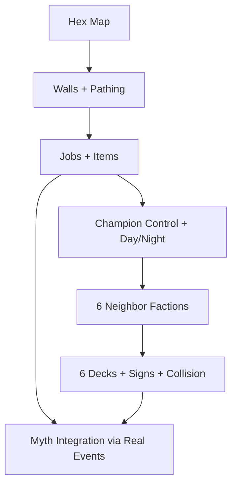

From `backend/src/fantasia/sim/core.clj` + friends:

*   You already have a **tight authoritative sim loop** (`tick-once`, `tick!`) and a **WS broadcast stream** (`tick/event/trace`), with a React “myth debugger” UI.

*   The **myth substrate is real**:

    *   `facets.clj` = spreading activation + recall scoring

    *   `events.clj` = event archetypes + claim candidates (nice micro-DSL)

    *   `myth.clj` = buzz/tradition ledger + attribution probabilities

*   The world is still a **20×20 square grid**, with movement = neighbor stepping, no obstacles (besides “trees” as a set, which currently don’t block).


So the fastest path to “RimWorld-ish + champion + powers” is: keep the myth system, and swap in a real map + jobs + factions + decks in layers.

* * *

North Star MVP
--------------

A playable loop where:

*   You have a **hex map**, can **build walls**, and pawns **path around** them.

*   You directly control a **champion** (day actions).

*   When the champion **sleeps**, **deities play cards** (night abilities) and **telegraphs** appear.

*   There are **6 neighbor factions** (one per hex direction) each with a **deck** (and your deity uses the same schema, even if it’s player-driven).


* * *

Roadmap (milestones → sprints)
------------------------------

### Milestone 1 — Hex backbone + rendering

**Done means**

*   Backend world uses axial hex coords

*   Frontend renders hex tiles and selection correctly

*   WS snapshot includes enough map data to draw


### Milestone 2 — Walls + pathing + “ghost build”

**Done means**

*   You can place wall ghosts, pawns build them, movement routes around them (BFS/A\* ok)

*   Tile passability is authoritative (backend)


### Milestone 3 — Colony job loop (RimWorld skeleton)

**Done means**

*   Jobs queue + reservations

*   Minimal items: `wood`, `food`

*   Needs drive jobs: sleep/eat; build requires wood; wood comes from trees


### Milestone 4 — Champion control + Day/Night gate

**Done means**

*   Player issues champion move/action intents during day

*   Champion can sleep → night begins

*   Night unlocks deity moves (cards) only while asleep


### Milestone 5 — 6 neighbor factions (ring settlements)

**Done means**

*   7 settlements exist (player center + 6 neighbors)

*   Neighbors can scout/trade/raid causally (even dumb at first)


### Milestone 6 — Decks of cards + signs + collisions

**Done means**

*   Each neighbor faction has a deck and plays 0–1 cards per Aker boundary

*   Cards emit **Signs** + **Modifiers** (not “spawn raid”)

*   Those modifiers generate **EventCandidates** (ultimatum/trial/schism/trade/wild/etc.)

*   Collision resolution produces winner + complication


* * *

Sprint 1 plan (Hex backbone + rendering) — “make the map real”
--------------------------------------------------------------

### 1) Add hex math + coordinate conventions

Create `backend/src/fantasia/sim/hex.clj`

*    Choose axial coords `q r` (pointy-top recommended)

*    Define `dirs` (6 neighbors) and `neighbors`

*    Define `axial->cube`, `distance`, `ring`, `line` (line optional for now)

*    Define `in-bounds?` for a rectangular axial viewport or radius world


**Why now:** everything else (walls, 6 neighbors, ring settlements) becomes trivial once coords are axial.

### 2) Convert world state map representation

Refactor `initial-world` to store tiles in a hex-friendly structure.

*    Replace `:size [w h]` and square assumptions with something like:

    *   `:map/kind :hex`

    *   `:map/bounds {:shape :rect :w 30 :h 30}` or `{:shape :radius :r 18}`

    *   `:tiles { [q r] {:terrain :ground :structure nil :resource ...}}` (sparse ok)

*    Convert `:trees` from a set into tile resources (`{:resource :tree}`) so it’s consistent with walls later

*    Update agent positions from `[x y]` → `[q r]`


### 3) Update movement to hex neighbors

Replace `neighbors` and movement stepping.

*    `move-agent` should select from 6 neighbors

*    Keep the movement deterministic like you have, just swap neighbor set (for now)


### 4) Update snapshot payload

Frontend needs map data.

*    Add to `snapshot`:

    *   `:map {:kind :hex :bounds ...}`

    *   `:tiles` (at minimum: walls + trees + shrine locations)

*    Keep it lean: send only “non-ground” tiles initially (trees/walls/shrine markers)


### 5) Frontend: hex renderer

In `web/src/App.tsx` (or split into `HexCanvas.tsx`)

*    Implement axial→pixel for chosen orientation

*    Draw hex grid

*    Draw non-ground tiles (trees as marker, shrine as solid)

*    Click selection:

    *   pixel→axial (approx) → cube-round → axial

*    Draw agents on hex centers


**Sprint 1 exit test**

*   You can click a hex, place a shrine there, and pawns walk on hexes (even dumbly).


* * *

Sprint 2 plan (Walls + pathing + build ghosts) — “first RimWorld feeling”
-------------------------------------------------------------------------

### Backend

*    Tile passability (`:structure :wall` blocks)

*    WS op: `place_wall_ghost` at selected hex

*    Jobs:

    *   `:job/build-wall` consumes `wood` and turns ghost → wall

*    Pathing:

    *   Start with BFS for “next step” toward a target; upgrade to A\* later


### Frontend

*    Build tool: click to place wall ghost

*    Draw wall ghosts differently than built walls


**Exit test**

*   Build a small enclosure and watch pawns route around it.


* * *

Sprint 3 plan (Colony core) — “it runs without you”
---------------------------------------------------

*    Stockpile zone + hauling

*    Chop tree → wood stack

*    Eat/sleep loops that actually matter

*    Basic combat stub (optional): “melee hit” so raids aren’t pure UI yet


* * *

Decks (how the 6-deck requirement fits cleanly)
-----------------------------------------------

Once Milestones 1–5 exist, decks are easy to integrate because the map gives you:

*   6 directions → 6 neighbor settlements

*   real routes → meaningful Herald moves

*   walls + jobs → meaningful sabotage/raid outcomes


### Deck schema (keep it identical for player + AI)

*    `:card/phase` = `:day | :night | :always`

*    `:card/cost` = `{:favor n :attention n :cred n}`

*    `:card/keys` = primary collision keys (tile, route, claim, settlement)

*    `:card/effect` = emits `Signs` + sets `Modifiers` (never spawns raids directly)


* * *

Architectural guardrails (so it doesn’t collapse later)
-------------------------------------------------------

*   **Don’t delete your myth engine.** Keep `events/facets/myth` intact; instead, feed it better event sources (jobs, raids, trials, shortages).

*   **Make map authoritative in backend.** UI can do previews; backend decides truth.

*   **Keep network payload sparse.** Send only changed tiles / non-ground tiles at first.


What we keep vs replace (review) #architecture
----------------------------------------------

### Keep (it’s valuable)

*   `tick-once` spine and WS broadcast model (server is simple and good)

*   `facets.clj`, `events.clj`, `myth.clj` as the **narrative metabolism**

*   “institution broadcast” concept (later becomes temples/courts/etc)


### Replace / evolve

*   Square grid (`:size [20 20]`, `neighbors`, `manhattan`) → **hex axial**

*   `:trees` as a set → unify into `:tiles` with `:resource/:structure`

*   `gen-event` (world magic bolt) → becomes **event candidates** produced by factions/cards/world state
    _We can keep a “weather/titan” layer later, but not as the primary drama source._


* * *

North Star MVP (definition of done)
-----------------------------------

A playable loop where you can:

*   See a **hex map**, place **wall ghosts**, and watch pawns **path around** walls.

*   Directly control a **champion during Day**.

*   Put champion to **sleep** → enter **Night** → deities (including 6 neighbors) **play cards**.

*   6 neighbor factions exist (one per hex direction), each with a **deck**.


_(You’ll probably also have a 7th deck: yours. But your requirement “6 decks” maps cleanly to the 6 neighbors.)_

* * *

Epic dependency graph (high-level) #epic
----------------------------------------



* * *

Milestones → Sprints (vertical slice first)
===========================================

Sprint 1 — Hex map backbone + renderer #sprint
----------------------------------------------

**Goal:** Make the map real (axial coords everywhere, UI draws hexes).

**Backend deliverables**

*   New namespace: `fantasia.sim.hex`

    *   axial `dirs`, `neighbors`, `distance`, `in-radius?` (start with radius disk)

*   World schema shift:

    *   `:size` → `:map {:kind :hex :layout :pointy :bounds {:shape :radius :r 18}}`

    *   agent `:pos [x y]` → `:pos [q r]`

    *   introduce sparse `:tiles { [q r] {:terrain :ground :resource :tree} ... }`

*   Snapshot includes:

    *   `:map`, plus `:tiles` as **position lists** at first (`:trees`, `:walls`, `:shrine`)


**Frontend deliverables**

*   `web/src/hex.ts` utilities:

    *   axial→pixel, pixel→axial (cube round), hex polygon points

*   Canvas renders:

    *   hexes in radius, trees, shrine, agents

*   Clicking selects hex + agent


**Acceptance test**

*   You can click a hex, “Place shrine”, see it on the hex grid, and agents move on hex neighbors.


* * *

Sprint 2 — Walls + passability + “ghost build” #sprint
------------------------------------------------------

**Goal:** First RimWorld-feel: build walls, watch pathing respond.

**Backend**

*   Tile structure: `:structure :wall` blocks movement

*   WS op: `place_wall_ghost` `{pos [q r]}`

*   Job: `:job/build-wall` converts ghost → wall

*   Pathing: start with BFS “next step toward target”; upgrade to A\* later


**Frontend**

*   Build tool: click to place wall ghost

*   Render ghost vs built wall differently


**Acceptance test**

*   Build a small enclosure and pawns route around it.


* * *

Sprint 3 — Colony core loop (jobs/items/needs) #sprint
------------------------------------------------------

**Goal:** Colony behaves without you micromanaging every tick.

**Backend**

*   Item stacks: `:items {pos {resource qty}}`

*   Jobs queue + reservations:

    *   `:chop-tree` → produces `wood`

    *   `:haul` → moves items to stockpile

    *   `:eat`, `:sleep`

*   Basic stockpile zone


**Frontend**

*   Inspect pawn: current job, needs

*   Inspect tile: items, structure/resource

*   Simple log panel: “pawn started job X”


**Acceptance test**

*   Colony can gather wood and keep itself alive while you build walls.


* * *

Sprint 4 — Champion control + Day/Night gate (Aker loop) #sprint
----------------------------------------------------------------

**Goal:** Player agency in day; deity agency in night (only when champion sleeps).

**Backend**

*   Define champion (either a special agent role or separate entity):

    *   `:champion/id` and `:champion/asleep?`

    *   `:world/phase :day|:night`

*   WS ops:

    *   `champion_move` / `champion_action`

    *   `champion_sleep` / `champion_wake`

*   Rule: Night abilities only tick when `:champion/asleep? true`


**Frontend**

*   Champion selection + move controls (click-to-move is enough)

*   Sleep button (and wake)

*   Day/Night indicator + transition panel


**Acceptance test**

*   You can walk the champion, then sleep to trigger Night behavior.


* * *

Sprint 5 — 6 neighbor factions (ring settlements) #sprint
---------------------------------------------------------

**Goal:** World becomes political: 6 neighbors, each with territory + behavior.

**Backend**

*   Place settlements:

    *   player at center

    *   6 neighbors at ring distance `D` in each hex direction

*   Each faction has:

    *   `:faction/id`

    *   `:faction/settlement-pos`

    *   `:faction/attitude` toward player

    *   basic intents: scout, trade caravan, probe raid


**Frontend**

*   Draw settlement markers

*   Simple “intel” log: scouts seen, caravan spotted, etc.


**Acceptance test**

*   Neighbors exist and generate observable activity (even if crude).


* * *

Sprint 6 — 6 decks of cards + signs + collisions #sprint
--------------------------------------------------------

**Goal:** Powers become the driver of conflict, but remain causal + telegraphed.

**Backend**

*   Card engine:

    *   deck/hand/discard per faction

    *   play policy (AI): pick 0–1 card per boundary

*   Collision resolution by primary keys:

    *   winner applies full effect

    *   runner-up becomes “complication” (smaller sideways effect)

*   Card effects **do not spawn raids directly**:

    *   they emit `:signs` + apply `:modifiers`

    *   modifiers generate `:event-candidates`

*   Event families (start with 3):

    *   `:ultimatum-raid-feud`

    *   `:trial-verdict`

    *   `:trade-scarcity-blackmarket`


**Frontend**

*   Night panel shows:

    *   your hand (if you also have a deck)

    *   signs feed (telegraphs)

    *   event chain viewer (telegraph → escalation → resolution)


**Acceptance test**

*   When champion sleeps, at least one neighbor plays a card and you see signs before the event resolves.


* * *

Concrete “6 decks” structure (minimal but scalable) #cards #decks
=================================================================

### Card schema (EDN map)

*   `:card/id`

*   `:card/phase` `:day|:night|:always`

*   `:card/cost` `{:favor n :cred n :attention n}`

*   `:card/keys` `{:primary [...] :secondary [...]}` (collision grouping uses primary)

*   `:card/tags` (for recency/samey suppression)

*   `:card/effect` (returns signs + modifiers)


### Minimal deck contents per neighbor (starter 8 cards)

*   2× **scouting/info** (Herald-ish)

*   2× **law/order** (Sun-ish)

*   2× **shadow/sabotage** (Moon-ish)

*   1× **relief/aid** (only when damaged)

*   1× **wild consequence** (only when taboo triggered)


That gives you identity without needing 40 cards.

* * *

How this plugs into your existing myth engine #myth
===================================================

Right now, myth is fed by:

*   talk packets

*   institution broadcasts

*   synthetic `gen-event`


In the MVP, myth should be fed by **world events**:

*   “wall built”

*   “trade caravan arrived”

*   “ultimatum issued”

*   “raid occurred”

*   “trial held”

*   “animals vanished”


### Add one bridge: `:world/event-bus`

Each tick appends structured events (maps) to an event list. Then:

*   myth consumes events into mentions/claims

*   cards can bias belief by manipulating info channels (signs/rumors), not by conjuring outcomes


This is the key to “many storytellers competing for the narrative.”

* * *

First sprint backlog (board-ready checklist) #sprint #todo
==========================================================

Sprint 1 tasks (HexMap)
-----------------------

*    Create `backend/src/fantasia/sim/hex.clj` (axial dirs, neighbors, distance, in-radius?)

*    Convert `initial-world`:

    *    add `:map` (radius bounds)

    *    agent positions become axial

    *    create sparse `:tiles` and migrate `:trees` into it

*    Update movement + proximity checks:

    *    `neighbors` uses hex dirs

    *    `near-shrine?` uses hex distance

*    Extend `snapshot` to include:

    *    `:map`

    *    `:tiles` as `{ :trees [[q r] ...] :walls [] :shrine [q r] }`

*    Frontend:

    *    add `web/src/hex.ts`

    *    rewrite canvas renderer to draw hexes + markers + agents

    *    implement click→axial selection

*    Smoke test:

    *    place shrine works on hex grid


* * *

A tiny Clojure-ish skeleton for the deck/night loop (so Sprint 6 doesn’t surprise you)
======================================================================================

```clojure
(defn aker-boundary? [world] ; optional
  true)

(defn play-night-phase! [world]
  (if (and (= (:world/phase world) :night) (get-in world [:champion :asleep?]))
    (let [plays (mapcat (fn [[fid faction]]
                          (when-let [card (ai/pick-card world fid)]
                            [{:faction fid :card card}]))
                        (:factions world))
          resolved (cards/resolve-collisions world plays)
          world' (reduce cards/apply-play world resolved)]
      world')
    world))
```

* * *

What I’d do _next_ if you keep saying “continue”
------------------------------------------------

1.  Write the **exact world schema** you can paste into `docs/notes/world-schema.md` (#obsidian friendly)

2.  Draft the **6 starter decks** as EDN (8 cards each) using the “phase + keys + signs + modifiers” model

3.  Outline the **three initial event families** as parameterized generators (ultimatum/trial/trade), matching your current myth vocabulary


Just say “continue” and I’ll generate those artifacts.
